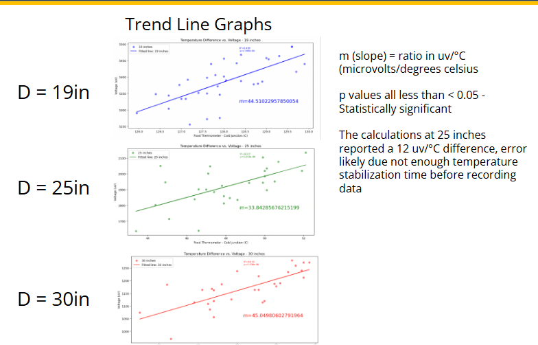
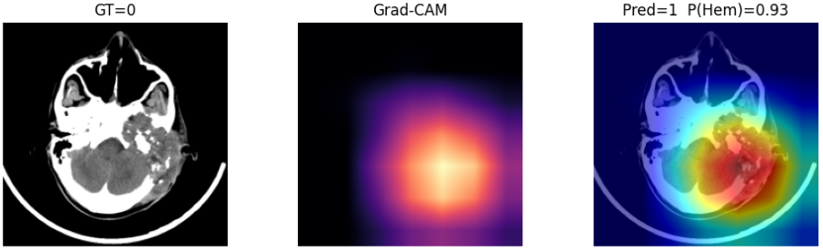
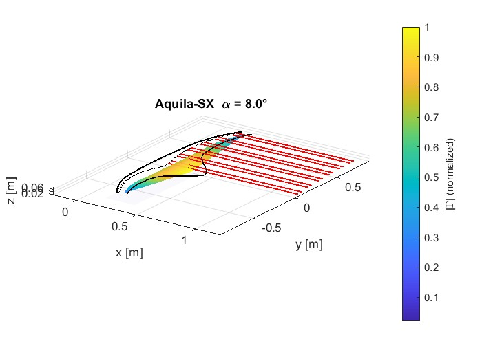
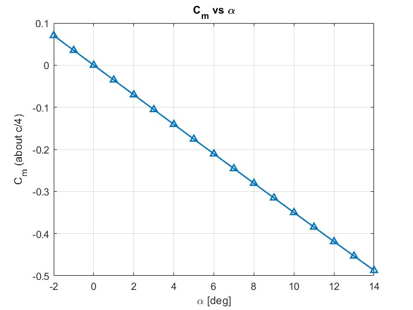

# Engineering Portfolio

Mechanical Engineering student focused on **aerospace systems, thermal modeling, and applied machine learning**.
Hands-on experience across **CubeSat payloads, UAV design, and medical image analysis**.

---

## HyCUBE: CubeSat Thermal & Instrumentation Payload
*NASA Minnesota Space Grant*

  
  
  

  

**Role:** Mechanical / Thermal Engineering
**Overview:**
Designed and analyzed a CubeSat payload for atmospheric sensing under the NASA Minnesota Space Grant program.
Work focused on **thermal behavior, instrumentation integration, and mission-level constraints**.

**Key Contributions**
- Thermal modeling of payload components under orbital boundary conditions
- Instrument packaging and environmental considerations
- Data visualization of temperature response and mission profiles
- Collaboration with aerospace systems and electrical teams

---

## Stroke Detection from Non-Contrast Head CT
*Machine Learning + Medical Imaging*

<!-- Grad-CAM hero image -->

  

<!-- ROC curves row -->

  
  
  

**Task:** Binary hemorrhage detection from head CT
**Model:** ResNet-18 (scratch, ImageNet pretrained, JEPA-style initialization)

**Overview:**
Built and evaluated convolutional neural networks for stroke detection using non-contrast head CT scans.
Emphasis on **model validation, interpretability, and robustness**, not just accuracy.

**Key Contributions**
- Compared training strategies via ROC-AUC analysis
- Evaluated generalization across initialization methods
- Used **Grad-CAM** to verify spatial attention aligned with clinically relevant regions
- Focused on interpretability to support real-world medical deployment

---

## Blended Wing Body UAV — *Aquila-S*
*Aerodynamics & Vehicle Design*
<!-- Flow visualization hero -->

  

<!-- Performance plots -->

  
  

**Overview:**
Designed and analyzed a custom **blended wing body UAV** for aerodynamic efficiency and stability studies.

**Key Contributions**
- Aerodynamic analysis of lift, moment, and flow behavior
- Stability characterization via pitching moment trends
- Flow visualization and interpretation to guide geometry iteration
- Integration of analysis results into design refinement

---

## Skills & Tools
- **Mechanical:** CAD, thermal modeling, system integration, aerodynamics
- **Analysis:** Python, MATLAB, numerical modeling, data visualization
- **ML:** PyTorch, CNNs, Grad-CAM, ROC/AUC evaluation
- **Workflow:** GitHub, Jupyter, technical documentation

---

📫 **Contact:**
LinkedIn / Email / Resume links here
