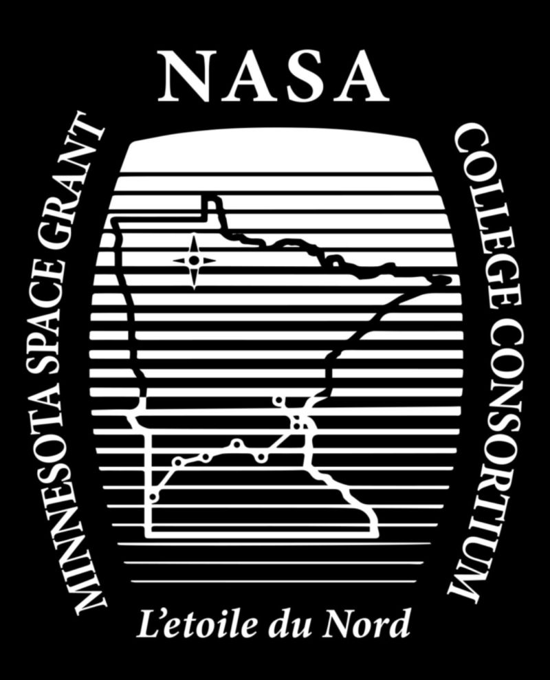
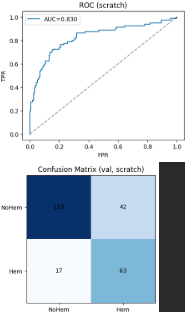
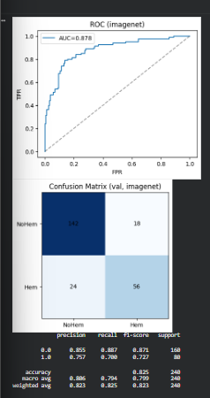
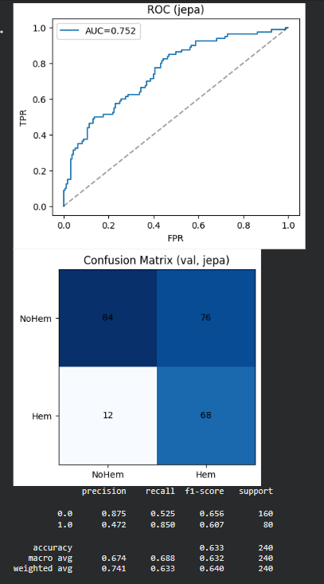

# Engineering Portfolio

Mechanical Engineering student focused on aerospace systems, thermal modeling, and applied machine learning.  
Hands-on experience across CubeSat payloads, aerodynamic analysis, and medical image modeling.

---

## Blended-Wing-Body CFD: Concept-to-Coefficients (SOLIDWORKS Flow Simulation 2024)

<em>Aerodynamics • CFD verification (mesh/domain) • Coefficient extraction + clean post-processing</em>

  

  <em>Relative static pressure on the BWB upper surface (α = 4°, V∞ ≈ 40 mph).</em> 
  📄 <a href="assets/BWB%20Executive%20Summary.pdf"><b>Open the executive summary (PDF)</b></a>

**What this is:** A concept-level aerodynamic characterization of a blended-wing-body (BWB) using steady-state CFD in SOLIDWORKS Flow Simulation 2024, including **convergence discipline**, **domain independence**, **mesh sensitivity**, and an **AoA sweep** at ~40 mph.

**Key outputs:** Lift coefficient (CL), drag coefficient (CD), lift-to-drag ratio (L/D), plus qualitative flow interpretation from **streamwise velocity (Vx)** cuts and **surface relative pressure / Cp scaling**.

**Highlights**
- **AoA sweep:** −2°, 0°, 2°, 4°, 6°, 8° at **V∞ ≈ 40 mph**
- **Verification workflow:** convergence (+100-iteration stability window), domain sensitivity, mesh sensitivity
- **Post-processing standard:** consistent views + fixed legend scales for clean visual comparisons

### Selected Figures

<b>Streamwise velocity montage (Vx)</b>

  

<b>Surface relative pressure montage (0°, 4°, 8°)</b>

  

<b>Mesh sensitivity (α = 4° baseline)</b>

  

---

## HyCUBE: CubeSat Thermal & Instrumentation Payload (NASA MN Space Grant / UMN SmallSat)

<em>Aerospace Systems + Instrumentation </em>

  <h3 style="margin-bottom:6px;">HyCUBE: CubeSat Thermal &amp; Instrumentation Payload </h3>
  

    <em>NASA’s Minnesota Space Grant Consortium &amp; University of Minnesota SmallSat Program</em>
  

  

    <b>Role:</b> Aerospace Systems Research Intern (Mechanical / Thermal Engineering — Instrumentation &amp; Data)
  

<!-- Only the two overview images (balloon hardware + mission context) -->

  
  

> **Payload integration + validation pipeline.** Built an end-to-end experiment + analysis workflow to quantify thermocouple sensitivity and measurement agreement versus a reference thermometer (with cold-junction compensation), supporting sensor selection and flight-readiness checks for HyCUBE testing (including high-altitude balloon operations).

**What I did:**
- Designed and executed thermocouple qualification experiments and produced decision-ready calibration outputs.
- Converted raw voltage/temperature measurements into regression-based fits (with confidence bounds).
- Validated agreement using parity + Bland–Altman methods so results are reviewable, reproducible, and ready for documentation/design reviews.

**Results Snapshot**
- **Estimated sensitivity (slope):** 19 in ≈ **44.51 µV/°C** (R² ≈ 0.499), 25 in ≈ **33.84 µV/°C** (R² ≈ 0.377), 30 in ≈ **45.05 µV/°C** (R² ≈ 0.542)
- **Agreement vs reference:** overall bias ≈ **0.00°C** with limits of agreement ≈ **±3.60°C** (Bland–Altman)
- **Deliverable:** calibration summary + figures exported as PNGs suitable for reports and review decks

### Selected Figures

<b>Centered calibration fits + 95% confidence bands (shared axes)</b>

  

<b>Validation (parity + error)</b>

  
  

<b>Agreement + sensitivity</b>

  
  

**Key Contributions**
- Designed thermocouple calibration experiments and produced decision-ready plots for sensor selection
- Implemented cold-junction compensation and regression-based calibration with confidence bounds
- Validated measurement behavior with parity + Bland–Altman agreement (bias and limits-of-agreement)
- Automated analysis outputs (tables + PNG exports) to keep results reproducible and reviewable
- Supported flight-readiness testing workflows, including high-altitude balloon operations and post-flight validation

---

## StrokeNet — Hemorrhage Detection from Non-Contrast Head CT (Lab-Mentored ML Project)

<em>Medical Imaging + Applied Deep Learning </em>

  

> **Interpretability as a validation tool.** Grad-CAM overlays check whether predictions rely on anatomically plausible regions (brain/bleed) rather than scanner artifacts, skull edges, or padding.

**What this is:** A reproducible baseline for slice-level hemorrhage detection from head CT, comparing initialization strategies and evaluating performance with **ROC-AUC + operating-point tradeoffs**, plus interpretability checks.

**Methods**
- DICOM → Hounsfield Units → brain windowing → normalization → 224×224 tensors  
- ResNet-18 binary classifier  
- Compared: scratch vs ImageNet initialization vs CT-native student/teacher self-supervision (JEPA-style) pretraining + fine-tuning

### Results snapshot (ROC curves)

  
  
  

- Best overall discrimination: ImageNet-initialized ResNet-18 achieved **ROC-AUC ≈ 0.884** on held-out validation.
- JEPA-style CT pretraining shifted the sensitivity/specificity trade-off in some runs, highlighting how pretraining can change error behavior even when it doesn’t dominate a strong baseline.

**What I contributed**
- Built an end-to-end CT preprocessing + training pipeline (HU conversion/windowing, augmentation, stratified splits)
- Implemented balanced training for class imbalance and stable fine-tuning
- Produced portfolio-grade interpretability visuals (Grad-CAM grids with artifact-aware cropping)
- Implemented and tested student/teacher self-supervised pretraining and compared initialization strategies

---
