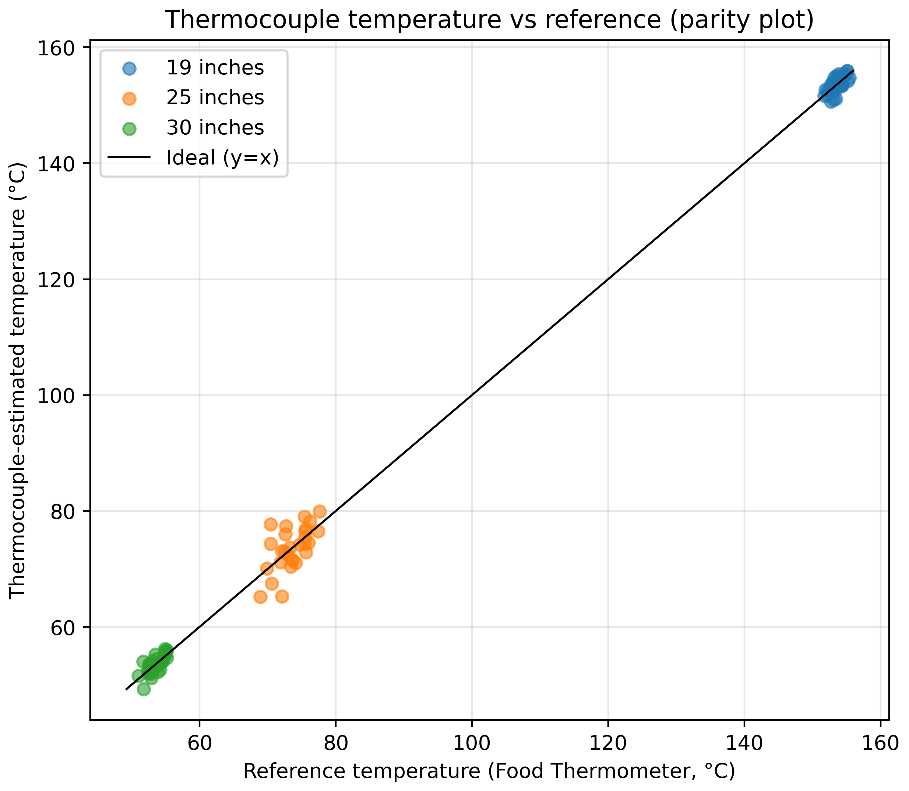
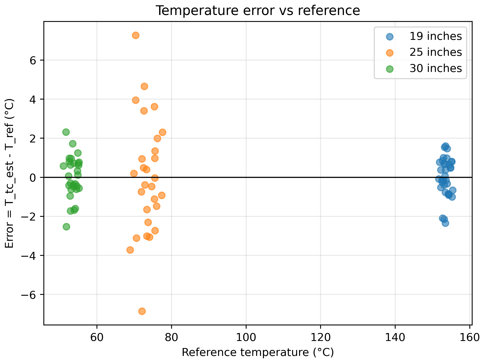
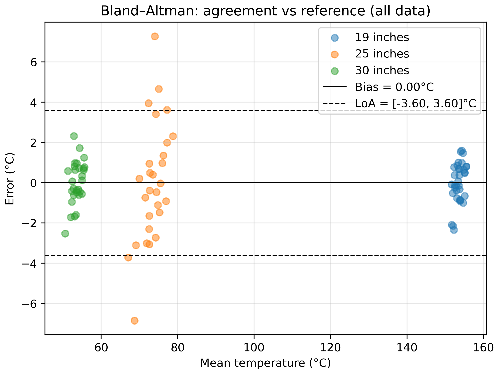
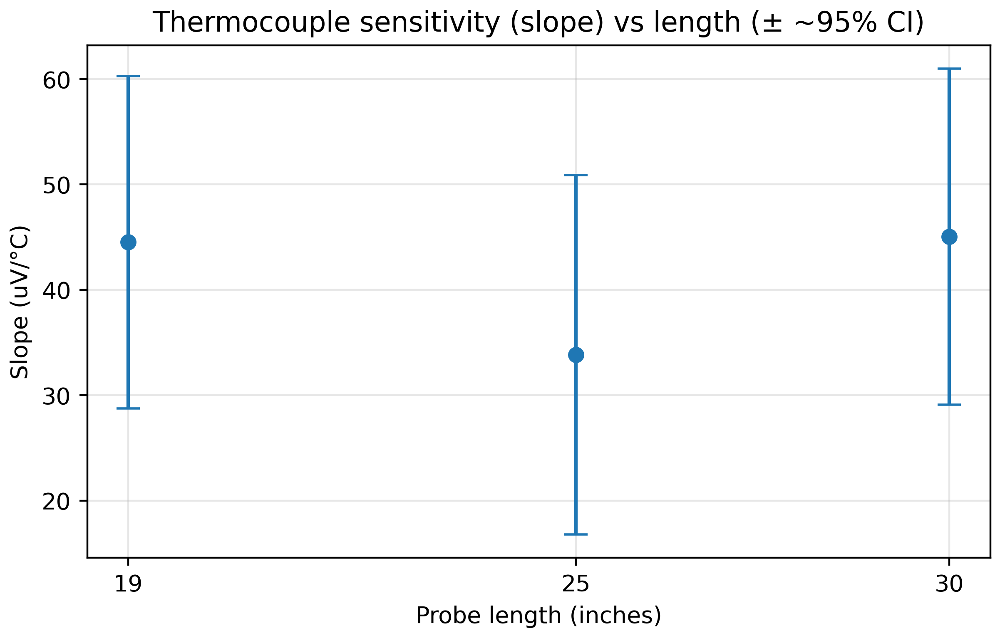

# Engineering Portfolio

Mechanical Engineering student focused on aerospace systems, thermal modeling, and applied machine learning. Hands-on experience across CubeSat payload testing, aerodynamic analysis, and medical image modeling.

---

<h3 align="center">Blended-Wing-Body CFD: Aerodynamic Coefficients & Flowfield (SOLIDWORKS Flow Simulation 2024)</h3>

<em>Aerodynamics • CFD verification (mesh/domain) • Coefficient extraction + clean post-processing</em>

  

  <em>Relative static pressure on the BWB upper surface (α = 4°, V∞ ≈ 40 mph).</em> 
  📄 <a href="assets/BWB%20Executive%20Summary.pdf"><strong>Open the executive summary (PDF)</strong></a>

A blended-wing-body aircraft can reduce drag by generating lift with more of the airframe, not just the wings, which is why it’s a recurring concept in efficiency-focused aircraft design. In this study, I used steady-state CFD in SOLIDWORKS Flow Simulation 2024 to estimate lift/drag coefficients across angle-of-attack and to produce clean, comparable flow/pressure visualizations while backing the results with basic verification (convergence, domain, and mesh sensitivity checks).

**Highlights**
- AoA sweep: −2°, 0°, 2°, 4°, 6°, 8° at V∞ ≈ 40 mph
- Verification workflow: convergence (+100-iteration stability window), domain sensitivity, mesh sensitivity
- Post-processing standard: consistent views + fixed legend scales for clean visual comparisons

### Selected figures

<strong>Streamwise velocity montage (Vx)</strong>

  

<strong>Surface relative pressure montage (0°, 4°, 8°)</strong>

  

<strong>Mesh sensitivity (α = 4° baseline)</strong>

  

---

<h3 align="center">HyCUBE: CubeSat Thermal &amp; Instrumentation Payload</h3>

<em>Aerospace Systems + Instrumentation • Sensor calibration + validation • Flight-readiness testing</em>

  <strong>Program:</strong> NASA Minnesota Space Grant Consortium × University of Minnesota SmallSat Program 
  <strong>Role:</strong> Aerospace Systems Research Intern

  
  

Reliable temperature sensing is critical for thermal testing and flight readiness. I built a thermocouple calibration + validation workflow for HyCUBE (Hypersonic Configurable Unit Ballistic Experiment) to support sensor selection and pre-flight verification. The pipeline converts raw voltage/temperature logs into regression-based calibration fits with confidence bounds and evaluates measurement agreement using parity and Bland–Altman analysis.

**Results snapshot**
- Estimated sensitivity (slope): 19 in ≈ 44.51 µV/°C (R² ≈ 0.499), 25 in ≈ 33.84 µV/°C (R² ≈ 0.377), 30 in ≈ 45.05 µV/°C (R² ≈ 0.542)
- Agreement vs reference: overall bias ≈ 0.00°C with limits of agreement ≈ ±3.60°C (Bland–Altman)
- Deliverable: calibration summary + figures exported as PNGs suitable for reports and review decks

### Selected figures

<strong>Validation views (parity + error)</strong>

<table width="100%" cellpadding="14">
  <tr>
    <td width="50%" align="center">
      
    </td>
    <td width="50%" align="center">
      
    </td>
  </tr>
</table>

<strong>Agreement + sensitivity</strong>

<table width="100%" cellpadding="14">
  <tr>
    <td width="50%" align="center">
      
    </td>
    <td width="50%" align="center">
      
    </td>
  </tr>
</table>

**Key contributions**
- Designed thermocouple calibration experiments and produced decision-ready plots for sensor selection
- Implemented cold-junction compensation and regression-based calibration with confidence bounds
- Validated measurement behavior with parity + Bland–Altman agreement (bias and limits-of-agreement)
- Automated analysis outputs (tables + PNG exports) to keep results reproducible and reviewable
- Supported high-altitude balloon flight operations: payload integration, ground-station setup, flight monitoring, recovery, and post-flight data validation

---

<h3 align="center">StrokeNet: Hemorrhage Detection on Non-Contrast Head CT (Mofrad Lab-Mentored ML Project)</h3>

<em>Medical Imaging • Applied Deep Learning • Interpretability + validation focus</em>

  

Rapid identification of intracranial hemorrhage on non-contrast head CT can accelerate triage because hemorrhagic findings drive time-critical decisions and differ from ischemic pathways. This project was motivated by Mofrad Lab discussions on stroke imaging and a concrete question that came up in mentorship feedback: whether CT-native self-supervised pretraining can provide better representations than standard ImageNet pretraining for CT. I built a reproducible slice-level hemorrhage detection baseline and compared three initialization strategies, random initialization (scratch), ImageNet pretraining, and CT-native student/teacher self-supervised pretraining (JEPA), using a fixed supervised training pipeline and interpretability checks with Grad-CAM.

### 1-page summary + validation results

  📄 <a href="assets/_CT%20(Non-Contrast)%20Hemorrhage%20Detection%20with%20CT-Native%20Self-Supervised%20Pretraining%20(JEPA)%20vs%20ImageNet%20(1).pdf"><strong>Open the 1-page project summary (PDF)</strong></a>

**Validation (held-out 20% split, n = 240 slices)**  
Same supervised training recipe across runs; only the initialization changed.

| Initialization | ROC AUC | Sensitivity | Specificity |
|---|---:|---:|---:|
| ImageNet-pretrained | 0.878 | 0.70 | 0.89 |
| Scratch (random init) | 0.829 | 0.79 | 0.74 |
| JEPA (CT self-supervised) | 0.752 | 0.85 | 0.53 |

**What this shows**
- On this small RSNA subset and a lightweight JEPA run, ImageNet pretraining preserved the best overall AUC and specificity.
- CT-native JEPA increased sensitivity (fewer missed hemorrhage slices) but traded off specificity, which is useful as a baseline and a pointer toward longer pretraining and tighter SSL tuning.

**Engineering contributions**
- Built an end-to-end CT preprocessing and training pipeline (HU conversion/windowing, normalization, augmentation, stratified splits)
- Implemented balanced training for class imbalance and stable fine-tuning
- Produced interpretability visuals (Grad-CAM grids with artifact-aware cropping) to sanity-check model behavior
- Implemented and tested student/teacher self-supervised pretraining and compared initialization strategies
