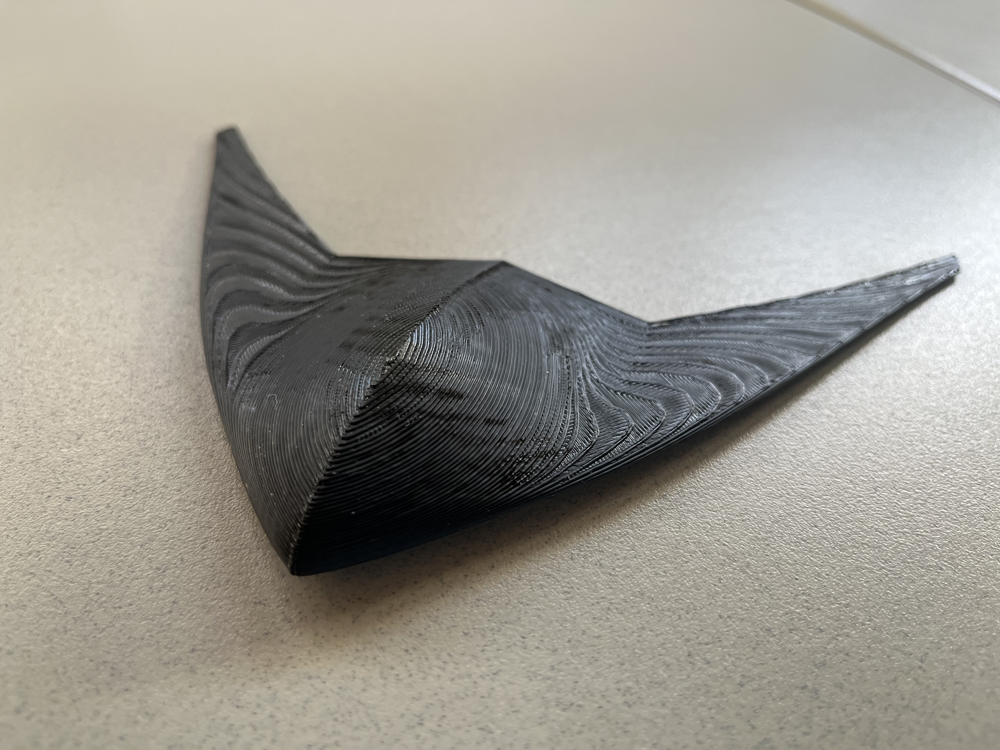
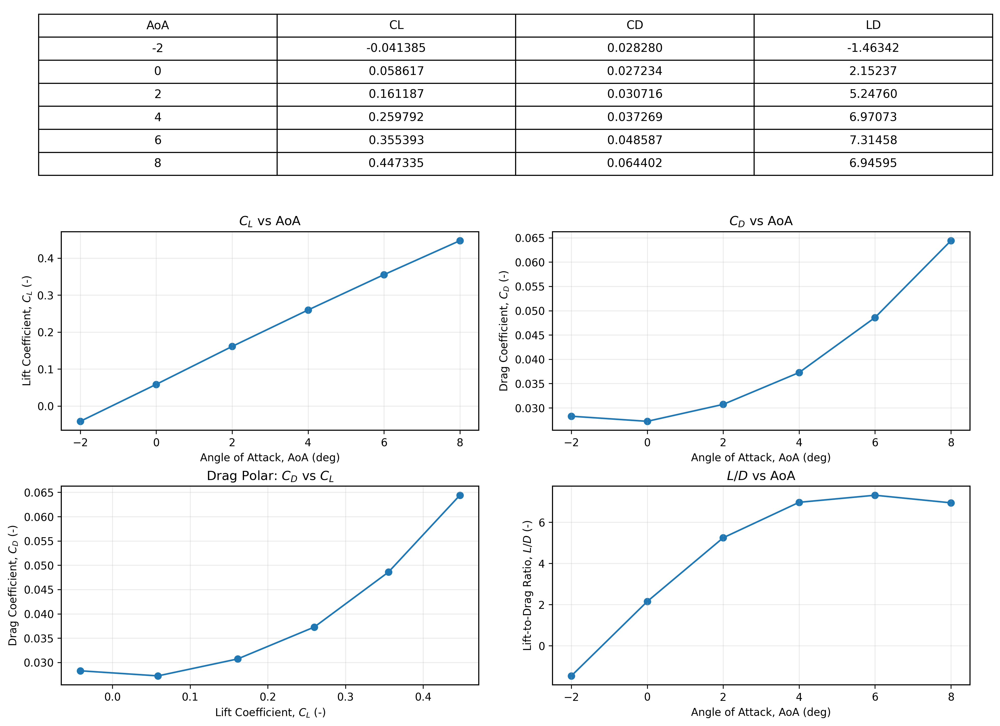
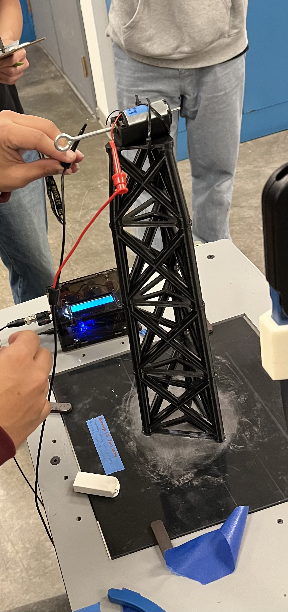

# Engineering Portfolio

Mechanical Engineering student focused on aerospace systems, thermal modeling/instrumentation, and applied machine learning. I build validated, reproducible engineering workflows backed by clear evidence (plots, summaries, verification checks).

Quick links  
- BWB CFD executive summary: [PDF](assets/BWB%20Executive%20Summary%20(2).pdf)  
- CT project 1-page summary: [PDF](assets/CT_Hemorrhage_1page_summary.pdf)  

---

## Table of contents
1. [Concept Aircraft: Blended-Wing-Body Aerodynamics](#concept-aircraft-blended-wing-body-aerodynamics)
2. [HyCUBE: CubeSat Thermal & Instrumentation Payload](#hycube-cubesat-thermal--instrumentation-payload)
3. [Post-Stroke Imaging Triage: Detecting Intracranial Bleeding on Head CT](#post-stroke-imaging-triage-detecting-intracranial-bleeding-on-head-ct)
4. [Wind Turbine Design–Build–Test (E26)](#wind-turbine-designbuildtest-e26)
5. [Reliability-First Automation Under Real-World Constraints (UPRO/SPXU)](#reliability-first-automation-under-real-world-constraints-uprospxu)

---

## Concept Aircraft: Blended-Wing-Body Aerodynamics

Validated low-speed CFD of a blended-wing-body aircraft  
Aerodynamics • CFD verification (mesh/domain) • Coefficient extraction • Clean post-processing

  

  <em>Relative static pressure on the BWB upper surface (α = 4°, V∞ ≈ 40 mph).</em> 
  <a href="assets/BWB%20Executive%20Summary%20(2).pdf">Open the executive summary (PDF)</a>

Blended-wing-body concepts aim to improve efficiency by generating lift across more of the airframe, not just the wings. I used steady-state CFD in SOLIDWORKS Flow Simulation to estimate lift/drag coefficients across angle-of-attack and produced comparable flow/pressure visualizations backed by convergence, domain, and mesh sensitivity checks.

Highlights
- AoA sweep: −2° → +8° at ~40 mph; peak efficiency L/D ≈ 7.3 near ~6°
- Verification: domain effect <0.5%; mesh medium→fine ΔCL ≈ 1.25%
- Comparison-ready visuals: fixed views/scales across cases (velocity cuts + pressure maps)

My contributions
- Ran steady-state CFD across AoA and extracted lift/drag trends (CL/CD)
- Verified results with convergence stability, domain sensitivity, and mesh sensitivity checks
- Produced clean figure sets for cross-case comparison and packaged results into an executive summary

Next step
- Physical validation: 3D-printing the final CAD model and running a small wind-tunnel campaign to compare measured lift/drag vs. AoA against the CFD sweep

Physical prototype (first draft)

  

  <em>First-draft 3D-printed BWB prototype for upcoming wind-tunnel / flow visualization validation.</em>

  
Selected figures

  
Aerodynamic Coefficients vs. Angle of Attack

  

    
  

  
Flow-field visualization (fixed legends for cross-case comparison)

  

    
  

---

## HyCUBE: CubeSat Thermal & Instrumentation Payload

Thermocouple calibration + validation workflow for flight-readiness decisions  
Aerospace Systems + Instrumentation • Sensor calibration • Validation • Flight-readiness testing

  
  

Reliable temperature sensing is a prerequisite for flight-readiness decisions. I built a thermocouple calibration + validation workflow for HyCUBE (Hypersonic Configurable Unit Ballistic Experiment) that converts raw voltage/temperature logs into regression-based calibration fits with confidence bounds and evaluates agreement using parity plots and Bland–Altman analysis.

Highlights
- Sensitivity (slope): 19 in ≈ 44.51 µV/°C (R² ≈ 0.499), 25 in ≈ 33.84 µV/°C (R² ≈ 0.377), 30 in ≈ 45.05 µV/°C (R² ≈ 0.542)
- Agreement vs reference: bias ≈ 0.00°C with limits of agreement ≈ ±3.60°C (Bland–Altman)
- Deliverable: calibration summary + figures exported as PNGs for reports and review decks

My contributions
- Designed thermocouple calibration experiments and produced decision-ready plots for sensor selection
- Implemented cold-junction compensation and regression-based calibration with confidence bounds
- Validated measurement behavior with parity plots and Bland–Altman limits-of-agreement
- Automated analysis outputs (tables + PNG exports) to keep results reproducible and reviewable
- Supported high-altitude balloon flight operations: payload integration, ground-station setup, flight monitoring, recovery, and post-flight data validation

  
Selected figures

  
Validation views (parity + error)

  

    
  

  
Agreement + sensitivity

  

    
  

  
Centered calibration fits + 95% confidence bands (shared axes)

  

    
  

---

## Post-Stroke Imaging Triage: Detecting Intracranial Bleeding on Head CT

Slice-level intracranial bleeding detection baseline + initialization comparison (Scratch vs ImageNet vs JEPA)  
Medical Imaging • Applied Deep Learning • Interpretability • Validation focus

  

Intracranial bleeding on head CT drives time-critical decisions in stroke triage. I built a reproducible slice-level baseline to detect intracranial bleeding on non-contrast head CT and compared three initialization strategies—scratch, ImageNet pretraining, and CT-native student/teacher self-supervised pretraining (JEPA)—using the same supervised training recipe and Grad-CAM checks.

1-page summary  
- [Open the 1-page project summary (PDF)](assets/CT_Hemorrhage_1page_summary.pdf)

Highlights
- Validation setup: held-out 20% split, n = 240 slices; same supervised pipeline across runs
- ImageNet-pretrained: ROC AUC 0.878, Sensitivity 0.70, Specificity 0.89
- JEPA (CT self-supervised): ROC AUC 0.752, Sensitivity 0.85, Specificity 0.53

My contributions
- Built an end-to-end CT preprocessing + training pipeline (HU conversion/windowing, normalization, augmentation, stratified splits)
- Implemented balanced training for class imbalance and stable fine-tuning
- Produced interpretability visuals (Grad-CAM grids with artifact-aware cropping) to sanity-check model behavior
- Implemented and tested student/teacher self-supervised pretraining and compared initialization strategies

  
Validation results

  <table align="center">
    <thead>
      <tr>
        <th>Initialization</th>
        <th>ROC AUC</th>
        <th>Sensitivity</th>
        <th>Specificity</th>
      </tr>
    </thead>
    <tbody>
      <tr>
        <td>ImageNet-pretrained</td>
        <td>0.878</td>
        <td>0.70</td>
        <td>0.89</td>
      </tr>
      <tr>
        <td>Scratch (random init)</td>
        <td>0.829</td>
        <td>0.79</td>
        <td>0.74</td>
      </tr>
      <tr>
        <td>JEPA (CT self-supervised)</td>
        <td>0.752</td>
        <td>0.85</td>
        <td>0.53</td>
      </tr>
    </tbody>
  </table>

---

## Wind Turbine Design–Build–Test (E26)

Iterative prototyping + test-based power characterization  
Rapid prototyping • Wind-tunnel testing • Power characterization • FEA-informed structural check

Ranked #1 / 40 teams in measured electrical power output (final course test). In a 4-person team project, we designed and tested a small wind turbine under manufacturability and performance constraints. We compared candidate blade concepts, fabricated prototypes via 3D printing, and evaluated designs in a wind-tunnel-style setup using voltage/current measurements. Structural sanity checks were performed with linear-static FEA (led by a teammate) and reviewed by the team.

Highlights
- Ranked #1 / 40 teams in measured electrical power output (final course test)
- Measured voltage/current across iterations and converted V–I data to comparable power curves/peak power
- Reviewed linear-static FEA assumptions/results to confirm stiffness/strength constraints were reasonable

My contributions (team of 4)
- Measurement owner: captured and hand-logged most voltage/current data during testing across runs and iterations
- Performance characterization: converted V–I measurements into comparable power results (curves/peak power) to rank iterations and support the final configuration
- Design input: conducted independent blade/airfoil research and contributed to group selection of blade geometry (airfoil/twist/profile tradeoffs)
- Verification review: double-checked a teammate’s linear-static FEA assumptions/results to confirm stiffness/strength constraints were reasonable

  
Selected figures

  

    
  

  

    <em>Linear-static FEA sanity check on the tower: displacement, von Mises stress, and factor of safety under representative loading.</em>
  

  

    
    
  

  

    <em>Measured electrical output (power vs current) and the wind-tunnel-style test setup used to capture voltage/current under controlled airflow.</em>
  

---

## Reliability-First Automation Under Real-World Constraints (UPRO/SPXU)

Deterministic market-open execution with explicit safety checks and audit logs  
Systems engineering • Deterministic state machine • Cloud-ready execution

I built a reliability-first paper-trading automation system that runs at the U.S. market open, briefly observes two leveraged S&P 500 ETFs (UPRO, SPXU), makes a deterministic winner/leader decision, and executes a single cash-only order with explicit safety checks. This was built as a reliability engineering exercise: predictable behavior under imperfect conditions through fail-closed checks, traceable state transitions, and auditability when APIs or market conditions are unreliable.

  

Highlights
- Deterministic decision logic: fixed open-time observation window + threshold-based winner selection with an explicit end-of-window tie-break
- Constraint-aware execution: whole-share sizing, cash-only allocation, and a dynamic PDT guard that fails closed if account checks can’t be verified
- Reliability guardrails: cancel-stale-orders, fill confirmation with timeouts, and “morning cleanup” to flatten leftover positions safely before a new run
- Auditability: timestamped logs at each state transition (open → observe → decide → route order → confirm fill → hold/exit) for post-run traceability

My contributions
- Implemented a state-machine structure with explicit pass/fail branches to make failure modes predictable
- Implemented fail-closed checks (market closed, API unreachable, fill not confirmed) and explicit logging for each exit path
- Built log outputs designed as audit trails (what the system believed, what it did, and when)

---
