Mechanical Engineering student-athlete at the University of California, Berkeley. My work spans aerospace systems, thermal instrumentation, and applied machine learning, with a focus on validated analysis, reproducible workflows, and decision-ready technical communication.

<strong>Aerospace Systems</strong> • <strong>Thermal Instrumentation</strong> • <strong>Applied ML</strong> • <strong>Verification &amp; Validation</strong>

<table style="width:100%; border-collapse:separate; border-spacing:18px 16px; table-layout:fixed;">
  <tr>
    <td style="vertical-align:top;">
      <a href="#concept-aircraft-blended-wing-body-aerodynamics">
        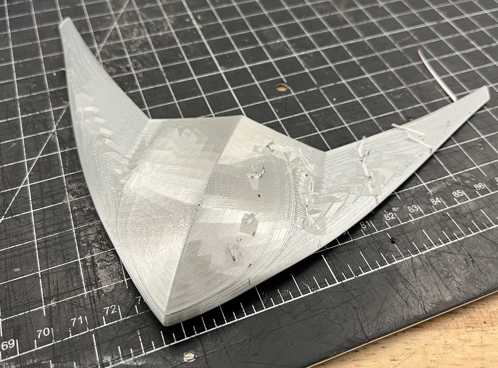
      </a>
      

        <a href="#concept-aircraft-blended-wing-body-aerodynamics" class="card-title"><strong>Blended-Wing-Body Aerodynamics</strong></a> 
        Validated CFD and planned tufting comparison.
      

    </td>
    <td style="vertical-align:top;">
      <a href="#hycube-cubesat-thermal--instrumentation-payload">
        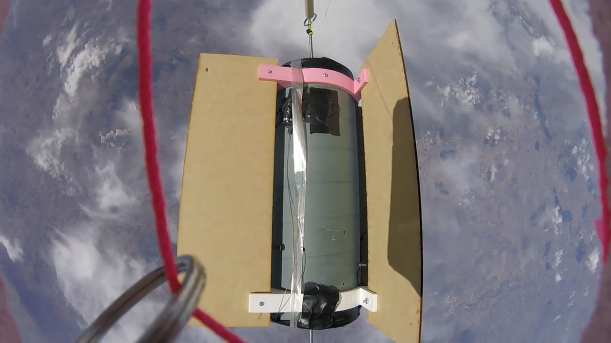
      </a>
      

        <a href="#hycube-cubesat-thermal--instrumentation-payload" class="card-title"><strong>HyCUBE Thermal Payload</strong></a> 
        Calibration, validation, and flight-ready instrumentation.
      

    </td>
  </tr>
  <tr>
    <td style="vertical-align:top;">
      

        <a href="#flynet-neural-flight-dynamics-modeling">
          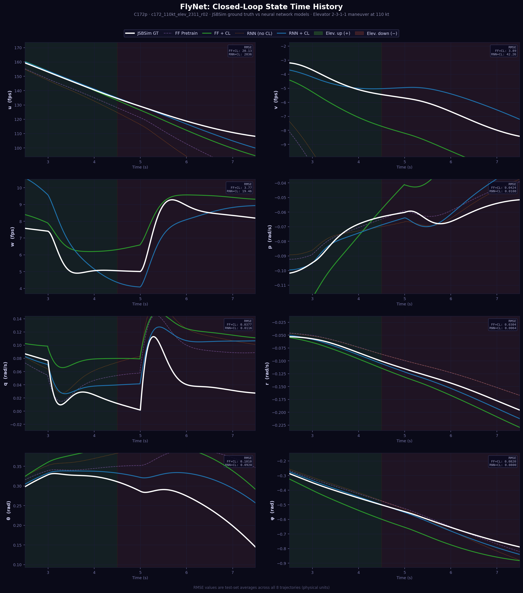
        </a>
      

      

        <a href="#flynet-neural-flight-dynamics-modeling" class="card-title"><strong>FlyNet: Neural Flight Dynamics</strong></a> 
        Physics-based neural network replication and GRU extension.
      

    </td>
    <td style="vertical-align:top;">
      

        
      

      

        <a href="#post-stroke-imaging-triage-detecting-intracranial-bleeding-on-head-ct" class="card-title"><strong>Medical Imaging ML</strong></a> 
        Reproducible CT modeling with interpretability checks.
      

    </td>
  </tr>
</table>

<em>Selected work in aerodynamics, aerospace instrumentation, applied machine learning, and test-backed mechanical design.</em>

## Quick links
- BWB CFD executive summary: [PDF](assets/BWB_Executive_Summary_.pdf)

## Explore Projects
- [Concept Aircraft: Blended-Wing-Body Aerodynamics](#concept-aircraft-blended-wing-body-aerodynamics)
- [HyCUBE: CubeSat Thermal & Instrumentation Payload](#hycube-cubesat-thermal--instrumentation-payload)
- [FlyNet: Neural Flight Dynamics Modeling](#flynet-neural-flight-dynamics-modeling)
- [Post-Stroke Imaging Triage: Detecting Intracranial Bleeding on Head CT](#post-stroke-imaging-triage-detecting-intracranial-bleeding-on-head-ct)
- [Wind Turbine Design–Build–Test (E26)](#wind-turbine-designbuildtest-e26)
- [Reliability-First Automation Under Real-World Constraints (UPRO/SPXU)](#reliability-first-automation-under-real-world-constraints-uprospxu)

---

## Concept Aircraft: Blended-Wing-Body Aerodynamics

Validated low-speed CFD of a blended-wing-body aircraft  
Aerodynamics • CFD verification (mesh/domain) • Coefficient extraction • Clean post-processing

  

  <a href="assets/BWB_Executive_Summary_.pdf">Open the executive summary (PDF)</a>

Blended-wing-body concepts aim to improve efficiency by generating lift across more of the airframe, not just the wings. I used steady-state CFD in SOLIDWORKS Flow Simulation to estimate lift/drag coefficients across angle-of-attack and produced comparable flow/pressure visualizations backed by convergence, domain, and mesh sensitivity checks.

**Highlights**
- AoA sweep: −2° → +8° at ~40 mph; peak efficiency L/D ≈ 7.3 near ~6°
- Verification: domain effect <0.5%; mesh medium→fine ΔCL ≈ 1.25%
- Comparison-ready visuals: fixed views/scales across cases (velocity cuts + pressure maps)

**My contributions**
- Ran steady-state CFD across AoA and extracted lift/drag trends (CL/CD)
- Verified results with convergence stability, domain sensitivity, and mesh sensitivity checks
- Produced clean figure sets for cross-case comparison and packaged results into an executive summary

**Next step**

- Physical validation: preparing a tufted prototype and running a small wind-tunnel campaign to compare measured lift/drag vs. AoA against the CFD sweep

<strong>Design-to-prototype path for physical validation</strong>

  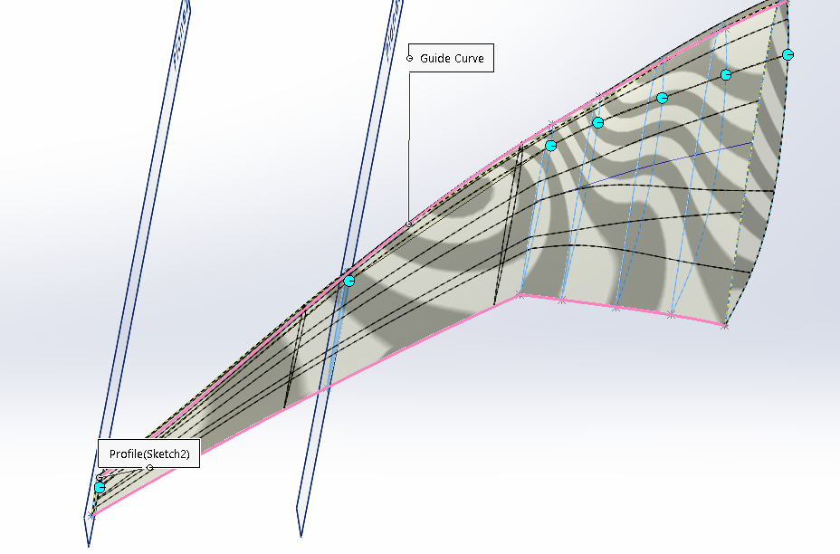
  &nbsp;&nbsp;&nbsp;
  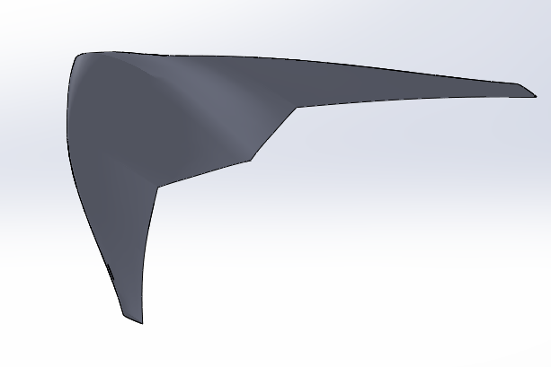
  &nbsp;&nbsp;&nbsp;
  

  <em>Left to right: concept sketch, CAD model, and 3D-printed tufted prototype for planned wind-tunnel and flow-visualization validation.</em>

Aerodynamic Coefficients vs. Angle of Attack

  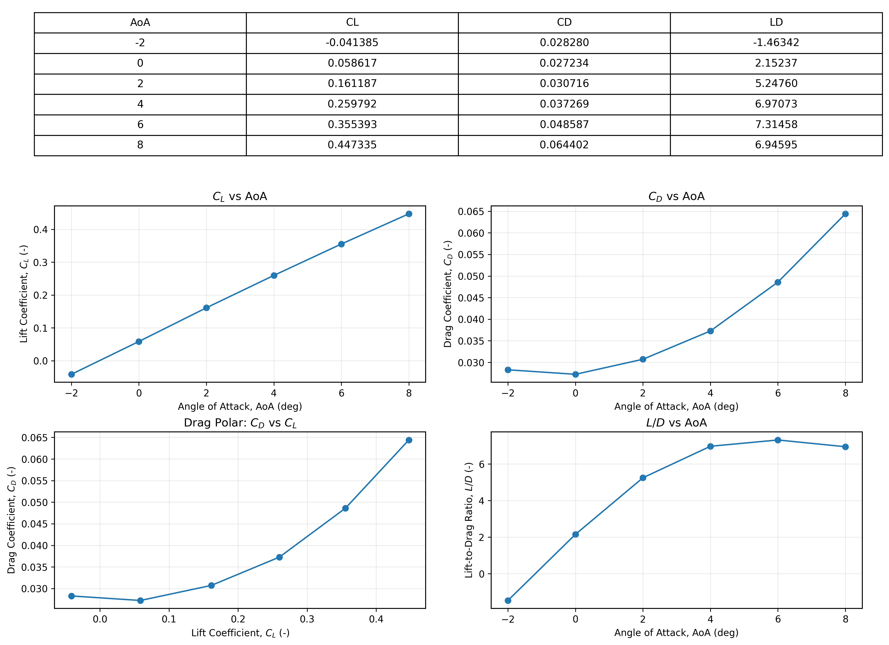

---

## HyCUBE: CubeSat Thermal & Instrumentation Payload

Thermocouple calibration + validation workflow for flight-readiness decisions  
Aerospace Systems + Instrumentation • Sensor calibration • Validation • Flight-readiness testing

  
  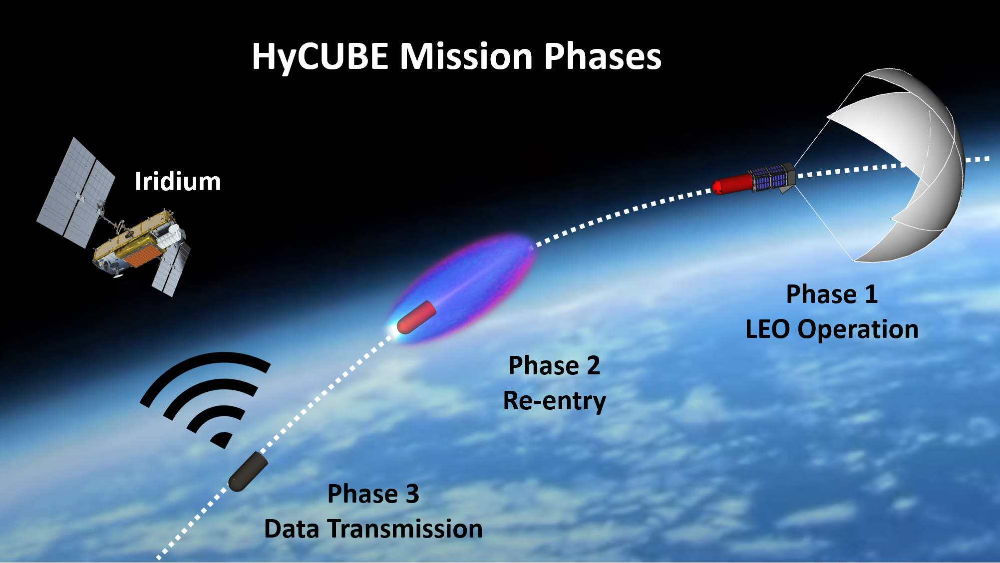

Reliable temperature sensing is a prerequisite for flight-readiness decisions. I built a thermocouple calibration + validation workflow for HyCUBE (Hypersonic Configurable Unit Ballistic Experiment) that converts raw voltage/temperature logs into regression-based calibration fits with confidence bounds and evaluates agreement using parity plots and Bland–Altman analysis.

**Highlights**
- Sensitivity (slope): 19 in ≈ 44.51 µV/°C (R² ≈ 0.499), 25 in ≈ 33.84 µV/°C (R² ≈ 0.377), 30 in ≈ 45.05 µV/°C (R² ≈ 0.542)
- Agreement vs reference: bias ≈ 0.00°C with limits of agreement ≈ ±3.60°C (Bland–Altman)
- Deliverable: calibration summary + figures exported as PNGs for reports and review decks

**My contributions**
- Designed thermocouple calibration experiments and produced decision-ready plots for sensor selection
- Implemented cold-junction compensation and regression-based calibration with confidence bounds
- Validated measurement behavior with parity plots and Bland–Altman limits-of-agreement
- Automated analysis outputs (tables + PNG exports) to keep results reproducible and reviewable
- Supported high-altitude balloon flight operations: payload integration, ground-station setup, flight monitoring, recovery, and post-flight data validation

Validation views (parity + error)

  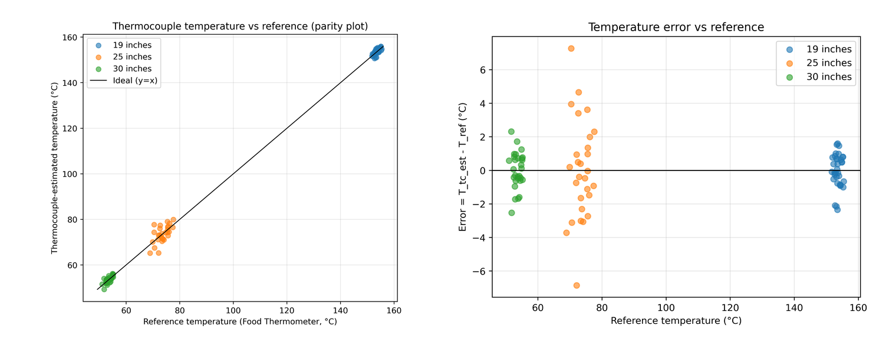

Agreement + sensitivity

  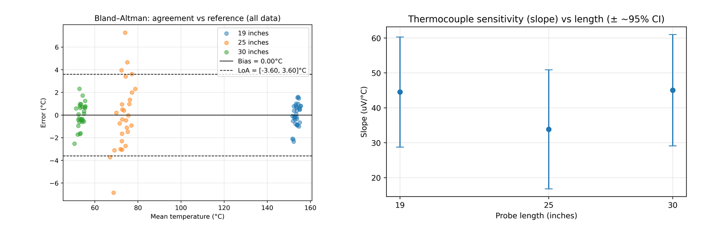

Centered calibration fits + 95% confidence bands (shared axes)

  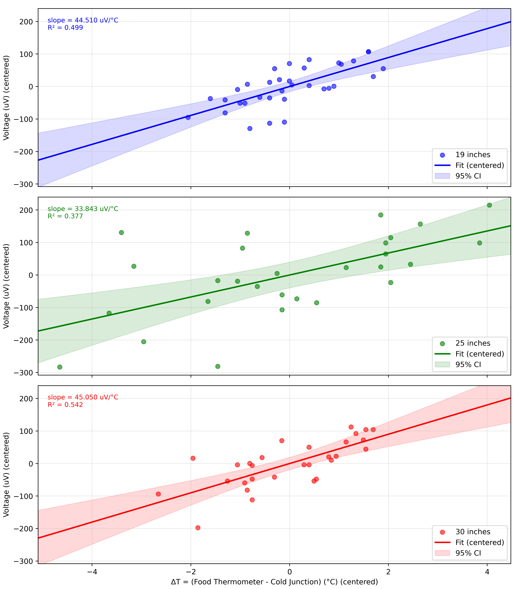

---

## FlyNet: Neural Flight Dynamics Modeling

Physics-based neural network replication and GRU architecture extension  
Flight Dynamics • JSBSim Simulation • PyTorch • Closed-Loop Training • Recurrent Networks  
Mofrad Lab collaboration

  

  <em>Closed-loop state time history across all models vs JSBSim ground truth. Shaded regions show elevator deflection phases of the 2-3-1-1 maneuver. RMSE values are test-set averages across 8 held-out trajectories.</em>

Here it is with regular dashes replaced by commas:

Replicated the FlyNet architecture (Stachiw et al., 2022), a physics-based neural network for global flight dynamics modeling, on a Cessna 172p using JSBSim simulation data instead of real flight test data. Extended the replication with a parameter-matched GRU comparison to test whether temporal context improves closed-loop simulation stability over a memoryless feed-forward model.

**Research question:** Does recurrent hidden state (GRU) improve closed-loop integration stability over a feed-forward model when both use identical input features and parameter budgets (~2,000 parameters)?

**Highlights**
- Generated 56 trajectories across 4 speed bins (80–110 kt) and 7 maneuver types using JSBSim trim oracle
- Replicated paper's two-stage pipeline: feed-forward pretrain (Stage 1) + closed-loop output-error refinement via Adams-Bashforth EOM integration (Stage 2)
- FF + closed-loop refinement reduced translational drift by up to 12× vs pretrain alone (v: 45.7 → 3.9 fps), directly replicating the paper's core claim
- Yaw rate (r) RMSE of 0.030 rad/s matched the paper; physically consistent with C172p's simpler yaw dynamics vs the paper's helicopter
- GRU without closed-loop training diverges catastrophically, confirming that the closed-loop training objective — not architecture — drives integration stability
- GRU + closed-loop partially stabilizes lateral channels (w: 55 → 19 fps) but introduces longitudinal divergence in u, revealing an architecture-dependent instability unique to recurrent rollout

**Pipeline**

| Stage | What it does |
|---|---|
| `generate_dataset.py` | JSBSim trim oracle → 56 CSV trajectories |
| `pretrain_model.py` | Stage 1 FF pretrain, 119 second-order features, Xavier init |
| `train_closedloop.py` | Stage 2 output-error refinement via EOM integration |
| `train_rnn.py` | GRU pretrain (hidden=8, ~2,000 params, parameter-matched) |
| `train_closedloop_rnn.py` | Closed-loop refinement with timestep-by-timestep GRU rollout |
| `evaluate.py` | Closed-loop RMSE across all 8 state channels |

**Closed-loop RMSE — test set (8 trajectories, physical units)**

<table align="center">
  <thead>
    <tr>
      <th>Channel</th>
      <th>Paper FlyNet</th>
      <th>FF Pretrain</th>
      <th>FF + CL</th>
      <th>RNN (no CL)</th>
      <th>RNN + CL</th>
    </tr>
  </thead>
  <tbody>
    <tr><td>u (fps)</td><td>2.04</td><td>22.18</td><td>20.13</td><td>21.07</td><td>2036</td></tr>
    <tr><td>v (fps)</td><td>2.70</td><td>45.68</td><td>3.89</td><td>51.31</td><td>42.26</td></tr>
    <tr><td>w (fps)</td><td>1.77</td><td>56.05</td><td>3.77</td><td>55.00</td><td>19.46</td></tr>
    <tr><td>p (rad/s)</td><td>0.030</td><td>0.0278</td><td>0.0424</td><td>0.0269</td><td>0.0108</td></tr>
    <tr><td>q (rad/s)</td><td>0.015</td><td>0.0212</td><td>0.0377</td><td>0.0250</td><td>0.0116</td></tr>
    <tr><td>r (rad/s)</td><td>0.026</td><td>0.0235</td><td>0.0304</td><td>0.0232</td><td>0.0064</td></tr>
    <tr><td>θ (rad)</td><td>0.028</td><td>0.151</td><td>0.101</td><td>0.150</td><td>0.092</td></tr>
    <tr><td>φ (rad)</td><td>0.050</td><td>0.096</td><td>0.082</td><td>0.077</td><td>0.080</td></tr>
  </tbody>
</table>

<em>Paper results: Bell 412HP helicopter, 252 real flight test trajectories. Our results: C172p fixed-wing, 56 JSBSim simulation trajectories.</em>

**My contributions**
- Built end-to-end JSBSim data pipeline: trim oracle, multi-speed multi-maneuver trajectory generation, trajectory-level stratified splits
- Implemented paper's full feature pipeline: range normalization (Eq. 19), second-order expansion (14 → 119 inputs), Xavier initialization
- Replicated two-stage training: FF pretrain + closed-loop output-error refinement with Adams-Bashforth 2nd-order EOM integrator
- Extended with parameter-matched GRU comparison and timestep-by-timestep closed-loop GRU rollout
- Ran full ablation: FF pretrain only → FF+CL → GRU pretrain only → GRU+CL
- Built evaluation pipeline and produced publication-comparable RMSE table

**Key finding (in progress)**

The closed-loop training objective is the primary driver of integration stability — not model architecture. The GRU's hidden state helps some channels under closed-loop refinement but introduces a longitudinal instability (u-channel divergence) absent in the feed-forward model, pointing to a fundamental difference in how recurrent rollout compounds errors through the EOM integrator.

---

## Post-Stroke Imaging Triage: Detecting Intracranial Bleeding on Head CT

Slice-level intracranial hemorrhage detection baseline + controlled initialization study (Scratch vs ImageNet vs JEPA) (Mofrad Lab Collaboration)
Medical Imaging • Applied Deep Learning • Interpretability • Validation focus  
Mofrad Lab collaboration

  

Intracranial hemorrhage on non-contrast head CT drives time-critical decisions in stroke triage. I built a reproducible slice-level baseline and ran a controlled comparison of three initialization strategies—scratch, ImageNet pretraining, and CT-native student/teacher self-supervised pretraining (JEPA)—using the same supervised training recipe and Grad-CAM checks.

### Highlights
- Fixed labeled split across all runs: 400 positive / 800 negative; held-out validation split (20%), n = 240 slices
- Matched supervised recipe across runs: ResNet-18, BCEWithLogits + pos_weight, dropout head, early stopping
- JEPA pretraining scale study: 10k/25k/50k/100k unlabeled CT slices, 5 SSL epochs each
- Best JEPA result: JEPA-10k achieved val ROC-AUC 0.8465 (eval AUC 0.8463), sensitivity 0.80, specificity 0.706 at threshold 0.5
- JEPA-100k showed a recall-heavy operating regime (eval AUC ~0.773, sensitivity ~0.875, specificity ~0.456 at threshold 0.5), motivating threshold sweeps as a next step

### My contributions
- Built an end-to-end CT preprocessing + training pipeline (DICOM ingestion, HU conversion/windowing, normalization, augmentation, stratified splits)
- Implemented class-imbalance handling (pos_weight and balanced sampling) and a stable fine-tuning setup
- Implemented student/teacher CT self-supervised pretraining (JEPA-style) and transferred encoder checkpoints into supervised fine-tuning
- Produced interpretability visuals (Grad-CAM grids with artifact-aware cropping) to sanity-check model behavior
- Summarized results into a clean deliverable table + run logs for fast lab review

### Validation results (threshold = 0.5)

<table align="center">
  <thead>
    <tr>
      <th>Initialization</th>
      <th>ROC AUC</th>
      <th>Sensitivity</th>
      <th>Specificity</th>
      <th>Notes</th>
    </tr>
  </thead>
  <tbody>
    <tr>
      <td>JEPA-10k</td>
      <td>0.846</td>
      <td>0.80</td>
      <td>0.706</td>
      <td>Best overall JEPA performance</td>
    </tr>
    <tr>
      <td>JEPA-25k</td>
      <td>~0.83</td>
      <td>~0.86</td>
      <td>~0.57</td>
      <td>Similar AUC; higher recall tradeoff</td>
    </tr>
    <tr>
      <td>JEPA-50k</td>
      <td>~0.826</td>
      <td>~0.775</td>
      <td>~0.681</td>
      <td>Mid-scale checkpoint</td>
    </tr>
    <tr>
      <td>JEPA-100k</td>
      <td>~0.773</td>
      <td>~0.875</td>
      <td>~0.456</td>
      <td>Recall-heavy at 0.5 threshold</td>
    </tr>
  </tbody>
</table>

Next experiments: threshold selection per run (e.g., Youden’s J or fixed sensitivity target) and multi-seed robustness reporting.

---

## Wind Turbine Design–Build–Test (E26)

Iterative prototyping + test-based power characterization  
Rapid prototyping • Wind-tunnel testing • Power characterization • FEA-informed structural check

Ranked #1 / 40 teams in measured electrical power output (final course test). In a 4-person team project, we designed and tested a small wind turbine under manufacturability and performance constraints. We compared candidate blade concepts, fabricated prototypes via 3D printing, and evaluated designs in a wind-tunnel-style setup using voltage/current measurements. Structural sanity checks were performed with linear-static FEA (led by a teammate) and reviewed by the team.

**Highlights**
- Ranked #1 / 40 teams in measured electrical power output (final course test)
- Measured voltage/current across iterations and converted V–I data to comparable power curves/peak power
- Reviewed linear-static FEA assumptions/results to confirm stiffness/strength constraints were reasonable

**My contributions (team of 4)**
- Measurement owner: captured and hand-logged most voltage/current data during testing across runs and iterations
- Performance characterization: converted V–I measurements into comparable power results (curves/peak power) to rank iterations and support the final configuration
- Design input: conducted independent blade/airfoil research and contributed to group selection of blade geometry (airfoil/twist/profile tradeoffs)
- Verification review: double-checked a teammate’s linear-static FEA assumptions/results to confirm stiffness/strength constraints were reasonable

  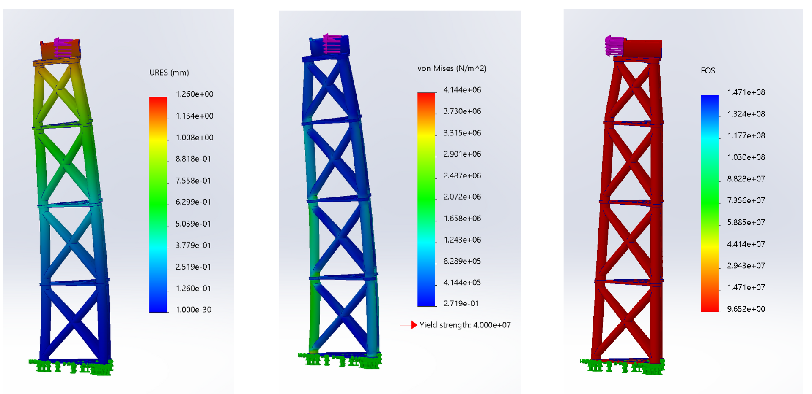

  <em>Linear-static FEA sanity check on the tower: displacement, von Mises stress, and factor of safety under representative loading.</em>

<table style="width:100%; max-width:980px; margin:12px auto; border-collapse:separate; border-spacing:16px 0;">
  <tr>
    <td style="width:62%; vertical-align:middle;">
      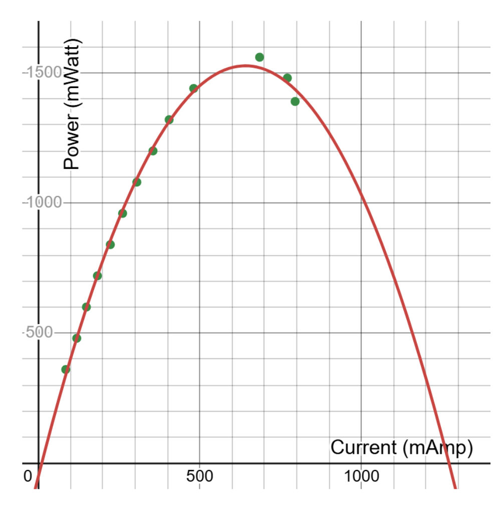
    </td>
    <td style="width:38%; vertical-align:middle;">
      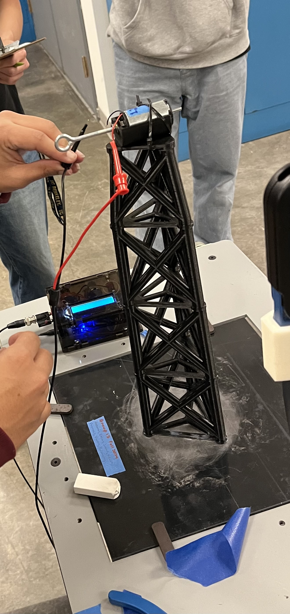
    </td>
  </tr>
</table>

  <em>Measured electrical output (power vs current) and the wind-tunnel-style test setup used to capture voltage/current under controlled airflow.</em>

---

## Reliability-First Automation Under Real-World Constraints (UPRO/SPXU)

Deterministic market-open execution with explicit safety checks and audit logs  
Systems engineering • Deterministic state machine • Cloud-ready execution

I built a reliability-first paper-trading automation system that runs at the U.S. market open, briefly observes two leveraged S&P 500 ETFs (UPRO, SPXU), makes a deterministic winner/leader decision, and executes a single cash-only order with explicit safety checks. This was built as a reliability engineering exercise: predictable behavior under imperfect conditions through fail-closed checks, traceable state transitions, and auditability when APIs or market conditions are unreliable.

  

**Highlights**
- Deterministic decision logic: fixed open-time observation window + threshold-based winner selection with an explicit end-of-window tie-break
- Constraint-aware execution: whole-share sizing, cash-only allocation, and a dynamic PDT guard that fails closed if account checks can’t be verified
- Reliability guardrails: cancel-stale-orders, fill confirmation with timeouts, and “morning cleanup” to flatten leftover positions safely before a new run
- Auditability: timestamped logs at each state transition (open → observe → decide → route order → confirm fill → hold/exit) for post-run traceability

**My contributions**
- Implemented a state-machine structure with explicit pass/fail branches to make failure modes predictable
- Implemented fail-closed checks (market closed, API unreachable, fill not confirmed) and explicit logging for each exit path
- Built log outputs designed as audit trails (what the system believed, what it did, and when)

---

## Contact

I’m always happy to connect with researchers, engineers, students, and teams interested in aerospace systems, instrumentation, and applied machine learning. Please feel free to reach out by email or connect with me on [LinkedIn](https://www.linkedin.com/in/kevin-armstrong-ii-647125319/).

**Email:** kevarm2028@berkeley.edu
