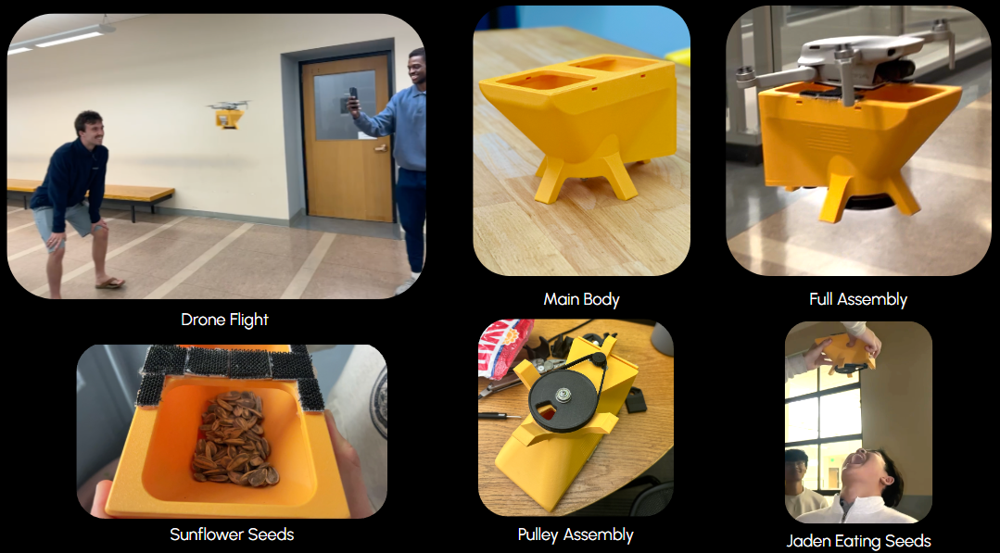
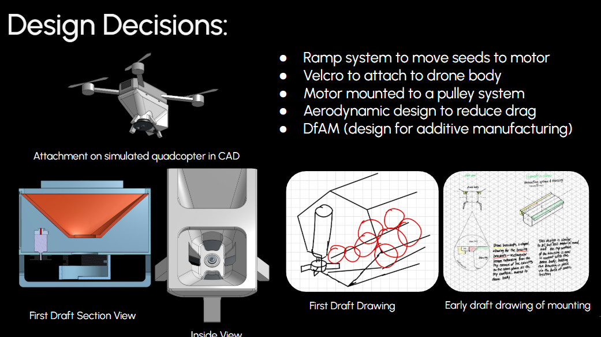
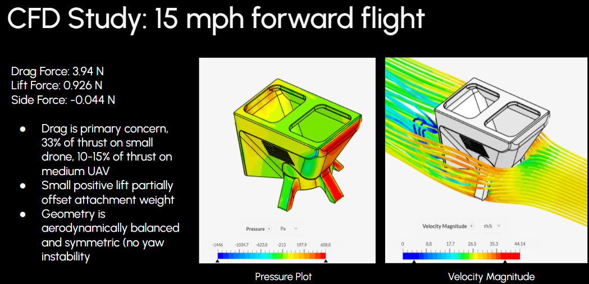
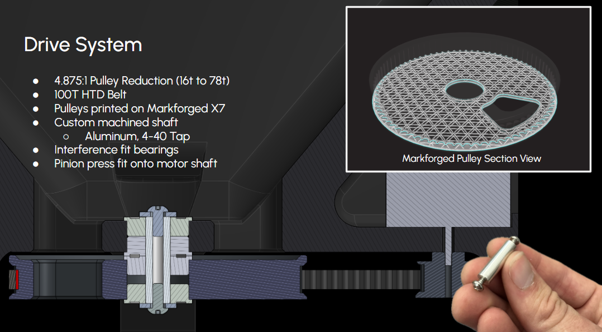
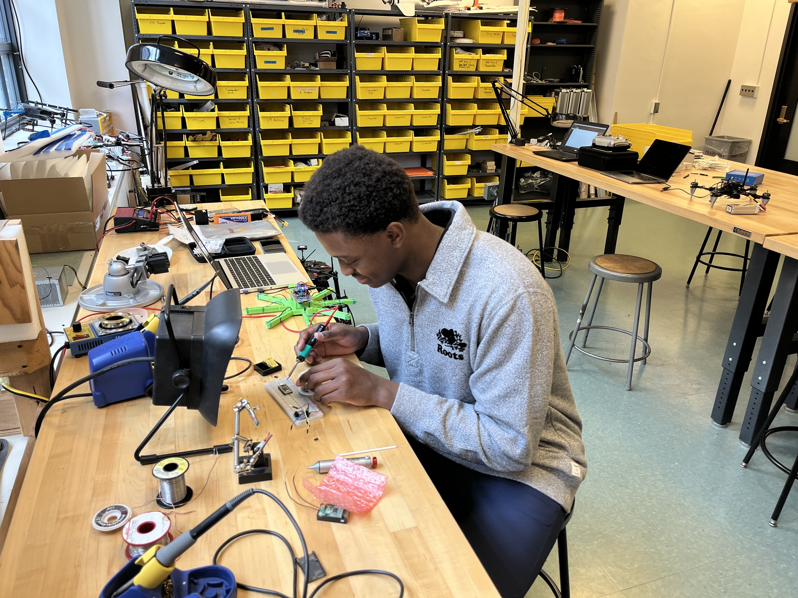

<!--
  STILL PENDING (everything else is live):
  assets/hycube_balloon_preflight.jpeg — uncomment block marked BALLOON PREFLIGHT below
  HYCUBE_VIDEO_URL — uncomment block marked PAYLOAD VIDEO below, replace placeholder URL
  assets/biofilm_abm_report.pdf — PDF download link will 404 until added
-->

I'm a mechanical engineering student-athlete at UC Berkeley building toward a career in aerospace and deeptech. As a sophomore I've run a full aerodynamics design-to-test pipeline — including wind tunnel stall characterization and tuft flow visualization — on a custom blended-wing-body aircraft, built neural flight dynamics models in the Mofrad Lab, designed and CFD-validated a seed-dispersal attachment for rewilding drones, and validated thermocouple instrumentation for a hypersonic reentry payload under NASA's Space Grant program. I care about work that closes the loop between analysis and physical reality.

<strong>Aerospace Systems</strong> • <strong>Experimental Aerodynamics</strong> • <strong>Mechanical Design</strong> • <strong>Applied ML</strong>

<table style="width:100%; border-collapse:separate; border-spacing:18px 16px; table-layout:fixed;">
  <tr>
    <td style="vertical-align:top;">
      
      

        <a href="#concept-aircraft-blended-wing-body-aerodynamics" class="card-title"><strong>Blended-Wing-Body Aerodynamics</strong></a> 
        Design-to-test pipeline: CFD, wind tunnel stall campaign, tuft flow visualization.
      

    </td>
    <td style="vertical-align:top;">
      

        
      

      

        <a href="#flynet-neural-flight-dynamics-modeling" class="card-title"><strong>FlyNet: Neural Flight Dynamics</strong></a> 
        Physics-based neural network replication and GRU extension.
      

    </td>
  </tr>
  <tr>
    <td style="vertical-align:top;">
      
      

        <a href="#drone-seed-dispersal-attachment-native-plant-rewilding" class="card-title"><strong>Drone Seed Dispersal Attachment</strong></a> 
        CFD-validated aerodynamic design for native plant rewilding deployment.
      

    </td>
    <td style="vertical-align:top;">
      
      

        <a href="#hycube-cubesat-thermal--instrumentation-payload" class="card-title"><strong>HyCUBE Thermal Payload</strong></a> 
        Calibration, validation, and flight operations for a hypersonic reentry CubeSat.
      

    </td>
  </tr>
</table>

<em>Selected work in aerodynamics, aerospace instrumentation, mechanical design, and applied machine learning.</em>

## Explore Projects
- [Concept Aircraft: Blended-Wing-Body Aerodynamics](#concept-aircraft-blended-wing-body-aerodynamics)
- [FlyNet: Neural Flight Dynamics Modeling](#flynet-neural-flight-dynamics-modeling)
- [Drone Seed Dispersal Attachment: Native Plant Rewilding](#drone-seed-dispersal-attachment-native-plant-rewilding)
- [HyCUBE: CubeSat Thermal & Instrumentation Payload](#hycube-cubesat-thermal--instrumentation-payload)
- [Post-Stroke Imaging Triage: Detecting Intracranial Bleeding on Head CT](#post-stroke-imaging-triage-detecting-intracranial-bleeding-on-head-ct)
- [Additional Projects](#additional-projects)
  - [Wind Turbine Design–Build–Test (E26)](#wind-turbine-designbuildtest-e26)
  - [Reliability-First Automation Under Real-World Constraints (UPRO/SPXU)](#reliability-first-automation-under-real-world-constraints-uprospxu)
  - [Agent-Based Biofilm Modeling for Medical Device Surface Design](#agent-based-biofilm-modeling-for-medical-device-surface-design)

---

## Concept Aircraft: Blended-Wing-Body Aerodynamics

**CAD Design · SolidWorks CFD · 3D-Printed Model · Wind Tunnel Force-Balance Testing · Tuft Flow Visualization**

AoA sweep: −2° to +20° &nbsp;·&nbsp; V∞ ≈ 40 mph &nbsp;·&nbsp; Re ≈ 5.6 × 10⁴ &nbsp;·&nbsp; EWT 3-component balance &nbsp;·&nbsp; 5.0% blockage

Blended-wing-body concepts generate lift across more of the airframe rather than concentrating it in the wings, offering potential efficiency gains at the cost of more complex stall behavior. I ran the full pipeline from scratch: designed a custom BWB geometry in SOLIDWORKS, characterized it computationally with validated CFD, fabricated a 1:1 scale FDM model, and ran a wind tunnel stall campaign — extending the sweep to 20° AoA with simultaneous force-balance and tuft flow visualization to map the full separation sequence.

---

### Design-to-test pipeline

  
  &nbsp;&nbsp;
  
  &nbsp;&nbsp;
  

<em>Left to right: concept sketch → SolidWorks multi-section loft (span 8 in, chord 9 in, NACA-derived centerbody) → 1:1 FDM model on EWT three-component balance sting.</em>

---

### Wind Tunnel — Stall Campaign

EWT three-component force balance (normal force, axial force, pitching moment), 25 Hz sampling, wind-off tare applied, dynamic-pressure corrected at each point. Sweep extended to 20° AoA — 12° beyond the CFD range — to capture the full post-stall regime.

**Key results:**

- Gradual stall onset confirmed at **14–16°** — identified simultaneously by two independent indicators: normal-force slope collapsing below 50% of the linear-regime reference *and* pitching-moment reversal at 16°
- **Peak normal force 3.36 N at 18°**; soft post-stall drop to 3.33 N at 20° — 1% decline consistent with progressive spanwise separation, not a full-span collapse
- CFD (pre-stall) and tunnel normal force in good agreement through 8°
- **Pitching moment peaks 2° before normal force** (16° vs 18°) — aerodynamic center shifting forward near stall, a physical signature of outer-panel separation preceding the final lift peak; recoverable only from simultaneous PM measurement
- Zero-lift angle ≈ −1.5° to −2°, confirming the NACA-derived cambered centerbody produces positive loading at zero incidence

---

### Tuft Flow Visualization — Surface Separation Sequence

Lightweight yarn tufts (~7 mm, ~12% chord spacing) attached to the upper surface, recorded by a fixed overhead camera at each AoA. Tufts lie flat during attached flow, deflect laterally in transitional zones, and reverse or flutter during separation — making the spatial stall pattern directly readable frame by frame.

**Key result: separation initiates at the centerbody and progresses outboard.** The outer panels remain partially attached well past centerbody stall onset, explaining the gradual force-balance stall character — the BWB sheds lift progressively over a 6° AoA range rather than collapsing suddenly across the full span. Tuft perturbation at the centerbody is visible before the force balance detects slope loss, making tufts a leading indicator of the stall sequence.

<table style="width:100%; border-collapse:separate; border-spacing:12px 0;">
  <tr>
    <td style="width:25%; vertical-align:top; text-align:center;">
      
      
<em>~0–4°: Fully attached. All tufts streaming rearward uniformly across span.</em>

    </td>
    <td style="width:25%; vertical-align:top; text-align:center;">
      
      
<em>~6–10°: Centerbody tufts begin curling near leading-edge junction. Outer panel still clean — earliest separation signal.</em>

    </td>
    <td style="width:25%; vertical-align:top; text-align:center;">
      
      
<em>~14–16°: Centerbody tufts disordered and lifting. Outer-panel tufts deflected but not reversed. Matches both force-balance indicators.</em>

    </td>
    <td style="width:25%; vertical-align:top; text-align:center;">
      
      
<em>~18–20°: Widespread centerbody disruption, some tufts reversed. Wingtip tufts partially ordered. Explains soft 1% NF drop.</em>

    </td>
  </tr>
</table>

---

### CFD — Pre-stall Characterization

Steady-state laminar + turbulent (I = 1%, L = 0.01 m), SolidWorks Flow Simulation. AoA swept −2° to +8° at V∞ = 40 mph. All coefficients reported after +100-iteration post-convergence averaging window and verified with domain and mesh sensitivity checks.

  

<em>Left: streamwise velocity Vx (midspan cut plane) at AoA = 0°, 4°, 8° — warm regions show upper-surface acceleration, blue shows stagnation and wake deficit. Right: surface relative pressure (top view, fixed scale −300 to +300 Pa) — leading-edge suction region expands chordwise with increasing AoA.</em>

**Coefficient sweep:**

| AoA (°) | C_L | C_D | L/D |
|--------:|------:|--------:|------:|
| −2 | −0.0414 | 0.02828 | −1.46 |
| 0 | 0.0586 | 0.02723 | 2.15 |
| 2 | 0.1612 | 0.03072 | 5.25 |
| 4 | 0.2598 | 0.03727 | 6.97 |
| **6** | **0.3554** | **0.04859** | **7.31 ← peak** |
| 8 | 0.4473 | 0.06440 | 6.95 |

**Verification:**
- Domain independence (α = 4°, medium mesh): ΔC_L = +0.17%, ΔC_D = +0.43% — far-field boundaries not biasing results
- Mesh independence (α = 4°, large domain): medium→fine ΔC_L ≈ 1.25%, ΔC_D ≈ 0.37% — near-converged; medium mesh selected for sweep

---

### Resources
- [Executive summary (HTML)](assets/BWB_Project_Showcase_Tufts%20(4).html)
- [Full project report (PDF)](assets/BWB_Executive_Summary_.pdf)

---

## FlyNet: Neural Flight Dynamics Modeling

Physics-based neural network replication and GRU architecture extension  
Flight Dynamics • JSBSim Simulation • PyTorch • Closed-Loop Training • Recurrent Networks  
Mofrad Lab collaboration

  

<em>Closed-loop state time history across all models vs JSBSim ground truth. Shaded regions show elevator deflection phases of the 2-3-1-1 maneuver. RMSE values are test-set averages across 8 held-out trajectories.</em>

  <iframe width="72%" height="420"
    src="https://www.youtube.com/embed/RBWWbZS1y6c"
    frameborder="0"
    allowfullscreen
    style="border-radius:12px; border:1px solid #2a3542;">
  </iframe>

Replicated the FlyNet architecture (Stachiw et al., 2022), a physics-based neural network for global flight dynamics modeling, on a Cessna 172p using JSBSim simulation data instead of real flight test data. Extended the replication with a parameter-matched GRU comparison to test whether temporal context improves closed-loop simulation stability over a memoryless feed-forward model.

**Research question:** Does recurrent hidden state (GRU) improve closed-loop integration stability over a feed-forward model when both use identical input features and parameter budgets (~2,000 parameters)?

**Highlights**
- Generated 56 trajectories across 4 speed bins (80–110 kt) and 7 maneuver types using JSBSim trim oracle
- Replicated paper's two-stage pipeline: feed-forward pretrain (Stage 1) + closed-loop output-error refinement via Adams-Bashforth EOM integration (Stage 2)
- FF + closed-loop refinement dramatically reduces translational drift vs pretrain alone — v: 45.7 → 2.98 fps, **w: 56.1 → 1.45 fps (w channel now beats the paper baseline of 1.77 fps)**
- Yaw rate (r) RMSE closely matches the paper; physically consistent with C172p's simpler yaw dynamics vs the paper's helicopter
- GRU without closed-loop training diverges catastrophically, confirming that the closed-loop training objective — not architecture — drives integration stability
- GRU + closed-loop partially stabilizes lateral channels but introduces longitudinal divergence in u, revealing an architecture-dependent instability unique to recurrent rollout

**Pipeline**

| Stage | What it does |
|---|---|
| `generate_dataset.py` | JSBSim trim oracle → 56 CSV trajectories |
| `pretrain_model.py` | Stage 1 FF pretrain, 119 second-order features, Xavier init |
| `train_closedloop.py` | Stage 2 output-error refinement via EOM integration |
| `train_rnn.py` | GRU pretrain (hidden=8, ~2,000 params, parameter-matched) |
| `train_closedloop_rnn.py` | Closed-loop refinement with timestep-by-timestep GRU rollout |
| `evaluate.py` | Closed-loop RMSE across all 8 state channels |

**Closed-loop RMSE — test set (8 trajectories, physical units)**

<table align="center">
  <thead>
    <tr>
      <th>Channel</th>
      <th>Paper FlyNet</th>
      <th>FF Pretrain</th>
      <th>FF + CL †</th>
      <th>RNN (no CL)</th>
      <th>RNN + CL ‡</th>
    </tr>
  </thead>
  <tbody>
    <tr><td>u (fps)</td><td>2.04</td><td>22.18</td><td>22.17</td><td>21.07</td><td>2036</td></tr>
    <tr><td>v (fps)</td><td>2.70</td><td>45.68</td><td>2.98</td><td>51.31</td><td>42.26</td></tr>
    <tr><td><strong>w (fps)</strong></td><td><strong>1.77</strong></td><td>56.05</td><td><strong>1.45 ✓</strong></td><td>55.00</td><td>19.46</td></tr>
    <tr><td>p (rad/s)</td><td>0.030</td><td>0.0278</td><td>0.0404</td><td>0.0269</td><td>0.0108</td></tr>
    <tr><td>q (rad/s)</td><td>0.015</td><td>0.0212</td><td>0.0377</td><td>0.0250</td><td>0.0116</td></tr>
    <tr><td>r (rad/s)</td><td>0.026</td><td>0.0235</td><td>0.0305</td><td>0.0232</td><td>0.0064</td></tr>
    <tr><td>θ (rad)</td><td>0.028</td><td>0.151</td><td>0.099</td><td>0.150</td><td>0.092</td></tr>
    <tr><td>φ (rad)</td><td>0.050</td><td>0.096</td><td>0.084</td><td>0.077</td><td>0.080</td></tr>
  </tbody>
</table>

<em>† FF+CL updated from latest run (early-stop epoch 634, log-scale translational normalization). ✓ = beats paper baseline. ‡ RNN+CL from prior run; pending rerun under current training configuration.</em>

<em>Paper results: Bell 412HP helicopter, 252 real flight test trajectories. Our results: C172p fixed-wing, 56 JSBSim simulation trajectories.</em>

**My contributions**
- Built end-to-end JSBSim data pipeline: trim oracle, multi-speed multi-maneuver trajectory generation, trajectory-level stratified splits
- Implemented paper's full feature pipeline: range normalization (Eq. 19), second-order expansion (14 → 119 inputs), Xavier initialization
- Replicated two-stage training: FF pretrain + closed-loop output-error refinement with Adams-Bashforth 2nd-order EOM integrator
- Extended with parameter-matched GRU comparison and timestep-by-timestep closed-loop GRU rollout
- Ran full ablation: FF pretrain only → FF+CL → GRU pretrain only → GRU+CL
- Built evaluation pipeline and produced publication-comparable RMSE table

**Key finding (in progress)**

The closed-loop training objective is the primary driver of integration stability — not model architecture. The w channel now beats the paper baseline (1.45 vs 1.77 fps), providing additional validation of the closed-loop refinement approach on fixed-wing JSBSim data. The GRU's hidden state helps some channels under closed-loop refinement but introduces a longitudinal instability (u-channel divergence) absent in the feed-forward model, pointing to a fundamental difference in how recurrent rollout compounds errors through the EOM integrator.

---

## Drone Seed Dispersal Attachment: Native Plant Rewilding

**CAD Design · DfAM · Pulley Drive System · CFD Aerodynamic Validation · GD&T · Flight Test**

CFD: V∞ = 15 mph forward flight &nbsp;·&nbsp; Drag 3.94 N &nbsp;·&nbsp; Lift 0.926 N &nbsp;·&nbsp; 4.875:1 pulley reduction &nbsp;·&nbsp; ABS + Markforged X7

  

<em>Full assembly in flight — 3D-printed ABS seed dispersal attachment mounted on a small quadcopter during indoor flight test.</em>

In a team project, designed and built a seed-dispersal attachment for a quadcopter drone intended for native plant rewilding applications. The system uses a gravity-fed ramp with a motor-driven pulley mechanism to disperse seeds during flight, Velcro-and-leg mounting to the drone body, and a DfAM-optimized enclosure printed in ABS. My primary contributions were the aerodynamic design of the attachment — including running the CFD study that validated drag loads and confirmed geometric symmetry — and integration decisions around attachment placement on the drone.

**Design decisions and engineering**
- Ramp geometry moves seeds by gravity to the dispersal motor; motor mounted to a belt-driven pulley reduction system for torque
- Velcro attachment to drone body with four-leg standoff structure for clearance and stability
- DfAM-driven print orientation selected to eliminate unsupported overhangs and minimize support material
- Leading-edge and corner fillets added to reduce flow separation and drag coefficient

  

<em>Design decisions overview: attachment on simulated quadcopter in CAD, cross-section showing ramp and motor placement, and early concept sketches.</em>

---

### CFD — Aerodynamic Validation at 15 mph Forward Flight

  

<em>Left: surface pressure plot. Right: velocity magnitude streamlines. V∞ = 15 mph forward flight condition.</em>

| Result | Value | Context |
|--------|-------|---------|
| Drag force | 3.94 N | ~33% of thrust on a small drone; 10–15% on a medium UAV |
| Lift force | +0.926 N | Small positive lift partially offsets attachment weight |
| Side force | −0.044 N | Geometry aerodynamically balanced — no yaw instability confirmed |

The CFD confirmed drag as the primary flight-performance concern and informed the geometry refinements (fillets, leading-edge smoothing) used in the final design. The near-zero side force confirms the symmetric external geometry does not introduce attitude-control challenges for the drone.

---

### Drive System

  

<em>Drive system cross-section: 4.875:1 belt reduction (16t to 78t), interference-fit bearings, custom machined aluminum shaft.</em>

- **4.875:1 pulley reduction** (16t pinion to 78t driven pulley), 100T HTD belt
- Large pulley printed on Markforged X7 (continuous fiber reinforcement for torque loads)
- Custom machined aluminum shaft with 4-40 tap; pinion press-fit onto motor shaft
- Interference-fit bearings for zero-backlash radial support

---

### Engineering Drawing (GD&T)

  

<em>Full GD&T engineering drawing. ABS, 1:3 scale. Tolerances specified for bearing bores (Ø0.400 A|C), ramp surface flatness (0.500), and centerbody runout (0.200 C).</em>

---

### Flight Test

  

<em>Indoor flight validation with sunflower seeds loaded in the hopper. Attachment mounted and stable in hover and slow forward flight.</em>

**My contributions (team project)**
- Led aerodynamic design: ran CFD study at 15 mph forward flight (drag/lift extraction, yaw symmetry confirmation), designed leading-edge and corner fillets for drag reduction, determined attachment placement on the drone body
- Reviewed DfAM print orientation decisions to support surface quality on aerodynamic faces
- Contributed to design reviews for drive system integration and mounting geometry

---

## HyCUBE: CubeSat Thermal & Instrumentation Payload

Thermocouple calibration + validation workflow for flight-readiness decisions  
Aerospace Systems + Instrumentation • Sensor calibration • Validation • Flight operations

  
  

  BALLOON PREFLIGHT — when assets/hycube_balloon_preflight.jpeg is ready:
  Delete the active 2-up block below and uncomment this one instead.

  
  

<em>Left: payload integration before balloon release. Right: soldering thermocouple electronics during bench assembly.</em>

  
  

<em>Left: soldering thermocouple electronics during bench assembly. Right: calibration rig — Hakko HJ5000 heat gun as controlled heat source with measurement circuit on breadboard.</em>

<!--
  PAYLOAD VIDEO — uncomment and replace HYCUBE_VIDEO_URL with your YouTube embed URL.
  Format: https://www.youtube.com/embed/VIDEO_ID  (not the /watch?v= URL)

  <iframe width="60%" height="360"
    src="HYCUBE_VIDEO_URL"
    frameborder="0"
    allowfullscreen
    style="border-radius:12px; border:1px solid #2a3542;">
  </iframe>

<em>HyCUBE payload in high-altitude flight — curvature of Earth visible.</em>

-->

Reliable temperature sensing is a prerequisite for flight-readiness decisions. I built a thermocouple calibration + validation workflow for HyCUBE (Hypersonic Configurable Unit Ballistic Experiment) that converts raw voltage/temperature logs into regression-based calibration fits with confidence bounds, and evaluates agreement using parity plots and Bland–Altman analysis.

**Highlights**
- Sensitivity (slope): 19 in ≈ 44.51 µV/°C (R² ≈ 0.499), 25 in ≈ 33.84 µV/°C (R² ≈ 0.377), 30 in ≈ 45.05 µV/°C (R² ≈ 0.542)
- Agreement vs reference: bias ≈ 0.00°C with limits of agreement ≈ ±3.60°C (Bland–Altman)
- Deliverable: calibration summary + figures exported as PNGs for reports and review decks

**My contributions**
- Designed thermocouple calibration experiments and produced decision-ready plots for sensor selection
- Implemented cold-junction compensation and regression-based calibration with confidence bounds
- Validated measurement behavior with parity plots and Bland–Altman limits-of-agreement
- Automated analysis outputs (tables + PNG exports) to keep results reproducible and reviewable
- Supported high-altitude balloon flight operations: payload integration, ground-station setup, flight monitoring, recovery, and post-flight data validation

  

<em>Validation: thermocouple temperature vs reference (parity plot, left) and error vs reference temperature (right).</em>

  

<em>Bland–Altman agreement (bias = 0.00°C, LoA ≈ ±3.60°C) and thermocouple sensitivity vs probe length with 95% CI.</em>

---

## Post-Stroke Imaging Triage: Detecting Intracranial Bleeding on Head CT

Slice-level intracranial hemorrhage detection baseline + controlled initialization study (Scratch vs ImageNet vs JEPA)  
Medical Imaging • Applied Deep Learning • Interpretability • Validation focus  
Mofrad Lab collaboration

  

Intracranial hemorrhage on non-contrast head CT drives time-critical decisions in stroke triage. I built a reproducible slice-level baseline and ran a controlled comparison of three initialization strategies — scratch, ImageNet pretraining, and CT-native student/teacher self-supervised pretraining (JEPA) — using the same supervised training recipe and Grad-CAM checks.

### Highlights
- Fixed labeled split across all runs: 400 positive / 800 negative; held-out validation split (20%), n = 240 slices
- Matched supervised recipe across runs: ResNet-18, BCEWithLogits + pos_weight, dropout head, early stopping
- JEPA pretraining scale study: 10k/25k/50k/100k unlabeled CT slices, 5 SSL epochs each
- Best JEPA result: JEPA-10k achieved val ROC-AUC 0.8465, sensitivity 0.80, specificity 0.706 at threshold 0.5
- JEPA-100k showed a recall-heavy operating regime (AUC ~0.773, sensitivity ~0.875, specificity ~0.456), motivating threshold sweeps as a next step

### My contributions
- Built an end-to-end CT preprocessing + training pipeline (DICOM ingestion, HU conversion/windowing, normalization, augmentation, stratified splits)
- Implemented class-imbalance handling (pos_weight and balanced sampling) and a stable fine-tuning setup
- Implemented student/teacher CT self-supervised pretraining (JEPA-style) and transferred encoder checkpoints into supervised fine-tuning
- Produced interpretability visuals (Grad-CAM grids with artifact-aware cropping) to sanity-check model behavior
- Summarized results into a clean deliverable table + run logs for fast lab review

### Validation results (threshold = 0.5)

<table align="center">
  <thead>
    <tr>
      <th>Initialization</th>
      <th>ROC AUC</th>
      <th>Sensitivity</th>
      <th>Specificity</th>
      <th>Notes</th>
    </tr>
  </thead>
  <tbody>
    <tr>
      <td>JEPA-10k</td>
      <td>0.846</td>
      <td>0.80</td>
      <td>0.706</td>
      <td>Best overall JEPA performance</td>
    </tr>
    <tr>
      <td>JEPA-25k</td>
      <td>~0.83</td>
      <td>~0.86</td>
      <td>~0.57</td>
      <td>Similar AUC; higher recall tradeoff</td>
    </tr>
    <tr>
      <td>JEPA-50k</td>
      <td>~0.826</td>
      <td>~0.775</td>
      <td>~0.681</td>
      <td>Mid-scale checkpoint</td>
    </tr>
    <tr>
      <td>JEPA-100k</td>
      <td>~0.773</td>
      <td>~0.875</td>
      <td>~0.456</td>
      <td>Recall-heavy at 0.5 threshold</td>
    </tr>
  </tbody>
</table>

Next experiments: threshold selection per run (Youden's J or fixed sensitivity target) and multi-seed robustness reporting.

---

## Additional Projects

Solid work that sits farther from my current core focus in aerospace systems and aerodynamics, included for completeness.

---

### Wind Turbine Design–Build–Test (E26)

Iterative prototyping + test-based power characterization  
Rapid prototyping • Wind-tunnel testing • Power characterization • FEA-informed structural check

Ranked #1 / 40 teams in measured electrical power output (final course test). In a 4-person team project, we designed and tested a small wind turbine under manufacturability and performance constraints. We compared candidate blade concepts, fabricated prototypes via 3D printing, and evaluated designs in a wind-tunnel-style setup using voltage/current measurements. Structural sanity checks were performed with linear-static FEA (led by a teammate) and reviewed by the team.

**My contributions (team of 4)**
- Measurement owner: captured and hand-logged most voltage/current data during testing across runs and iterations
- Performance characterization: converted V–I measurements into comparable power results (curves/peak power) to rank iterations and support the final configuration
- Design input: conducted independent blade/airfoil research and contributed to group selection of blade geometry (airfoil/twist/profile tradeoffs)
- Verification review: double-checked a teammate's linear-static FEA assumptions/results to confirm stiffness/strength constraints were reasonable

  

<em>Linear-static FEA sanity check on the tower: displacement, von Mises stress, and factor of safety under representative loading.</em>

<table style="width:100%; max-width:980px; margin:12px auto; border-collapse:separate; border-spacing:16px 0;">
  <tr>
    <td style="width:62%; vertical-align:middle;">
      
    </td>
    <td style="width:38%; vertical-align:middle;">
      
    </td>
  </tr>
</table>

<em>Measured electrical output (power vs current) and the wind-tunnel-style test setup used to capture voltage/current under controlled airflow.</em>

---

### Reliability-First Automation Under Real-World Constraints (UPRO/SPXU)

Deterministic market-open execution with explicit safety checks and audit logs  
Systems engineering • Deterministic state machine • Cloud-ready execution

Built a reliability-first paper-trading automation system that runs at the U.S. market open, briefly observes two leveraged S&P 500 ETFs (UPRO, SPXU), makes a deterministic winner/leader decision, and executes a single cash-only order with explicit safety checks. This was built as a reliability engineering exercise: predictable behavior under imperfect conditions through fail-closed checks, traceable state transitions, and auditability when APIs or market conditions are unreliable.

  

**Highlights**
- Deterministic decision logic: fixed open-time observation window + threshold-based winner selection with an explicit end-of-window tie-break
- Constraint-aware execution: whole-share sizing, cash-only allocation, and a dynamic PDT guard that falls closed if account checks can't be verified
- Reliability guardrails: cancel-stale-orders, fill confirmation with timeouts, and "morning cleanup" to flatten leftover positions safely before a new run
- Auditability: timestamped logs at each state transition (open → observe → decide → route order → confirm fill → hold/exit) for post-run traceability

**My contributions**
- Implemented a state-machine structure with explicit pass/fail branches to make failure modes predictable
- Implemented fail-closed checks (market closed, API unreachable, fill not confirmed) and explicit logging for each exit path
- Built log outputs designed as audit trails (what the system believed, what it did, and when)

---

### Agent-Based Biofilm Modeling for Medical Device Surface Design

Python (MESA) • Agent-Based Simulation • Parametric Design Screening  
Co-developed with a senior ME student

Built a parametric agent-based model in MESA (Python) to simulate bacterial biofilm formation on catheter surfaces. Individual bacterial agents undergo planktonic motion, probabilistic surface attachment, EPS secretion, nutrient-driven growth, and shear-driven detachment on a 50×50 surface grid. Ran 2D parameter sweeps over roughness × coating strength and roughness × shear flow, one-at-a-time sensitivity analysis, and a five-material comparison (silicone, polyurethane, PTFE, latex, antimicrobial-coated silicone), each averaged over stochastic replicates. Results: shear flow was the strongest single protective factor; antimicrobial coating reduced predicted attachment rate; absolute material ranking requires experimental calibration against real biofilm datasets. Designed as a low-cost pre-prototyping screening workflow for medical-device surface engineers — compare candidate surface designs before committing to physical testing.

[Full technical report (PDF)](assets/biofilm_abm_report.pdf)

---

## Contact

I'm always happy to connect with researchers, engineers, students, and teams interested in aerospace systems, instrumentation, and applied machine learning. Please feel free to reach out by email or connect with me on [LinkedIn](https://www.linkedin.com/in/kevin-armstrong-ii-647125319/).

**Email:** kevarm2028@berkeley.edu
