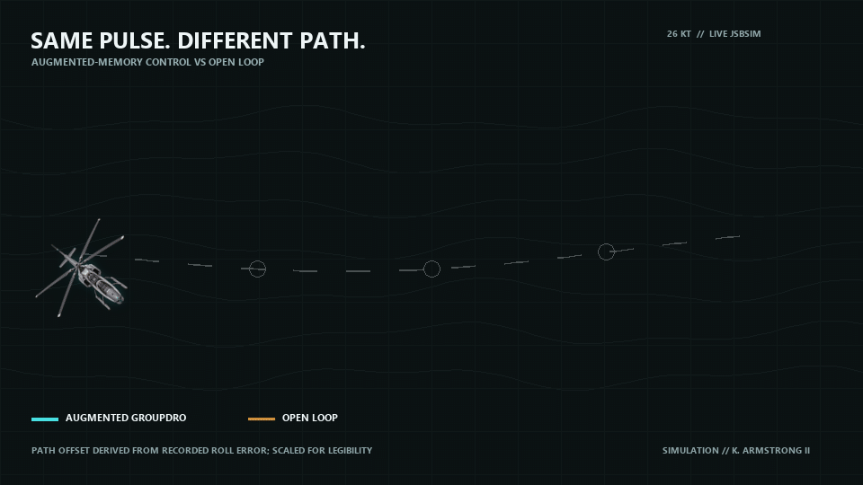
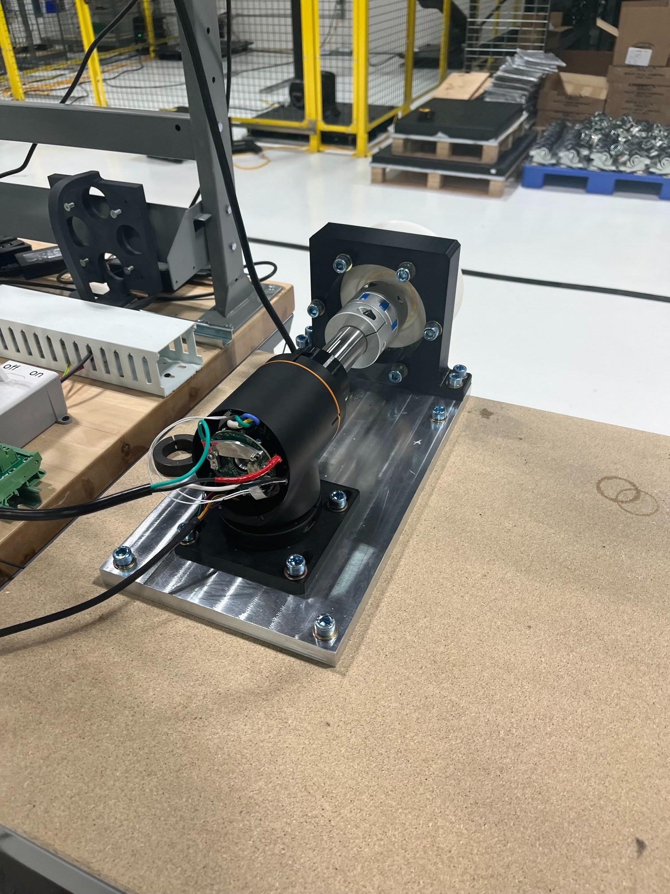
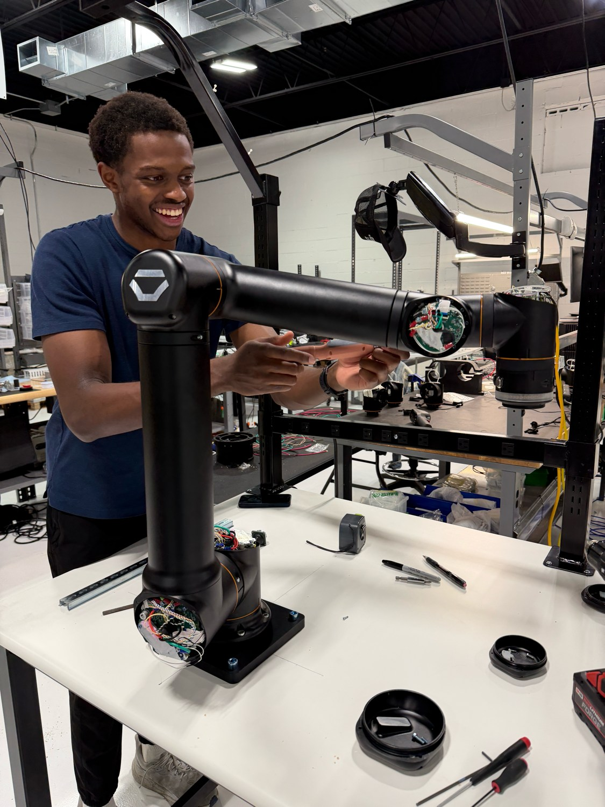

<nav class="portfolio-nav" aria-label="Portfolio navigation">
  <a class="portfolio-brand" href="#top">KA</a>
  

    <a href="#experience">Experience</a>
    <a href="#bwb">Aircraft</a>
    <a href="#rotorcraft">Research</a>
    <a href="#hycube">Flight Hardware</a>
  

</nav>

<section class="hero-compact">
  

    
UC BERKELEY · MECHANICAL ENGINEERING ’28

    <h1>Kevin Armstrong II</h1>
     
Aerospace systems, robotics hardware, and experimental aerodynamics.

    

      I build engineering systems from geometry and first-principles analysis through fabrication,
      instrumentation, and physical test.
    

    

      <a class="hero-link" href="https://www.linkedin.com/in/kevin-armstrong-ii-647125319/"
         target="_blank" rel="noopener noreferrer">LinkedIn</a>
      <a class="hero-link" href="https://mail.google.com/mail/?view=cm&amp;fs=1&amp;to=kevarm2028@berkeley.edu"
         target="_blank" rel="noopener noreferrer">Email</a>
    

  

  
</section>

<section class="experience-brief" aria-label="Experience overview">
  

    ROBOTICS HARDWARE
    <strong>Standard Bots</strong>
    
Mechanical Design &amp; Test Intern · Long Island, New York

  

  

    AEROSPACE SYSTEMS
    <strong>UMN Aerospace Systems Lab</strong>
    
Aerospace Systems Intern · HyCUBE Hypersonic Reentry Vehicle · NASA Minnesota Space Grant

  

  

    FLIGHT DYNAMICS RESEARCH
    <strong>UC Berkeley</strong>
    
Learned rotorcraft dynamics · IEEE Aerospace 2027 accepted abstract

  

</section>

<section id="featured-work" class="featured-work">
  <header class="section-heading">
    
SELECTED ENGINEERING

    <h2>Work</h2>
  </header>

  

    <a class="featured-card" href="#experience">
      

        
      

      

        MECHANICAL DESIGN + TEST
        <h3>Standard Bots</h3>
        
Industrial-robot test infrastructure, high-load interfaces, assembly, calibration, and production validation.

        <strong class="card-result">100 hr loaded burn-in</strong>
      

    </a>

    <a class="featured-card" href="#bwb">
      

        
      

      

        AIRCRAFT DESIGN + AERODYNAMICS
        <h3>Blended-Wing-Body Aircraft</h3>
        
Outer-mold-line design, CFD verification, FDM fabrication, force-balance testing, and tuft visualization.

        <strong class="card-result">14–16° stall onset</strong>
      

    </a>

    <a class="featured-card" href="#rotorcraft">
      

        
      

      

        FLIGHT DYNAMICS + ML
        <h3>Learned Rotorcraft Dynamics</h3>
        
Physics-informed force and moment models evaluated through trajectory rollout and controller-facing behavior.

        <strong class="card-result">IEEE Aerospace 2027</strong>
      

    </a>

    <a class="featured-card" href="#hycube">
      

        
      

      

        AEROSPACE SYSTEMS
        <h3>HyCUBE Reentry Vehicle</h3>
        
Flight instrumentation, calibration, payload integration, high-altitude operations, recovery, and validation.

        <strong class="card-result">~90,000 ft flight</strong>
      

    </a>
  

</section>

<section id="experience" class="case-study standardbots-case">
  <header class="case-header standardbots-header">
    

      
PROFESSIONAL EXPERIENCE · SUMMER 2026

      

        <h2>Standard Bots</h2>
        Series C industrial robotics startup
      

      
Mechanical Design &amp; Test Intern · Long Island, New York

    

  </header>

  

    Industrial robots must maintain positioning accuracy under repeated production loads, making joint reliability and validation critical to reducing downstream failures and rework.
    Designed mechanical hardware and test infrastructure for six-axis industrial robots across CAD,
    structural analysis, fabrication, assembly, instrumentation, and validation.
  

  

    

      <strong>100 hr</strong>
      automated loaded burn-in
    

    

      <strong>&gt;2.5 kN·m</strong>
      momentary interface load verified
    

    

      <strong>~75 hr</strong>
      downstream disassembly / rework avoided
    

  

  

    <figure class="figure-card">
      
      <figcaption>
        <strong>Automated loaded burn-in fixture.</strong>
        Built station used to screen joints under representative load before full robot assembly.
      </figcaption>
    </figure>

    <figure class="figure-card">
      <video class="cad-video"
             autoplay muted loop playsinline controls preload="metadata"
             poster="assets/standardbots_test_hardware.jpg">
        <source src="assets/Loaded%20Burn-in%20View%20+%20Still.mp4" type="video/mp4">
      </video>
      <figcaption>
        <strong>Exploded CAD sequence.</strong>
        Fixture architecture, coupling stack, support structure, and test-side interfaces coming together.
      </figcaption>
    </figure>
  

  

    <article>
      01
      <h3>Automated load-testing station</h3>
      

        Designed an automated pre-assembly burn-in station that applied representative load for long-duration testing,
        integrated torque and position sensing, and screened joints before complete robot assembly.
      

    </article>

    <article>
      02
      <h3>High-load dynamometer interface</h3>
      

        Designed a precision mechanical interface and checked bolted, doweled, and keyed load paths
        with hand calculations and static FEA before releasing the manufactured part.
      

    </article>

    <article>
      03
      <h3>Assembly, checkout + production support</h3>
      

        Assembled and calibrated three complete robot arms, programmed checkout motion routines,
        improved technician-facing build instructions, and trained technicians.
      

    </article>
  

  

    <figure class="figure-card assembly-photo">
      
      <figcaption>
        <strong>Assembly + calibration.</strong>
        Bringing up and validating a completed robot arm.
      </figcaption>
    </figure>

    <figure class="figure-card">
      <video autoplay muted loop playsinline controls preload="metadata"
             poster="assets/standardbots_motion_poster.jpg">
        <source src="assets/standardbots_motion_routine.mp4" type="video/mp4">
      </video>
      <figcaption>
        <strong>Checkout routine.</strong>
        Arm executing a motion routine I programmed while bringing up the completed assembly.
      </figcaption>
    </figure>
  

</section>

<section id="bwb" class="case-study">
  <header class="case-header split">
    

      <h2>Blended-Wing-Body Aircraft Design &amp; Aerodynamic Validation</h2>
      
Outer-mold-line design · CFD verification · FDM fabrication · force-balance testing · tuft flow visualization

    

    <a class="text-link" href="assets/BWB_Project_Showcase_Tufts%20(4).html">Full technical showcase ↗</a>
  </header>

  <figure class="case-hero">
    
  </figure>

  

    

      <strong>−2° → 20°</strong>
      wind-tunnel test envelope
    

    

      <strong>14–16°</strong>
      stall onset
    

    

      <strong>3.36 N</strong>
      peak normal force at 18°
    

    

      <strong>7.31</strong>
      peak CFD L/D at 6°
    

  

  

    Blended-wing-body aircraft integrate the wing and fuselage into a single lifting form, reducing drag and offering significant fuel-burn potential over conventional tube-and-wing aircraft.
    I designed a custom blended-wing-body outer mold line in SOLIDWORKS, established a repeatable pre-stall CFD workflow,
    fabricated a 1:1 FDM model, and extended the physical test campaign through 20° angle of attack to characterize the stall sequence.
  

  

    

      01 / DESIGN
      <h3>From cross-sections to a physical test article</h3>
      

        A multi-section loft with guide curves blends a custom centerbody into the outer panels.
        The geometry moved directly from CAD into simulation, FDM fabrication, and wind-tunnel testing.
      

    

    

      <figure class="figure-card bwb-geometry-card bwb-sketch-card">
        
        <figcaption><strong>Geometry definition.</strong> Cross-sections and guide curves used to shape the BWB outer mold line.</figcaption>
      </figure>
      <figure class="figure-card bwb-geometry-card bwb-loft-card">
        
        <figcaption><strong>SOLIDWORKS loft definition.</strong> Multi-section loft and guide-curve setup used to generate the final outer mold line.</figcaption>
      </figure>
    

  

  

    

      02 / CFD
      <h3>Checked numerical sensitivity before using the sweep for design conclusions</h3>
      

        Steady external-flow cases covered −2° to +8° at 40 mph.
        A domain study at 4° changed CL by 0.17% and CD by 0.43%;
        medium-to-fine mesh refinement changed CL by 1.25% and CD by 0.37%.
      

    

    <figure class="figure-card wide-figure bwb-cfd-overview">
      
      <figcaption><strong>CFD field comparison.</strong> Streamwise-velocity and surface-pressure views compared at 0°, 4°, and 8° angle of attack.</figcaption>
    </figure>

    

      

        DOMAIN SENSITIVITY
        <strong>ΔCL = 0.17%</strong>
        <small>ΔCD = 0.43% at 4°</small>
      

      

        MESH REFINEMENT
        <strong>ΔCL = 1.25%</strong>
        <small>ΔCD = 0.37% from medium → fine</small>
      

      

        CONVERGENCE CHECK
        <strong>100+ iterations</strong>
        <small>beyond solver-goal convergence</small>
      

    

  

  

    

      03 / TEST
      <h3>Extended the experiment beyond the CFD range to capture stall</h3>
      

        The tunnel sweep ran from −2° through 20° using a three-component balance, wind-off tare,
        point-by-point dynamic-pressure correction, and 25 Hz acquisition.
        Stall onset appears around 14–16°; normal force peaks at 3.36 N at 18° and falls only about 1% by 20°.
      

    

    

      <figure class="figure-card bwb-performance-plot">
        
        <figcaption>Pre-stall CFD sweep.</figcaption>
      </figure>
      <figure class="figure-card bwb-performance-plot">
        
        <figcaption>Wind-tunnel run through 20°.</figcaption>
      </figure>
    

  

  

    

      04 / UNDERSTAND
      <h3>The force balance showed when stall began; tufts showed where it began</h3>
      

        Tufts show the centerbody becoming disturbed before the outer panels.
        At 14–16° the inboard flow is clearly separated while the tips remain partially attached,
        matching the gradual roll-over in the force data.
      

    

    

      <figure>
        
        <figcaption><strong>0–4°</strong>Attached baseline</figcaption>
      </figure>
      <figure>
        
        <figcaption><strong>6–10°</strong>Inboard disturbance</figcaption>
      </figure>
      <figure>
        
        <figcaption><strong>14–16°</strong>Centerbody separation</figcaption>
      </figure>
      <figure>
        
        <figcaption><strong>18–20°</strong>Progressive post-stall</figcaption>
      </figure>
    

  

  

    <article>
      01
      <h3>Progressive stall onset</h3>
      
Force and tuft evidence converge on a 14–16° onset window.

    </article>
    <article>
      02
      <h3>Peak CFD efficiency at 6°</h3>
      
Within the simulated range, L/D peaks at 7.31 before drag growth overtakes lift growth.

    </article>
    <article>
      03
      <h3>Moment changes before peak normal force</h3>
      
Pitching moment turns before the normal-force peak, consistent with loading redistribution near stall.

    </article>
    <article>
      04
      <h3>Outer panels remain partly attached</h3>
      
Tip tufts stay partly ordered through 20°, explaining the soft force roll-over.

    </article>
  

  

    
Technical appendix — current CFD coefficient sweep

    

      

        <table>
          <thead>
            <tr><th>AoA</th><th>CL</th><th>CD</th><th>L/D</th></tr>
          </thead>
          <tbody>
            <tr><td>−2°</td><td>−0.0414</td><td>0.0283</td><td>−1.46</td></tr>
            <tr><td>0°</td><td>0.0586</td><td>0.0272</td><td>2.15</td></tr>
            <tr><td>2°</td><td>0.1612</td><td>0.0307</td><td>5.25</td></tr>
            <tr><td>4°</td><td>0.2598</td><td>0.0373</td><td>6.97</td></tr>
            <tr><td>6°</td><td>0.3554</td><td>0.0486</td><td><strong>7.31</strong></td></tr>
            <tr><td>8°</td><td>0.4473</td><td>0.0644</td><td>6.95</td></tr>
          </tbody>
        </table>
      

      

        <a href="assets/BWB_CFD_Summary_.pdf">CFD summary PDF ↗</a>
        <a href="assets/BWB_Project_Showcase_Tufts%20(4).html">Full project showcase ↗</a>
      

    

  

</section>

<section id="rotorcraft" class="case-study compact-case">
  <header class="case-header split">
    

      
RESEARCH · FLIGHT DYNAMICS

      <h2>Learned Rotorcraft Dynamics for Controller-Facing Simulation</h2>
      
Physics-informed force/moment modeling · nonlinear 6-DOF rollout · local stability · LQR tracking

    

    IEEE Aerospace 2027 · Accepted
  </header>

  

    

      

        Rotorcraft are dynamically complex and often inherently unstable, making accurate, control-ready models essential for simulation and flight-control design.
        I am developing physics-informed AH-1S rotorcraft surrogates that learn aerodynamic force and moment maps
        while retaining the nonlinear rigid-body equations of motion. The research asks whether a learned model
        preserves controller-facing behavior under rollout, local linearization, and feedback tracking—not only whether
        it matches one-step data.
      

      

        <article>
          01
          <h3>Physics-informed 6-DOF simulator</h3>
          

            Built a PyTorch/JSBSim pipeline coupling learned force/moment maps to nonlinear rigid-body dynamics
            across 56 maneuver trajectories, 8 aircraft states, and multiple speed regimes.
          

        </article>

        <article>
          02
          <h3>Rollout + local differential fidelity</h3>
          

            A past-12 temporal model cut held-out rollout geomean RMSE from 0.06498 to 0.02293 (64.7%);
            GroupDRO reduced mean locally unstable-mode incidence from 0.771 to 0.302 (60.8%).
          

        </article>

        <article>
          03
          <h3>Controller-facing validation</h3>
          

            Developed local A/B Jacobian, eigenmode, and paired LQR tracking tests across 27 cases;
            leading variants achieved about 0.91× baseline tracking error with no observed divergence in nonideal tests.
          

        </article>
      

      

        <strong>Accepted abstract:</strong>
        “From Accurate Predictions to Controller-Facing Learned Rotorcraft Surrogates: Stability &amp; Tracking.”
      

    

    <figure class="figure-card rotorcraft-figure">
      
      <figcaption>
        <strong>Same-pulse trajectory response.</strong>
        Augmented-memory GroupDRO and open-loop dynamics receive the same control pulse but produce different flight paths, exposing controller-facing differences that one-step prediction error alone does not capture.
</figcaption>
    </figure>
  

</section>

<section id="hycube" class="case-study compact-case">
  <header class="case-header">
    

      
NASA MINNESOTA SPACE GRANT · UMN SMALL SATELLITE PROGRAM

      <h2>HyCUBE Hypersonic Reentry Vehicle</h2>
      
Thermal instrumentation · calibration · payload integration · high-altitude flight operations

    

  </header>

  

    <figure class="figure-card">
      
      <figcaption><strong>High-altitude flight.</strong> HyCUBE payload during the balloon mission.</figcaption>
    </figure>

    <figure class="figure-card">
      
      <figcaption><strong>Mission architecture.</strong> Balloon ascent, release, reentry experiment, and Iridium data return.</figcaption>
    </figure>
  

  

    

      

        Hypersonic entry exposes vehicles to extreme aerothermal heating, making reliable temperature measurements essential for validating thermal-protection-system performance.
        Built, wired, and programmed a thermocouple calibration rig for flight instrumentation,
        then characterized probe configurations against a reference and supported payload integration,
        high-altitude flight operations, recovery, and post-flight validation.
      

      <ul class="clean-list">
        <li>
          Used Arduino DAQ and cold-junction compensation to characterize probe configurations
          from 50–155°C using regression and agreement analysis.
        </li>
        <li>
          Integrated and secured payload hardware, tracked telemetry and state estimates over the Iridium satellite network
          to approximately 90,000 ft, recovered the payload, and validated post-flight data.
        </li>
      </ul>

      

        

          <strong>50–155°C</strong>
          probe characterization range
        

        

          <strong>~90,000 ft</strong>
          high-altitude flight and recovery
        

      

    

    <figure class="figure-card hycube-plot-card">
      
      <figcaption><strong>Calibration validation.</strong> Parity and residual error across the 50–155°C probe-characterization range.</figcaption>
    </figure>

    <figure class="figure-card hycube-ground-photo">
      
      <figcaption><strong>Preflight integration.</strong> Securing payload hardware before balloon release.</figcaption>
    </figure>

    <figure class="figure-card hycube-plot-card secondary">
      
      <figcaption><strong>Agreement + sensitivity.</strong> Bias, limits of agreement, and fitted sensitivity across probe configurations.</figcaption>
    </figure>
  

</section>

<section id="drone" class="case-study compact-case">
  <header class="case-header">
    

      
MECHANICAL INTEGRATION · AERODYNAMIC ANALYSIS · FLIGHT TEST

      <h2>Drone Seed-Dispersal Attachment</h2>
      
CAD · DfAM · CFD analysis · mechanical integration · loaded flight testing

    

  </header>

  

    <figure class="figure-card drone-cad-card">
      
      <figcaption><strong>Integrated CAD.</strong> ABS-printed hopper/body, mounting interface, and service-access geometry.</figcaption>
    </figure>
    <figure class="figure-card drone-flight-card">
      
      <figcaption><strong>Loaded flight validation.</strong> Complete attachment mounted under the DJI quadcopter during indoor testing.</figcaption>
    </figure>
  

  

    
<strong>15 mph</strong>CFD forward-flight condition

    
<strong>3.94 N</strong>predicted drag

    
<strong>0.926 N</strong>predicted lift

    
<strong>−0.044 N</strong>predicted side force

  

  

    

      

        External payloads can alter an aircraft’s mass distribution, aerodynamics, stability, and controllability, so drone attachments must be engineered as part of the flight vehicle.
        On a four-person team, I owned mounting placement, aerodynamic outer geometry, maintenance access,
        and DfAM for a 418 g ABS-printed seed-dispersal attachment, then validated retention and aircraft integration
        on a DJI quadcopter through loaded flight testing.
      

      

        The attachment combined a gravity-fed hopper/ramp with a belt-driven dispensing mechanism.
        The drivetrain used a 4.875:1 HTD reduction (16T → 78T), printed pulleys, interference-fit bearings,
        and a custom shaft/bearing stack packaged beneath the hopper.
      

      

        I ran a 15 mph CFD study that predicted 3.94 N drag, 0.926 N lift, and −0.044 N side force,
        then redesigned the leading edge from flat to curved to reduce simulated flow separation and improve
        aerodynamic integration before final flight testing.
      

    

    <figure class="figure-card drone-cfd-pair">
      

        
        
      

      <figcaption><strong>15 mph CFD.</strong> Pressure and velocity fields used to quantify loads and drive the leading-edge redesign.</figcaption>
    </figure>
  

</section>

<footer class="portfolio-footer">
  Kevin Armstrong II · UC Berkeley Mechanical Engineering
  

    <a href="https://mail.google.com/mail/?view=cm&amp;fs=1&amp;to=kevarm2028@berkeley.edu"
       target="_blank" rel="noopener noreferrer">Email</a>
    <a href="https://www.linkedin.com/in/kevin-armstrong-ii-647125319/"
       target="_blank" rel="noopener noreferrer">LinkedIn</a>
  

</footer>
