

I'm a mechanical engineering student-athlete at UC Berkeley building toward a career in hardware and aerospace. As a sophomore, I have run a full design-to-test pipeline on a custom aircraft, built physics-informed neural dynamics models in the Mofrad Lab, designed and GD&T-toleranced a flight-tested drone attachment, and validated sensor instrumentation for a flight-critical payload through NASA Space Grant. I care about work that closes the loop between CAD, simulation, fabrication, and physical test: hardware that actually gets built and validated.

<strong>Mechanical Design</strong> • <strong>Hardware Integration</strong> • <strong>GD&T and Tolerancing</strong> • <strong>Physical Validation</strong> • <strong>Applied ML for Physical Systems</strong>

<table style="width:100%; border-collapse:separate; border-spacing:18px 16px; table-layout:fixed;">
  <tr>
    <td style="vertical-align:top;">
      
      

        <a href="#concept-aircraft-hardware-design-fabrication-and-physical-test" class="card-title"><strong>Concept Aircraft: Design, Build and Test</strong></a> 
        Full design-to-manufacture pipeline: SolidWorks CAD, FDM fabrication, force-balance testing, and tuft flow instrumentation.
      

    </td>
    <td style="vertical-align:top;">
      <a href="#drone-mechanical-integration-cad-gdandt-and-flight-tested-hardware">
        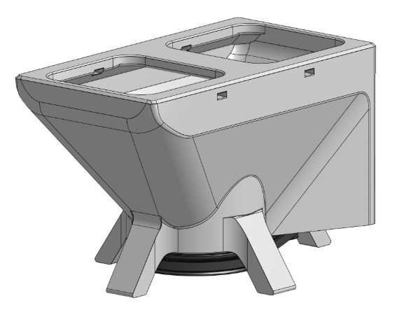
      </a>
      

        <a href="#drone-mechanical-integration-cad-gdandt-and-flight-tested-hardware" class="card-title"><strong>Drone Mechanical Integration</strong></a> 
        SolidWorks CAD, GD&T drawing package, DfAM, CFD-validated geometry, and flight-tested hardware.
      

    </td>
  </tr>
  <tr>
    <td style="vertical-align:top;">
      <a href="#hycube-flight-instrumentation-and-sensor-validation">
        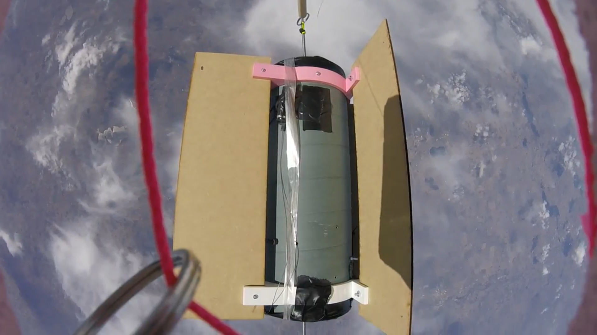
      </a>
      

        <a href="#hycube-flight-instrumentation-and-sensor-validation" class="card-title"><strong>HyCUBE Flight Instrumentation</strong></a> 
        Sensor calibration, hardware integration, and flight-readiness validation for a NASA-supported reentry payload.
      

    </td>
  <td style="vertical-align:top;">
    <a href="#wind-turbine-design-build-test">
      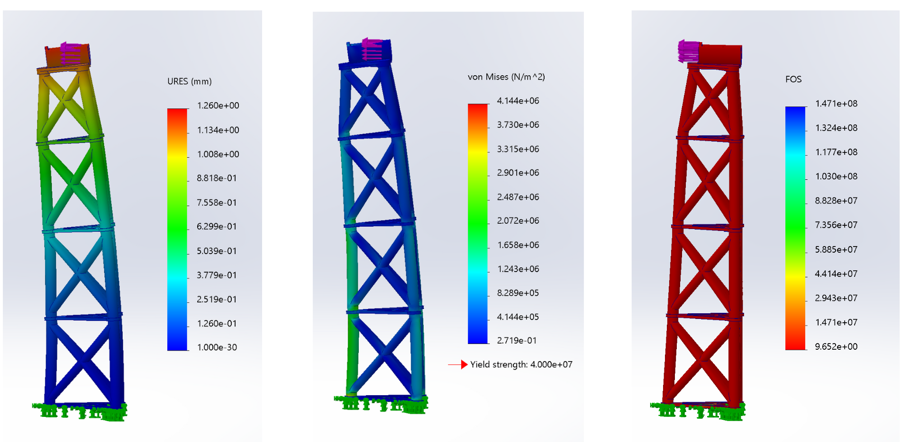
    </a>
    

      <a href="#wind-turbine-design-build-test" class="card-title"><strong>Wind Turbine Design-Build-Test</strong></a> 
      Structural FEA, blade CAD, wind-tunnel testing, and power characterization; ranked #1 of 40 teams.
    

  </td>
  </tr>
</table>

<em>Selected work in mechanical design, hardware integration, GD&T tolerancing, sensor validation, and physics-informed machine learning.</em>

## Explore Projects
- [Concept Aircraft: Hardware Design, Fabrication and Physical Test](#concept-aircraft-hardware-design-fabrication-and-physical-test)
- [Drone Mechanical Integration: CAD, GD&T and Flight-Tested Hardware](#drone-mechanical-integration-cad-gdandt-and-flight-tested-hardware)
- [HyCUBE: Flight Instrumentation and Sensor Validation](#hycube-flight-instrumentation-and-sensor-validation)
- [Wind Turbine: Design-Build-Test](#wind-turbine-design-build-test)
- [FlyNet: Physics-Informed Neural Dynamics Modeling](#flynet-physics-informed-neural-dynamics-modeling)
- [Additional Projects](#additional-projects)
  - [Post-Stroke Imaging Triage](#post-stroke-imaging-triage)
  - [Agent-Based Biofilm Modeling](#agent-based-biofilm-modeling)
  - [Reliability-First Trading Automation](#reliability-first-trading-automation)

---

## Concept Aircraft: Hardware Design, Fabrication and Physical Test

**SolidWorks CAD · DfAM-Optimized FDM Fabrication · Wind Tunnel Force-Balance Testing · Flow Visualization Instrumentation**

  <strong>AoA sweep:</strong> −2° to +20° &nbsp;·&nbsp;
  <strong>V∞:</strong> ≈ 40 mph &nbsp;·&nbsp;
  <strong>Re:</strong> ≈ 5.6 × 10⁴ &nbsp;·&nbsp;
  <strong>Testing:</strong> EWT 3-component balance &nbsp;·&nbsp;
  <strong>Blockage:</strong> 5.0%

I designed a custom blended-wing-body aircraft geometry, fabricated a 1:1 FDM model with DfAM decisions built into the surface and sting-mount geometry, and ran a full physical test campaign with simultaneous force-balance data acquisition and tuft flow visualization on the EWT three-component balance. The project is a complete design-to-manufacture-to-test loop executed independently.

### Design-to-fabrication-to-test pipeline

  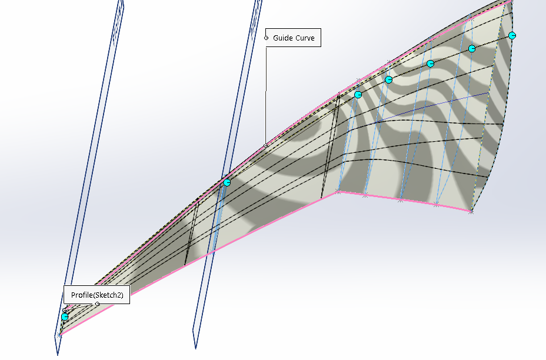
  &nbsp;&nbsp;
  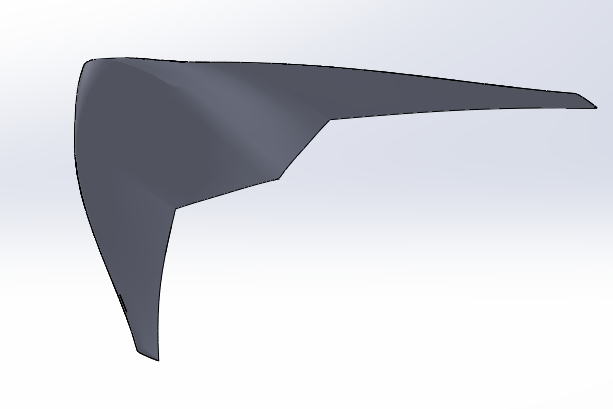
  &nbsp;&nbsp;
  

<em>Left to right: concept sketch, SolidWorks multi-section surface loft, and 1:1 FDM model installed on the EWT three-component balance sting.</em>

### Physical Test Campaign

The wind tunnel test used a three-component force balance to capture normal force, axial force, and pitching moment simultaneously. I instrumented the setup for 25 Hz multi-channel data acquisition with wind-off tare correction and real-time pressure correction applied at each angle-of-attack point. I extended the sweep 12° beyond the CFD-characterized range to map the full post-stall regime, the region where CFD cannot reliably predict behavior and physical testing adds the most value.

**Key hardware and test results**

- Force-balance data and CFD predictions agreed well through the 8° pre-stall range, validating the simulation setup against physical hardware.
- Gradual stall onset confirmed at **14 to 16°** by normal-force slope collapse and pitching-moment sign reversal.
- **Peak normal force: 3.36 N at 18°**, dropping only 1% at 20°, indicating progressive spanwise separation rather than a sudden full-span stall, a result that only becomes visible in physical test.
- Pitching moment peaked before normal force (16° vs 18°), identifying an aerodynamic-center shift that has real consequences for control system design.
- Zero-lift angle: approximately −1.5° to −2°, consistent with the cambered geometry.

### Aerodynamic Data Summary

  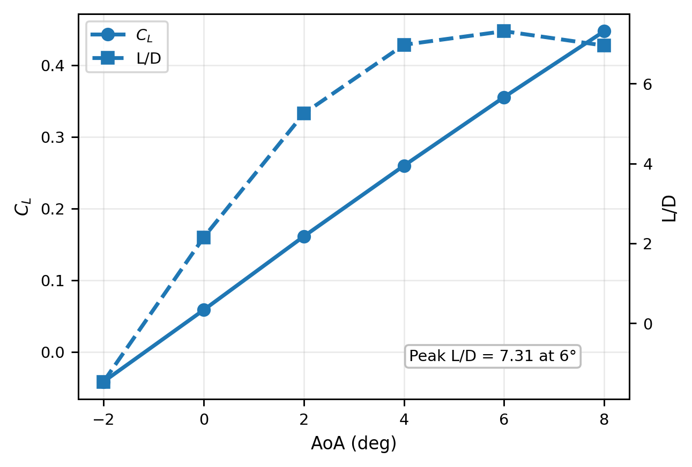
  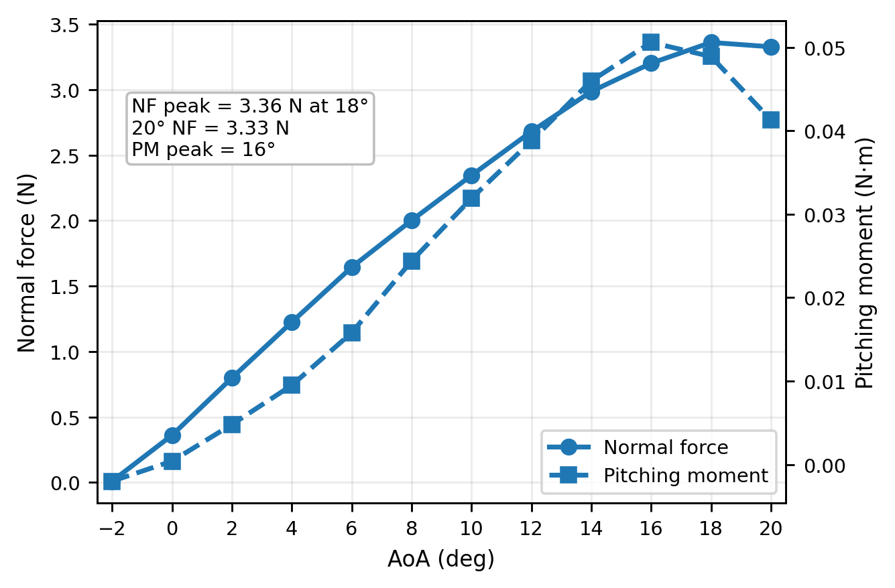

<em>Left: pre-stall CFD sweep from −2° to 8° AoA used for design validation. Right: physical wind-tunnel sweep from −2° to 20° AoA (Run 4, after flow visualization), extending into the post-stall regime.</em>

### Tuft Flow Visualization: Surface Instrumentation

I attached yarn tufts (roughly 7 mm, spaced at approximately 12% chord) to the upper surface and recorded separation behavior from above at each AoA. This is a direct hardware observation technique: the tufts respond to local surface flow and make separation progression visible without requiring pressure taps or a more complex sensor array.

**Main finding: separation initiates at the centerbody and progresses outward.** The outer panels remain partially attached after centerbody stall begins. That progressive behavior explains the gradual force-curve rollover and has direct implications for how a control system would need to respond.

<table style="width:100%; border-collapse:separate; border-spacing:12px 0; table-layout:fixed;">
  <tr>
    <td style="width:25%; vertical-align:top; text-align:center; border:1px solid #d1d5db; padding:10px;">
      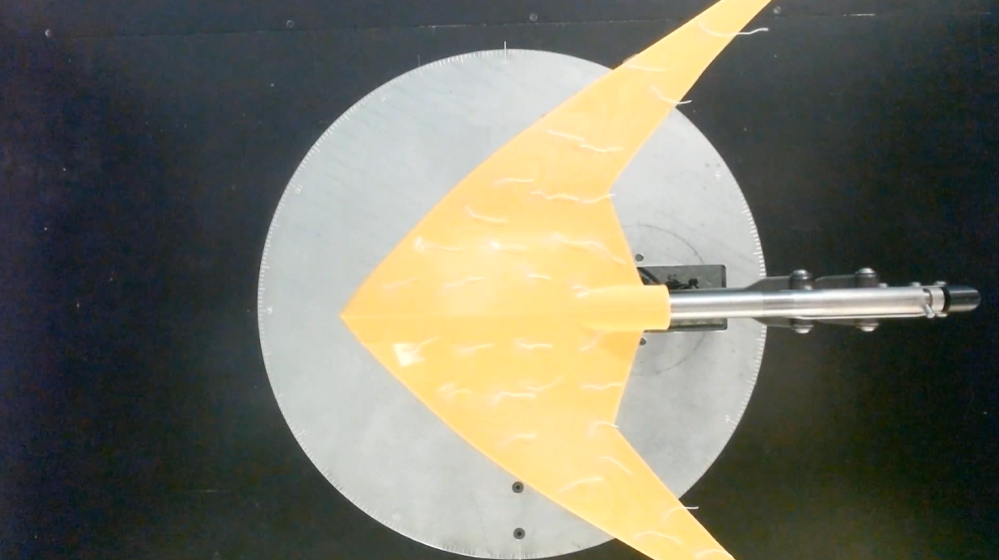
      
<em>0 to 4°: fully attached. Tufts stream rearward across the whole surface.</em>

    </td>
    <td style="width:25%; vertical-align:top; text-align:center; border:1px solid #d1d5db; padding:10px;">
      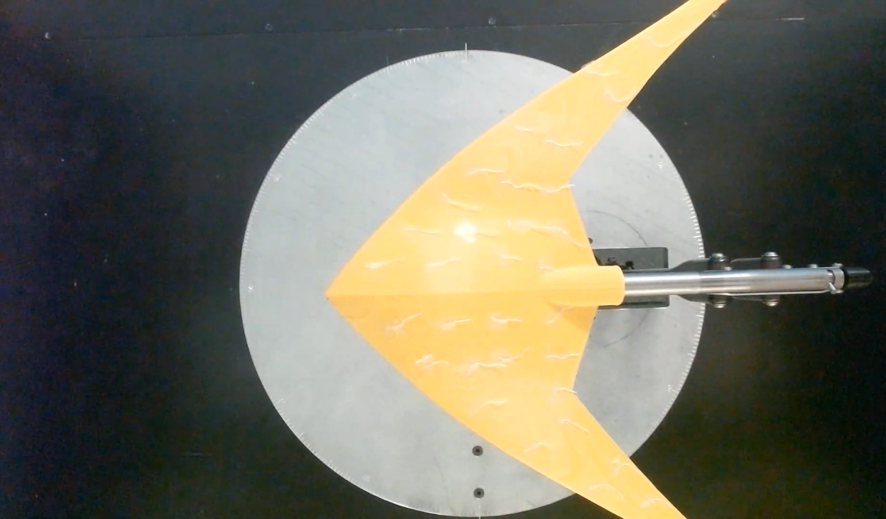
      
<em>6 to 10°: centerbody tufts begin to deflect laterally. Outer panel remains clean.</em>

    </td>
    <td style="width:25%; vertical-align:top; text-align:center; border:1px solid #d1d5db; padding:10px;">
      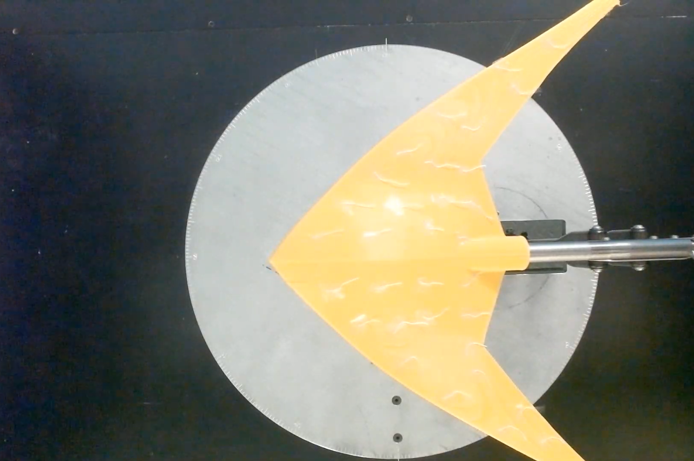
      
<em>14 to 16°: centerbody tufts disordered. Outer-panel tufts deflect but do not fully reverse.</em>

    </td>
    <td style="width:25%; vertical-align:top; text-align:center; border:1px solid #d1d5db; padding:10px;">
      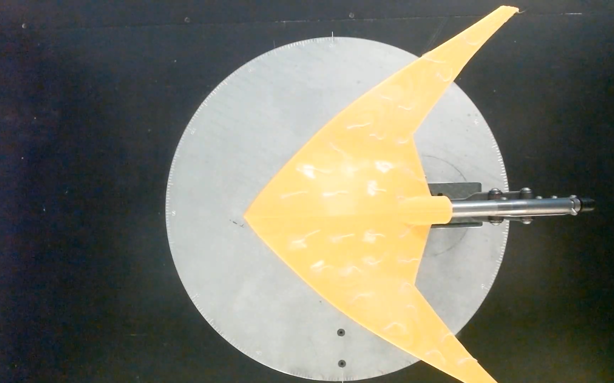
      
<em>18 to 20°: widespread centerbody separation. Wingtip tufts remain partially ordered.</em>

    </td>
  </tr>
</table>

### CFD: Pre-Build Simulation for Design Validation

Steady-state SolidWorks Flow Simulation swept −2° to +8° AoA at V∞ = 40 mph before fabrication, giving a predicted performance envelope to compare against physical test results. Mesh and domain sensitivity studies were run to verify the simulation was not producing resolution-dependent outputs.

  

<em>Pre-fabrication CFD sweep: streamwise velocity cut planes and surface pressure maps at 0°, 4°, and 8° AoA.</em>

**Simulation verification**

- Domain independence at α = 4°: ΔC_L = +0.17%, ΔC_D = +0.43%.
- Mesh independence at α = 4°: medium-to-fine ΔC_L ≈ 1.25%, ΔC_D ≈ 0.37%.

### Resources
- [Project Executive summary (HTML)](assets/BWB_Project_Showcase_Tufts%20%284%29.html)
- [CFD Summary (PDF)](assets/BWB_CFD_Summary_.pdf)

---

## Drone Mechanical Integration: CAD, GD&T and Flight-Tested Hardware

**Mechanism Design · SolidWorks CAD · GD&T Drawing Package · DfAM · CFD Validation · Closed-Circuit Flight Test**

  <strong>Material:</strong> ABS, FDM &nbsp;·&nbsp;
  <strong>Projection:</strong> Third angle &nbsp;·&nbsp;
  <strong>Validation:</strong> CAD review, GD&T drawing package, CFD study, and closed-circuit flight test

<table style="width:70%; margin:0 auto; border-collapse:separate; border-spacing:14px 0; table-layout:fixed;">
  <tr>
    <td style="width:50%; vertical-align:middle; text-align:center;">
      
    </td>
    <td style="width:50%; vertical-align:middle; text-align:center;">
      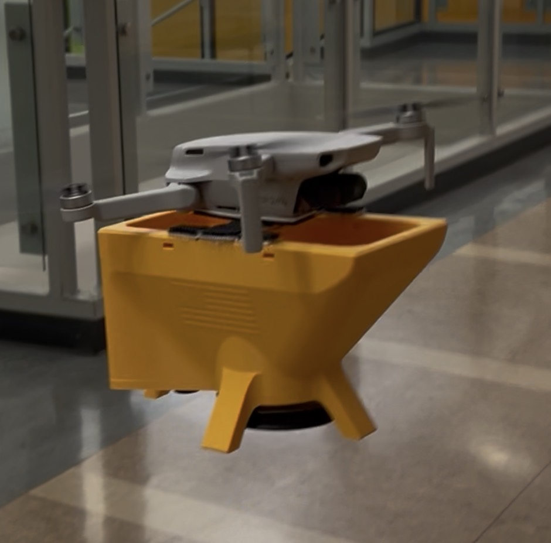
    </td>
  </tr>
</table>

  <em>Left: SolidWorks CAD render of the attachment. Right: closed-circuit flight test with the attachment mounted, loaded, and running.</em>

In a team project, we designed, manufactured, and flight-tested a motor-driven, gravity-fed attachment that mounts under a quadcopter. The project combined CAD, DfAM, GD&T documentation, drive-system integration, CFD analysis, mounting/interface problem-solving, and physical flight testing. My main technical ownership was the <strong>CFD aerodynamic validation study</strong>, and I also contributed to integration work by helping resolve the drone-attachment mounting approach and drafting an initial internal component layout for the enclosure.

**What I contributed**

- Owned the forward-flight CFD validation study at 15 mph to characterize drag, lift, side force, and external-flow behavior before final hardware review.
- Interpreted the CFD results in vehicle-level terms, especially the near-zero side force result, which indicated the attachment was unlikely to introduce meaningful yaw-control issues.
- Helped resolve the drone-attachment mounting problem after early integration issues, identifying a more workable mounting approach so the system could be secured and flown during closed-circuit testing.
- Drafted an initial internal component layout for the enclosure to explore packaging constraints, component clearance, and how the drive system could fit inside the available volume.
- Connected simulation results to the physical test program by framing CFD as a design-validation step before closed-circuit flight testing.
- Supported the final engineering review by communicating aerodynamic loads, mounting constraints, and CFD findings alongside the team’s CAD, GD&T, drive-system, and flight-test work.

### GD&T Drawing Package

  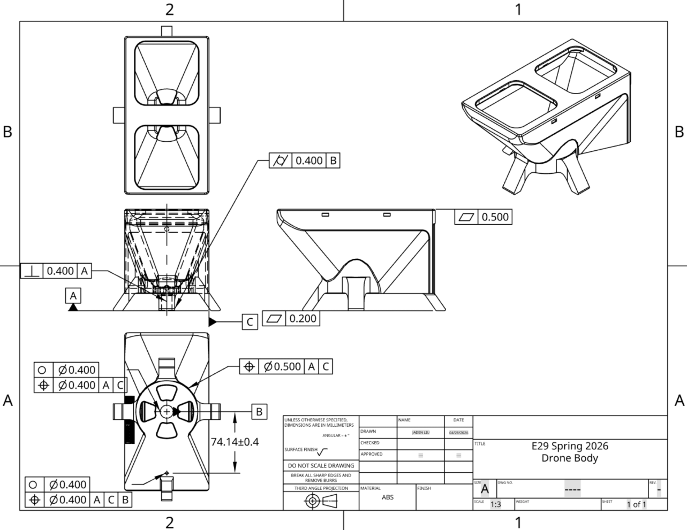

  <em>Team GD&T drawing package for the E29 drone body. The drawing controlled key datum surfaces, mounting features, motor-bore geometry, and structural interfaces needed for manufacturing and assembly.</em>

### Drive System

  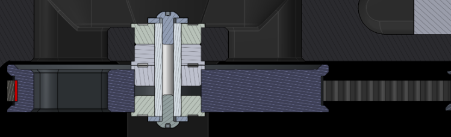

  <em>Team drive-system cross-section showing the 4.875:1 pulley reduction, HTD belt, bearing stack, and custom machined shaft.</em>

- **4.875:1 pulley reduction** from 16t to 78t with a 100T HTD belt.
- Pulleys printed on Markforged X7 for high-strength fiber-reinforced construction.
- Custom machined aluminum shaft with 4-40 tap.
- Interference-fit bearings and pinion press fit onto the motor shaft.

### CFD Aerodynamic Validation

  <strong>CFD condition:</strong> V∞ = 15 mph forward flight &nbsp;·&nbsp;
  <strong>Drag:</strong> 3.94 N &nbsp;·&nbsp;
  <strong>Lift:</strong> 0.926 N &nbsp;·&nbsp;
  <strong>Side force:</strong> −0.044 N

<table style="width:82%; margin:0 auto; border-collapse:separate; border-spacing:18px 0; table-layout:fixed;">
  <tr>
    <td style="width:50%; vertical-align:top; text-align:center; border:1px solid #d1d5db; border-radius:12px; padding:12px; background:#ffffff;">
      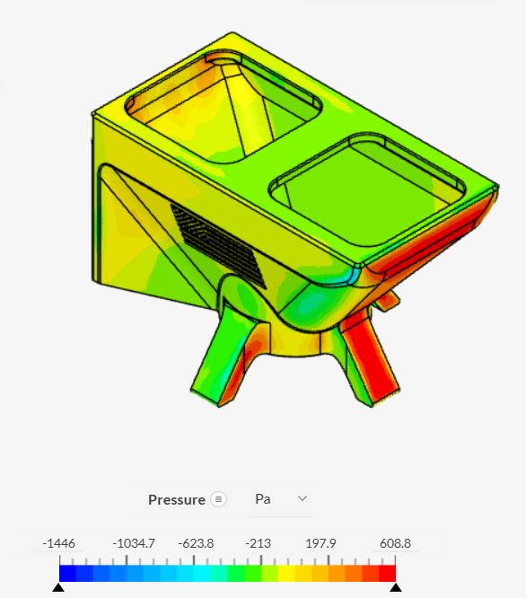
      

        <em>Static pressure distribution used to identify high-load regions and external-flow behavior.</em>
      

    </td>

  <td style="width:50%; vertical-align:top; text-align:center; border:1px solid #d1d5db; border-radius:12px; padding:12px; background:#ffffff;">
      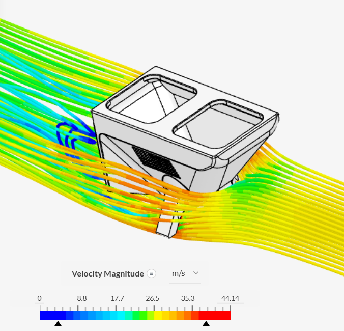
      

        <em>Velocity field from the 15 mph forward-flight CFD study used to validate the external geometry before production.</em>
      

    </td>
  </tr>
</table>

<table align="center">
  <thead>
    <tr>
      <th>Result</th>
      <th>Value</th>
      <th>Engineering meaning</th>
    </tr>
  </thead>
  <tbody>
    <tr>
      <td>Drag force</td>
      <td>3.94 N</td>
      <td>Primary aerodynamic load on the vehicle; important for motor margin and flight performance.</td>
    </tr>
    <tr>
      <td>Lift force</td>
      <td>+0.926 N</td>
      <td>Partially offsets attachment weight; favorable for hover and forward-flight efficiency.</td>
    </tr>
    <tr>
      <td>Side force</td>
      <td>−0.044 N</td>
      <td>Near-zero lateral loading, indicating the attachment should not meaningfully disturb yaw control.</td>
    </tr>
  </tbody>
</table>

CFD was used as a design-validation step before final flight testing, not just as a post-project visualization. The key result was that the attachment generated measurable drag but almost no side force, supporting the conclusion that the geometry was aerodynamically acceptable for closed-circuit flight testing.

---

## HyCUBE: Flight Instrumentation and Sensor Validation

**Sensor Calibration · Hardware Integration · Telemetry Validation · Payload Operations**
*NASA Space Grant, hypersonic reentry payload*

  
  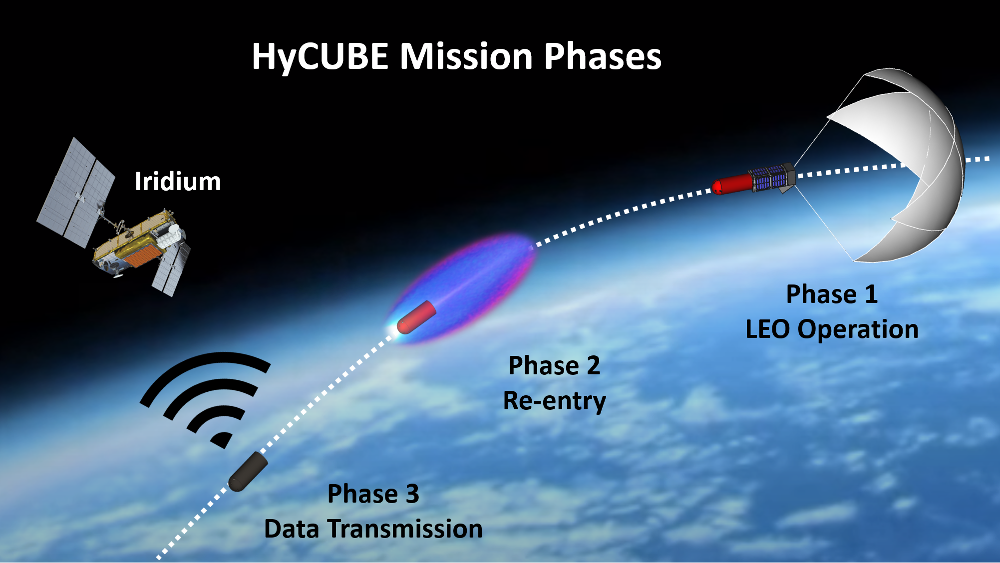

<em>HyCUBE payload in high-altitude flight and mission profile for the ballistic reentry experiment.</em>

  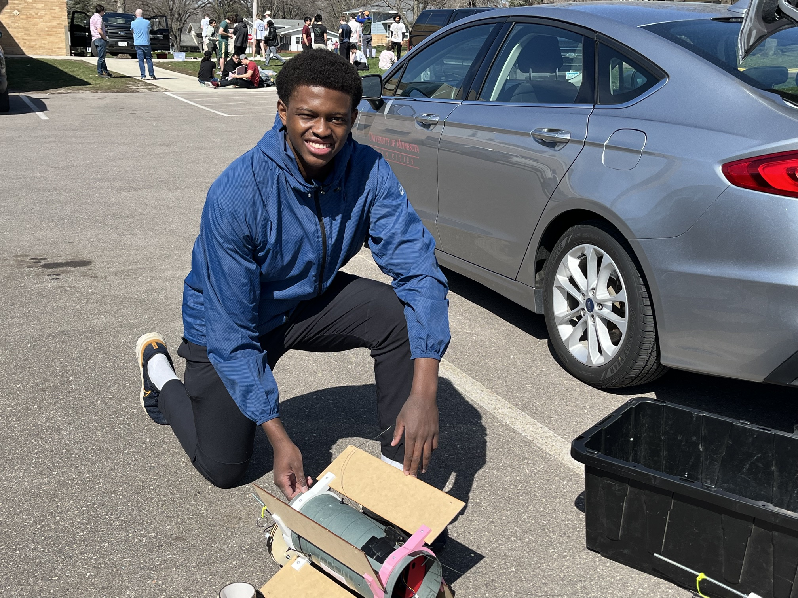
  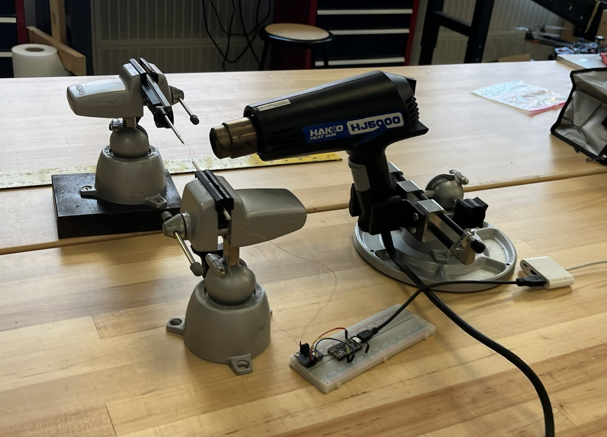

<em>Left: payload integration before balloon release. Right: thermocouple calibration rig with a controlled heat source and measurement circuit.</em>

Instrumentation that isn't calibrated isn't useful. I built the thermocouple calibration and validation pipeline for HyCUBE, converting raw sensor logs into calibration fits, error boundary plots, and review-ready validation figures. The output of this work was a documented flight-readiness determination for the thermal sensing subsystem.

**What I built and validated**

- Designed and implemented a multi-sensor calibration workflow in Python and Arduino, including cold-junction compensation and regression-based sensitivity models for each probe configuration.
- Verified sensor agreement against a reference standard, producing parity plots and Bland-Altman agreement plots to characterize bias and error bounds across the operating temperature range.
- Generated review-ready validation figures and summary tables used in the flight-readiness decision process.
- Supported the full payload integration and launch sequence: mechanical installation, ground-station setup, real-time monitoring, recovery operations to approximately 90,000 ft, and post-flight telemetry validation.

  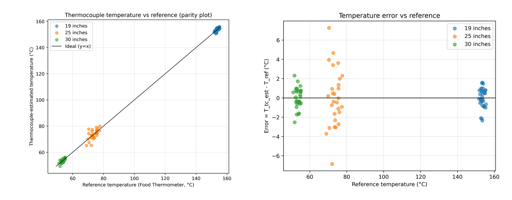

<em>Validation output: thermocouple temperature versus reference and error versus reference temperature across three probe lengths.</em>

  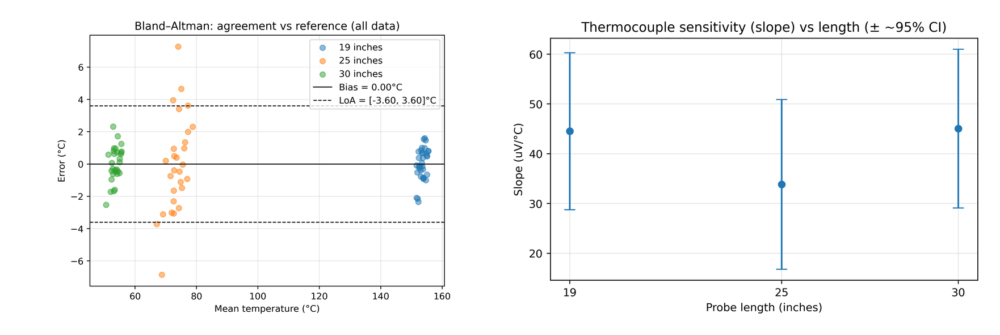

<em>Bland-Altman agreement plot and sensitivity (slope) versus probe length, used to characterize instrumentation behavior before flight.</em>

---

## Wind Turbine: Design-Build-Test

**Rapid Prototyping · Blade Design · Wind-Tunnel Testing · Power Characterization · Structural FEA · CAD Validation**

  <strong>Result:</strong> #1 of 40 teams in measured electrical power output &nbsp;·&nbsp;
  <strong>Team size:</strong> 4 &nbsp;·&nbsp;
  <strong>Constraints:</strong> Manufacturability, structural integrity, and wind-tunnel performance limits

In a four-person design-build-test project, we developed a small-scale wind turbine from blade geometry research through CAD, fabrication, structural validation, and wind-tunnel testing. Our turbine ranked **#1 of 40 teams** in measured electrical power output. The project required balancing aerodynamic performance, printability, tower stiffness, hub/blade strength, and measurement repeatability into one working hardware system.

**What I owned**

- Led power characterization and measurement: designed the test procedure, collected voltage and current data at each operating point, and converted raw measurements into comparable power curves used to evaluate design changes.
- Researched blade geometry trade-offs including swept area, chord distribution, manufacturability, and twist-angle behavior under the project constraints.
- Built and reviewed CAD models of the rotor/blade geometry before fabrication to check blade shape, hub fit, and assembly feasibility.
- Ran structural FEA to evaluate displacement, Von Mises stress, and factor of safety before committing to the final printed geometry.
- Verified the assembled turbine and test setup before tunnel runs, including tower alignment, sensor placement, wiring, and generator/load connections.

<h3>Structural validation as the design gate</h3>

  

  <em>
    Structural FEA of the turbine tower assembly showing displacement, Von Mises stress, and factor of safety.
    This analysis validated the tower/support geometry before wind-tunnel testing.
  </em>

<h3>Blade design, test setup, and measured output</h3>

<table style="width:94%; margin:0 auto; border-collapse:separate; border-spacing:14px 12px; table-layout:fixed;">
  <tr>
    <td style="width:33%; vertical-align:top; text-align:center; border:1px solid #d1d5db; border-radius:12px; padding:12px; background:#ffffff;">
      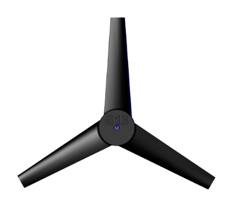
      

        <em>Blade CAD used to define rotor geometry and hub layout before fabrication.</em>
      

    </td>

  <td style="width:33%; vertical-align:top; text-align:center; border:1px solid #d1d5db; border-radius:12px; padding:12px; background:#ffffff;">
      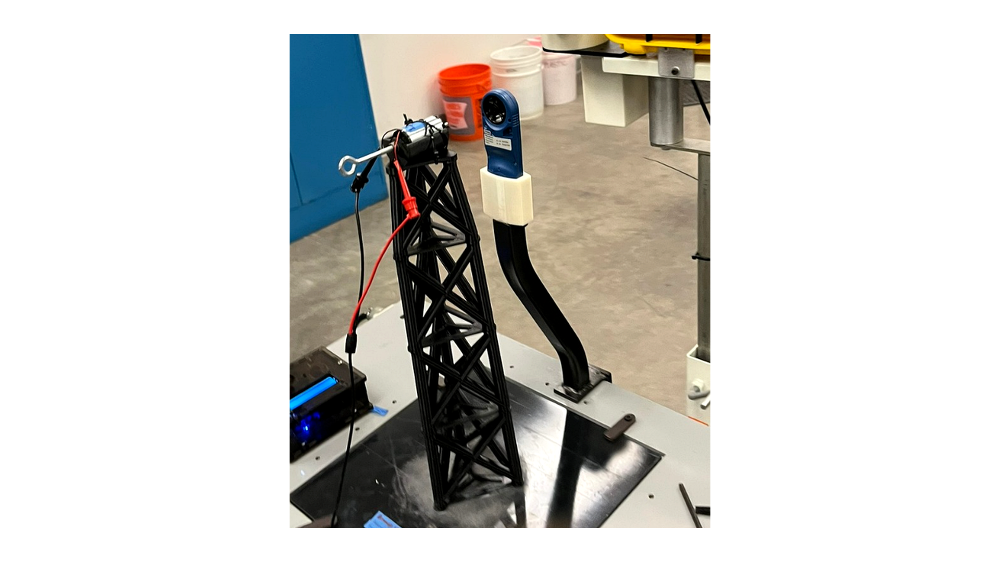
      

        <em>Wind-tunnel test setup used to evaluate turbine output under airflow.</em>
      

    </td>

  <td style="width:33%; vertical-align:top; text-align:center; border:1px solid #d1d5db; border-radius:12px; padding:12px; background:#ffffff;">
      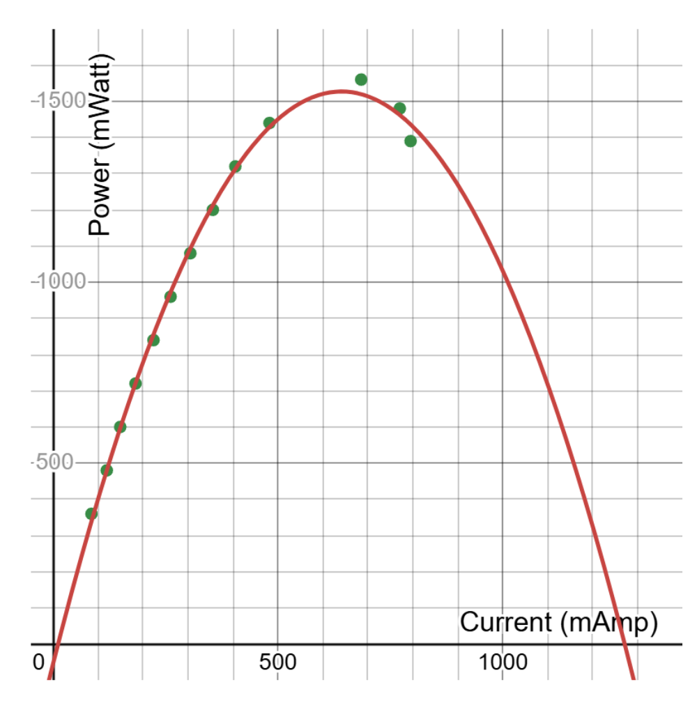
      

        <em>Measured power curve used to compare output across operating points.</em>
      

    </td>
  </tr>
</table>

The final system connected CAD-driven blade design, physical fabrication, test instrumentation, and structural validation into a single working turbine. The key engineering challenge was not only producing a high-output rotor, but also building a repeatable test setup where measured electrical power could be trusted and used to guide design decisions.

---

## FlyNet: Physics-Informed Neural Dynamics Modeling

**Dynamics Modeling · PyTorch · Closed-Loop Training · Equations of Motion Integration · Recurrent Networks**
*Mofrad Lab, UC Berkeley*

  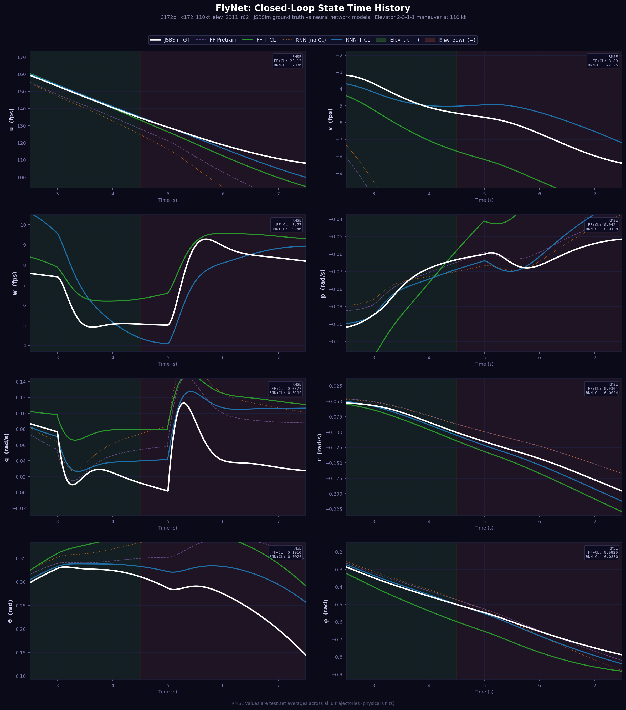

<em>Closed-loop state time history across all model variants versus ground truth. Shaded regions show control input phases of the 2-3-1-1 maneuver.</em>

  <iframe width="72%" height="420"
    src="https://www.youtube.com/embed/RBWWbZS1y6c"
    frameborder="0"
    allowfullscreen
    style="border-radius:12px; border:1px solid #2a3542;">
  </iframe>

Neural networks that model physical systems are only useful if they stay stable in closed-loop rollout, the same challenge that matters for any robot running a learned dynamics or control model on real hardware. I replicated FlyNet (Stachiw et al., 2022), a physics-based neural network for rigid-body dynamics modeling, then extended the comparison to a parameter-matched recurrent architecture to isolate what actually drives closed-loop stability.

**Core question:** Is rollout stability driven by the training objective or by the model architecture?

**Highlights**

- Built an end-to-end simulation data pipeline generating 56 trajectories across 4 speed conditions and 7 maneuver types.
- Implemented a two-stage training pipeline: feed-forward pretraining followed by closed-loop output-error refinement with Adams-Bashforth equations-of-motion integration.
- Closed-loop refinement reduced translational drift substantially, especially in lateral velocity channels. The w-channel RMSE reached **1.45 fps**, beating the paper baseline of 1.77 fps.
- The recurrent (GRU) model, trained without closed-loop refinement, diverged in rollout, proving the training objective governs stability, not hidden-state architecture alone.
- GRU closed-loop training stabilized some channels but introduced longitudinal divergence, revealing an architecture-dependent instability that would not appear in open-loop evaluation.

**Pipeline**

| Stage | What it does |
|---|---|
| `generate_dataset.py` | Trim oracle and trajectory generation across speed and maneuver conditions |
| `pretrain_model.py` | Stage 1 feed-forward pretraining with 119 second-order features |
| `train_closedloop.py` | Stage 2 output-error refinement with EOM integration |
| `train_rnn.py` | Parameter-matched GRU pretraining |
| `train_closedloop_rnn.py` | Timestep-by-timestep GRU closed-loop rollout |
| `evaluate.py` | Closed-loop RMSE across 8 state channels |

**Closed-loop RMSE, test set**

<table align="center">
  <thead>
    <tr>
      <th>Channel</th>
      <th>Paper FlyNet</th>
      <th>FF Pretrain</th>
      <th>FF + CL</th>
      <th>RNN, no CL</th>
      <th>RNN + CL</th>
    </tr>
  </thead>
  <tbody>
    <tr><td>u (fps)</td><td>2.04</td><td>22.18</td><td>22.17</td><td>21.07</td><td>2036</td></tr>
    <tr><td>v (fps)</td><td>2.70</td><td>45.68</td><td>2.98</td><td>51.31</td><td>42.26</td></tr>
    <tr><td><strong>w (fps)</strong></td><td><strong>1.77</strong></td><td>56.05</td><td><strong>1.45</strong></td><td>55.00</td><td>19.46</td></tr>
    <tr><td>p (rad/s)</td><td>0.030</td><td>0.0278</td><td>0.0404</td><td>0.0269</td><td>0.0108</td></tr>
    <tr><td>q (rad/s)</td><td>0.015</td><td>0.0212</td><td>0.0377</td><td>0.0250</td><td>0.0116</td></tr>
    <tr><td>r (rad/s)</td><td>0.026</td><td>0.0235</td><td>0.0305</td><td>0.0232</td><td>0.0064</td></tr>
    <tr><td>θ (rad)</td><td>0.028</td><td>0.151</td><td>0.099</td><td>0.150</td><td>0.092</td></tr>
    <tr><td>φ (rad)</td><td>0.050</td><td>0.096</td><td>0.084</td><td>0.077</td><td>0.080</td></tr>
  </tbody>
</table>

<em>Paper baseline: Bell 412HP helicopter with real flight-test data. My replication: C172p fixed-wing aircraft with simulation trajectories.</em>

**My contributions**

- Built the full data pipeline: trim oracle, maneuver generation, and trajectory-level train/test splits.
- Implemented the feature pipeline with normalization, second-order feature expansion, and Xavier initialization.
- Recreated both training stages: feed-forward pretraining and closed-loop output-error refinement with EOM integration.
- Extended the study with a parameter-matched GRU and timestep-level closed-loop recurrent rollout.
- Built the evaluation pipeline and produced a publication-comparable RMSE table across all model variants.

**Key finding**

Closed-loop training is the primary driver of rollout stability in neural rigid-body dynamics models. Architecture (feed-forward vs recurrent) is secondary. The feed-forward model became stable after output-error refinement; the recurrent model introduced a new instability when trained the same way. The implication for any learned dynamics or control model running on physical hardware: the training objective and integration scheme matter more than the network structure.

---

## Additional Projects

Smaller projects included for range and technical depth.

### Post-Stroke Imaging Triage

**Medical Imaging · Applied Deep Learning · CT Preprocessing · Interpretability**
*Mofrad Lab collaboration*

Built a reproducible slice-level baseline for intracranial hemorrhage detection on non-contrast head CT and ran a controlled initialization study comparing scratch training, ImageNet pretraining, and CT-native JEPA-style self-supervised pretraining. I built the full preprocessing and training pipeline, implemented class-imbalance handling and stable fine-tuning, and found that the best JEPA-10k model reached validation ROC-AUC of about 0.846 with sensitivity of about 0.80 and specificity of about 0.706 at a 0.5 threshold.

  

### Agent-Based Biofilm Modeling

**Python · MESA · Agent-Based Simulation · Parametric Design Screening**
*Co-developed with a senior mechanical engineering student*
[Full technical report (PDF)](assets/biofilm_abm_report.pdf)

Built a parametric agent-based model in MESA to simulate bacterial biofilm formation on catheter surfaces, including planktonic motion, probabilistic attachment, EPS secretion, nutrient-driven growth, and shear-driven detachment. I used the model to run parameter sweeps over roughness, coating strength, and shear flow, compare five candidate material surfaces under stochastic replicates, and frame the project as a low-cost pre-prototyping screen for medical-device surface design before physical testing.

  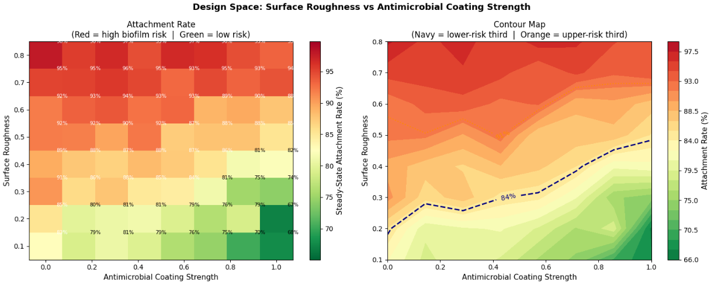

<em>Parameter sweep heatmap: how surface roughness and coating strength jointly affect biofilm attachment rate across simulated material candidates.</em>

### Reliability-First Trading Automation

**Systems Engineering · Deterministic State Machine · Fail-Closed Logic · Audit Logs**

Built a paper-trading automation system designed as a reliability engineering exercise. The system observes leveraged S&P 500 ETFs at market open, runs a deterministic decision logic, and executes one order with explicit safety checks at every state transition. The focus was predictable, auditable behavior under real-world failure modes: bad market data, API timeouts, and account constraint violations. Every exit path is logged; the system fails closed.

---

## Contact
Always happy to connect with engineers, teams, and companies working on physical systems.

[LinkedIn](https://www.linkedin.com/in/kevin-armstrong-ii-647125319/)  

**Email:** kevarm2028@berkeley.edu
