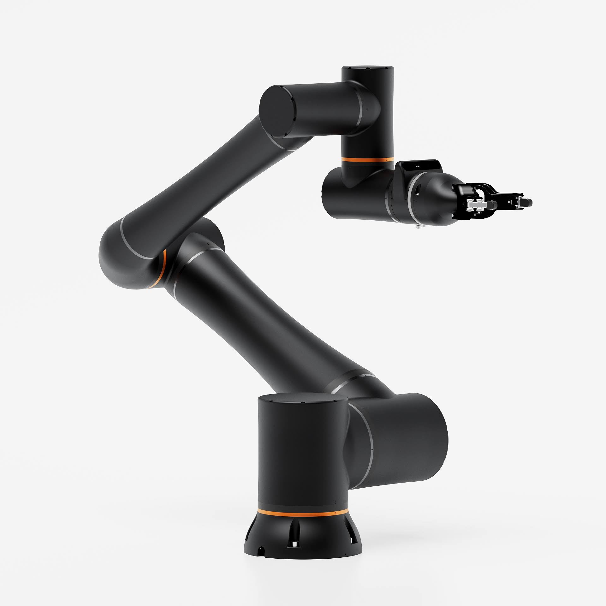
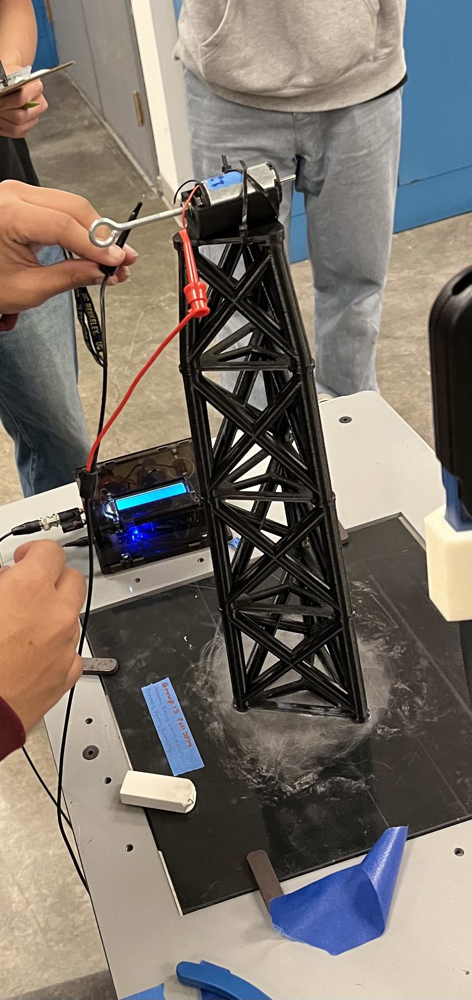

  <a class="portfolio-brand" href="#top">KA</a>
  

    <a href="#experience">Experience</a>
    <a href="#bwb">Aircraft</a>
    <a href="#rotorcraft">Research</a>
    <a href="#hycube">Flight Hardware</a>
  

<section class="hero">
  

    
UC BERKELEY · MECHANICAL ENGINEERING ’28

    <h1>Kevin Armstrong II</h1>
    
Aircraft and mechanical hardware, from CAD and analysis through build and test.

    

      <a class="button button-primary" href="#featured-work">View work</a>
      <a class="button button-ghost" href="https://www.linkedin.com/in/kevin-armstrong-ii-647125319/">LinkedIn</a>
      <a class="button button-ghost" href="mailto:kevarm2028@berkeley.edu">Email</a>
    

  

  <aside class="hero-profile">
    

    

      

        PROFESSIONAL HARDWARE
        <strong>Standard Bots</strong>
        <small>Hardware Engineering · 2026</small>
      

      

        FLIGHT DYNAMICS RESEARCH
        <strong>IEEE Aerospace 2027</strong>
        <small>Accepted conference paper</small>
      

      

        UC BERKELEY
        <strong>Mechanical Engineering</strong>
        <small>NCAA Division I</small>
      

    

  </aside>
</section>

<section id="featured-work" class="featured-work">
  <header class="section-heading">
    
FEATURED WORK

    <h2>Selected engineering</h2>
  </header>

  

    <a class="featured-card" href="#experience">
      

        
      

      

        HARDWARE ENGINEERING
        <h3>Standard Bots</h3>
        
Mechanical design, test infrastructure, assembly, calibration, and production validation.

        <strong class="card-result">100 hr loaded burn-in</strong>
      

    </a>

    <a class="featured-card" href="#bwb">
      

        
      

      

        EXPERIMENTAL AERODYNAMICS
        <h3>Blended-Wing-Body Aircraft</h3>
        
Custom OML, CFD, FDM test article, force-balance testing, and tuft visualization.

        <strong class="card-result">14–16° stall onset</strong>
      

    </a>

    <a class="featured-card" href="#rotorcraft">
      

        
      

      

        FLIGHT DYNAMICS + ML
        <h3>Learned Rotorcraft Dynamics</h3>
        
Physics-informed force and moment models evaluated through rollout and controller-facing behavior.

        <strong class="card-result">IEEE Aerospace 2027</strong>
      

    </a>

    <a class="featured-card" href="#hycube">
      

        
      

      

        FLIGHT INSTRUMENTATION
        <h3>HyCUBE Reentry Vehicle</h3>
        
Thermal instrumentation, payload integration, high-altitude operations, and recovery.

        <strong class="card-result">~90,000 ft flight</strong>
      

    </a>
  

</section>

<section class="intro">
  

    
ABOUT

    <h2>I like engineering that closes the loop.</h2>
  

  

    

      I’m a UC Berkeley mechanical engineering student focused on aircraft design, experimental aerodynamics,
      and complex mechanical hardware. My strongest projects move from geometry and first-principles analysis
      into fabrication, instrumentation, and physical test.
    

    

      Aircraft Design
      Experimental Aerodynamics
      Mechanical Hardware
      Test Engineering
    

  

</section>

<section id="experience" class="case-study standardbots-case">
  <header class="case-header">
    

      
FEATURED EXPERIENCE · BROOKLYN, NY · SUMMER 2026

      <h2>Standard Bots</h2>
      
Hardware Engineering Intern

    

  </header>

  

    

      

        Designed mechanical hardware and test infrastructure for six-axis industrial robots across CAD,
        structural analysis, fabrication, assembly, instrumentation, and validation.
      

      

        

          <strong>100 hr</strong>
          automated loaded burn-in
        

        

          <strong>&gt;2.5 kN·m</strong>
          momentary interface load verified
        

        

          <strong>~75 hr</strong>
          downstream disassembly/rework avoided
        

      

      

        <article>
          01
          <h3>Joint reliability test system</h3>
          

            Designed an automated pre-assembly burn-in station that applied representative load for long-duration testing,
            integrated torque and position sensing, and screened joints before complete robot assembly.
          

        </article>

        <article>
          02
          <h3>High-load dynamometer interface</h3>
          

            Designed a precision mechanical interface and checked bolted, doweled, and keyed load paths
            with hand calculations and static FEA before releasing the manufactured part.
          

        </article>

        <article>
          03
          <h3>Assembly + production support</h3>
          

            Assembled and calibrated three complete robot arms, programmed checkout motion routines,
            improved technician-facing build instructions, and trained technicians.
          

        </article>
      

    

    <figure class="standardbots-photo standardbots-fixture-photo">
      
      <figcaption><strong>Loaded burn-in station fixture.</strong></figcaption>
    </figure>
  

  

    <figure class="figure-card assembly-photo">
      
      <figcaption>
        <strong>Assembly + calibration.</strong> Bringing up and validating a completed robot arm during production-facing hardware work.
      </figcaption>
    </figure>

    <figure class="figure-card">
      <video autoplay muted loop playsinline controls preload="metadata"
             poster="assets/standardbots_motion_poster.jpg">
        <source src="assets/standardbots_motion_routine.mp4" type="video/mp4">
      </video>
      <figcaption>
        <strong>Checkout routine.</strong> Arm executing a motion routine I programmed while bringing up the completed assembly.
      </figcaption>
    </figure>
  

</section>

<section id="bwb" class="case-study">
  <header class="case-header split">
    

      <h2>Blended-Wing-Body Aircraft Design &amp; Aerodynamic Validation</h2>
      
Outer-mold-line design · CFD verification · FDM fabrication · force-balance testing · tuft flow visualization

    

    <a class="text-link" href="assets/BWB_Project_Showcase_Tufts%20(4).html">Full technical showcase ↗</a>
  </header>

  <figure class="case-hero">
    
  </figure>

  

    

      <strong>−2° → 20°</strong>
      wind-tunnel test envelope
    

    

      <strong>14–16°</strong>
      stall onset
    

    

      <strong>3.36 N</strong>
      peak normal force at 18°
    

    

      <strong>7.31</strong>
      peak CFD L/D at 6°
    

  

  

    I designed a custom blended-wing-body outer mold line in SOLIDWORKS, established a repeatable pre-stall CFD workflow,
    fabricated a 1:1 FDM model, and extended the physical test campaign through 20° angle of attack to characterize the stall sequence.
  

  

    

      01 / DESIGN
      <h3>From cross-sections to a physical test article</h3>
      

        A multi-section loft with guide curves blends a custom centerbody into the outer panels.
        The geometry moved directly from CAD into simulation, FDM fabrication, and wind-tunnel testing.
      

    

    

      <figure class="figure-card">
        
        <figcaption>Concept and early geometry definition.</figcaption>
      </figure>
      <figure class="figure-card">
        
        <figcaption>SOLIDWORKS multi-section loft and guide-curve definition.</figcaption>
      </figure>
    

  

  

    

      02 / CFD
      <h3>Checked numerical sensitivity before using the sweep for design conclusions</h3>
      

        Steady external-flow cases covered −2° to +8° at 40 mph.
        A domain study at 4° changed CL by 0.17% and CD by 0.43%;
        medium-to-fine mesh refinement changed CL by 1.25% and CD by 0.37%.
      

    

    <figure class="figure-card wide-figure">
      
      <figcaption>Matched streamwise-velocity and surface-pressure views at 0°, 4°, and 8°.</figcaption>
    </figure>

    

      

        DOMAIN · 4°
        <strong>ΔCL 0.17%</strong>
        <small>ΔCD 0.43%</small>
      

      

        MESH · 4°
        <strong>ΔCL 1.25%</strong>
        <small>ΔCD 0.37% · medium → fine</small>
      

      

        CONVERGENCE
        <strong>+100 iterations</strong>
        <small>after solver goals were achieved</small>
      

    

  

  

    

      03 / TEST
      <h3>Extended the experiment beyond the CFD range to capture stall</h3>
      

        The tunnel sweep ran from −2° through 20° using a three-component balance, wind-off tare,
        point-by-point dynamic-pressure correction, and 25 Hz acquisition.
        Stall onset appears around 14–16°; normal force peaks at 3.36 N at 18° and falls only about 1% by 20°.
      

    

    

      <figure class="figure-card">
        
        <figcaption>Pre-stall CFD sweep.</figcaption>
      </figure>
      <figure class="figure-card">
        
        <figcaption>Wind-tunnel run through 20°.</figcaption>
      </figure>
    

  

  

    

      04 / UNDERSTAND
      <h3>The force balance showed when stall began; tufts showed where it began</h3>
      

        Tufts show the centerbody becoming disturbed before the outer panels.
        At 14–16° the inboard flow is clearly separated while the tips remain partially attached,
        matching the gradual roll-over in the force data.
      

    

    

      <figure>
        
        <figcaption><strong>0–4°</strong>Attached baseline</figcaption>
      </figure>
      <figure>
        
        <figcaption><strong>6–10°</strong>Inboard disturbance</figcaption>
      </figure>
      <figure>
        
        <figcaption><strong>14–16°</strong>Centerbody separation</figcaption>
      </figure>
      <figure>
        
        <figcaption><strong>18–20°</strong>Progressive post-stall</figcaption>
      </figure>
    

  

  

    <article>
      01
      <h3>Progressive stall onset</h3>
      
Force and tuft evidence converge on a 14–16° onset window.

    </article>
    <article>
      02
      <h3>Peak CFD efficiency at 6°</h3>
      
Within the simulated range, L/D peaks at 7.31 before drag growth overtakes lift growth.

    </article>
    <article>
      03
      <h3>Moment changes before peak normal force</h3>
      
Pitching moment turns before the normal-force peak, consistent with loading redistribution near stall.

    </article>
    <article>
      04
      <h3>Outer panels remain partly attached</h3>
      
Tip tufts stay partly ordered through 20°, explaining the soft force roll-over.

    </article>
  

  

    
Technical appendix — current CFD coefficient sweep

    

      

        <table>
          <thead>
            <tr><th>AoA</th><th>CL</th><th>CD</th><th>L/D</th></tr>
          </thead>
          <tbody>
            <tr><td>−2°</td><td>−0.0414</td><td>0.0283</td><td>−1.46</td></tr>
            <tr><td>0°</td><td>0.0586</td><td>0.0272</td><td>2.15</td></tr>
            <tr><td>2°</td><td>0.1612</td><td>0.0307</td><td>5.25</td></tr>
            <tr><td>4°</td><td>0.2598</td><td>0.0373</td><td>6.97</td></tr>
            <tr><td>6°</td><td>0.3554</td><td>0.0486</td><td><strong>7.31</strong></td></tr>
            <tr><td>8°</td><td>0.4473</td><td>0.0644</td><td>6.95</td></tr>
          </tbody>
        </table>
      

      

        <a href="assets/BWB_CFD_Summary_.pdf">CFD summary PDF ↗</a>
        <a href="assets/BWB_Project_Showcase_Tufts%20(4).html">Full project showcase ↗</a>
      

    

  

</section>

<section id="rotorcraft" class="case-study compact-case">
  <header class="case-header split">
    

      
RESEARCH · FLIGHT DYNAMICS

      <h2>Learned Rotorcraft Dynamics</h2>
      
Physics-informed ML · rigid-body dynamics · rollout stability · controller-facing evaluation

    

    IEEE Aerospace 2027 · Accepted
  </header>

  

    

      

        I am developing learned rotorcraft models that predict forces and moments while preserving the rigid-body equations of motion.
        My work focuses on whether the models remain stable and useful when rolled forward through complete trajectories,
        not only whether they minimize one-step prediction error.
      

      <ul class="clean-list">
        <li>Built the PyTorch flight-dynamics and force/moment integration pipeline.</li>
        <li>Compared feed-forward, temporal, recurrent, and training-objective variants under matched conditions.</li>
        <li>Evaluated trajectory drift, stability, tracking, and control-relevant response on held-out cases.</li>
      </ul>

      

        <strong>Accepted paper:</strong>
        “From Accurate Predictions to Controller-Facing Learned Rotorcraft Surrogates: Stability &amp; Tracking.”
      

    

    <figure class="figure-card rotorcraft-figure">
      
    </figure>
  

</section>

<section id="hycube" class="case-study compact-case">
  <header class="case-header">
    

      
NASA MINNESOTA SPACE GRANT · UMN SMALL SATELLITE PROGRAM

      <h2>HyCUBE Hypersonic Reentry Vehicle</h2>
      
Thermal instrumentation · calibration · payload integration · high-altitude flight operations

    

  </header>

  

    <figure class="figure-card">
      
      <figcaption>HyCUBE in high-altitude flight.</figcaption>
    </figure>

    <figure class="figure-card">
      
      <figcaption>Mission profile: balloon ascent, release, and reentry experiment.</figcaption>
    </figure>
  

  

    

      

        Built, wired, and programmed a thermocouple calibration rig for flight instrumentation,
        then characterized probe configurations against a reference and supported payload integration,
        high-altitude flight operations, recovery, and post-flight validation.
      

      <ul class="clean-list">
        <li>
          Used Arduino DAQ and cold-junction compensation to characterize probe configurations
          from 50–155°C using regression and agreement analysis.
        </li>
        <li>
          Integrated and secured payload hardware, tracked telemetry and state estimates over the Iridium satellite network
          to approximately 90,000 ft, recovered the payload, and validated post-flight data.
        </li>
      </ul>

      

        

          <strong>50–155°C</strong>
          probe characterization range
        

        

          <strong>~90,000 ft</strong>
          high-altitude flight and recovery
        

      

    

    <figure class="figure-card hycube-plot-card">
      
      <figcaption>Thermocouple parity and temperature-error validation.</figcaption>
    </figure>

    <figure class="figure-card hycube-ground-photo">
      
      <figcaption>Payload integration before balloon release.</figcaption>
    </figure>

    <figure class="figure-card hycube-plot-card secondary">
      
      <figcaption>Agreement and sensitivity plots across probe configurations.</figcaption>
    </figure>
  

</section>

<section id="drone" class="case-study compact-case">
  <header class="case-header">
    

      
MECHANICAL INTEGRATION · AERODYNAMIC ANALYSIS · FLIGHT TEST

      <h2>Drone Seed-Dispersal Attachment</h2>
      
CAD · DfAM · CFD analysis · mechanical integration · loaded flight testing

    

  </header>

  

    <figure class="figure-card">
      
      <figcaption>CAD integration of the seed-dispersal attachment.</figcaption>
    </figure>
    <figure class="figure-card">
      
      <figcaption>Loaded indoor flight test with the attachment installed.</figcaption>
    </figure>
  

  

    
<strong>15 mph</strong>CFD forward-flight condition

    
<strong>3.94 N</strong>predicted drag

    
<strong>0.926 N</strong>predicted lift

    
<strong>−0.044 N</strong>predicted side force

  

  

    

      

        On a team, I owned mounting placement, aerodynamic outer geometry, maintenance access,
        and DfAM for an ABS-printed quadcopter attachment, then validated retention and aircraft integration
        on a DJI drone through loaded flight testing.
      

      

        I ran a 15 mph CFD study to quantify aerodynamic loads, then redesigned the leading edge from flat to curved
        to reduce simulated flow separation and improve aerodynamic integration.
      

    

    <figure class="figure-card drone-cfd-pair">
      

        
        
      

      <figcaption>Pressure and velocity fields used to quantify aerodynamic loads and refine the attachment geometry at 15 mph forward flight.</figcaption>
    </figure>
  

</section>

<section class="portfolio-section wind-section">
  <header class="section-heading">
    
ADDITIONAL ENGINEERING

    <h2>Wind Turbine Design-Build-Test</h2>
    
Rapid prototyping · wind-tunnel-style testing · power characterization · structural review

  </header>

  <article class="case-study compact-case wind-case">
    

      

        

          
        

        

          

            <strong>#1 / 40</strong>
            teams in measured electrical power output
          

          

            In a four-person team project, we designed, built, and tested a small wind turbine under
            manufacturability and performance constraints. I focused on measurement, power characterization,
            blade concept research, and verification review.
          

          

            Our final design ranked <strong>#1 of 40 teams</strong> in measured electrical power output.
          

        

        
Physical test setup.

      

      <figure class="figure-card wind-final-fea">
        
        <figcaption>Structural sanity-check results.</figcaption>
      </figure>

    

  </article>
</section>

<footer class="portfolio-footer">
  Kevin Armstrong II · UC Berkeley Mechanical Engineering
  

    <a href="mailto:kevarm2028@berkeley.edu">Email</a>
    <a href="https://www.linkedin.com/in/kevin-armstrong-ii-647125319/">LinkedIn</a>
  

</footer> class="portfolio-footer">
  Kevin Armstrong II · UC Berkeley Mechanical Engineering
  

    <a href="mailto:kevarm2028@berkeley.edu">Email</a>
    <a href="https://www.linkedin.com/in/kevin-armstrong-ii-647125319/">LinkedIn</a>
  

</footer>
