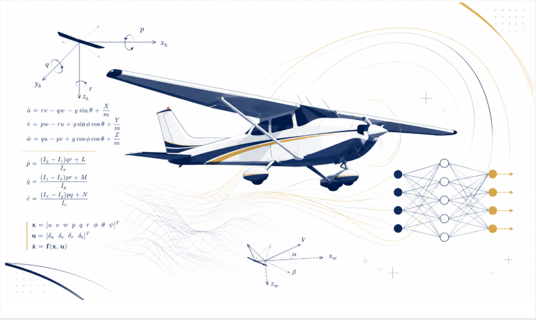
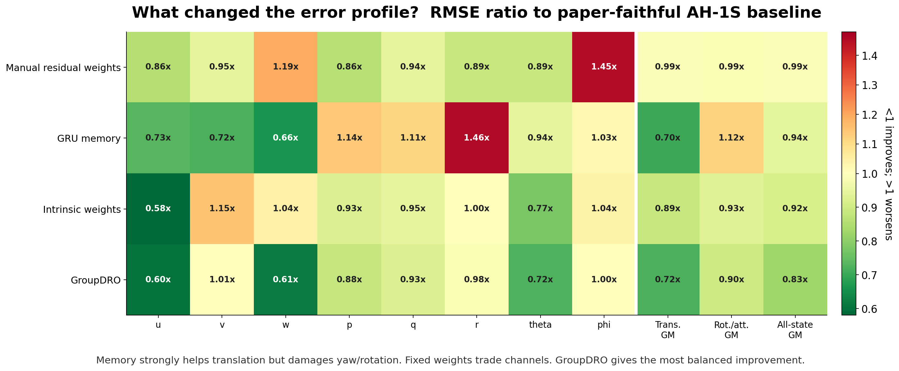

<strong>Aerospace Systems</strong> • <strong>Experimental Aerodynamics</strong> • <strong>Mechanical Design</strong> • <strong>Applied ML</strong>

<table style="width:100%; border-collapse:separate; border-spacing:18px 16px; table-layout:fixed;">
  <tr>
    <td style="vertical-align:top;">
      
      

        <a href="#concept-aircraft-blended-wing-body-aerodynamics" class="card-title"><strong>Blended-Wing-Body Aerodynamics</strong></a> 
        Full design-to-test pipeline with CFD, wind tunnel data, and tuft flow visualization.
      

    </td>
    <td style="vertical-align:top;">
      

        
      

      

        <a href="#flynet-neural-flight-dynamics-modeling" class="card-title"><strong>Learned Rotorcraft Dynamics</strong></a> 
        Physics-informed ML for closed-loop flight simulation and control-oriented validation.
      

    </td>
  </tr>
  <tr>
    <td style="vertical-align:top;">
      
      

        <a href="#hycube-cubesat-thermal--instrumentation-payload" class="card-title"><strong>HyCUBE Thermal Payload</strong></a> 
        Aerospace instrumentation, calibration, and flight operations for a reentry payload.
      

    </td>
    <td style="vertical-align:top;">
      
      

        <a href="#drone-seed-dispersal-attachment-native-plant-rewilding" class="card-title"><strong>Drone Seed Dispersal Attachment</strong></a> 
        CAD, CFD validation, DfAM, and flight-tested mechanical integration.
      

    </td>
  </tr>
</table>

I'm a mechanical engineering student at UC Berkeley building toward a career in aerospace and hardware. As a junior, I have run a full aerodynamics design-to-test pipeline on a custom blended-wing-body aircraft, built neural flight dynamics models in the Mofrad Lab, designed and CFD-validated a seed-dispersal attachment for rewilding drones, and validated thermocouple instrumentation for a hypersonic reentry payload through NASA Space Grant. I care about work that closes the loop between analysis, simulation, fabrication, and physical testing.

<em>Selected work in aerodynamics, aerospace instrumentation, mechanical design, and applied machine learning.</em>

## Explore Projects
- [Concept Aircraft: Blended-Wing-Body Aerodynamics](#concept-aircraft-blended-wing-body-aerodynamics)
- [Learned Rotorcraft Dynamics for Control-Oriented Simulation](#flynet-neural-flight-dynamics-modeling)
- [HyCUBE: CubeSat Thermal & Instrumentation Payload](#hycube-cubesat-thermal--instrumentation-payload)
- [Drone Seed Dispersal Attachment: Native Plant Rewilding](#drone-seed-dispersal-attachment-native-plant-rewilding)
- [Additional Projects](#additional-projects)
  - [Wind Turbine Design-Build-Test](#wind-turbine-design-build-test)
  - [Post-Stroke Imaging Triage](#post-stroke-imaging-triage)
  - [Agent-Based Biofilm Modeling](#agent-based-biofilm-modeling)
  - [Reliability-First Trading Automation](#reliability-first-trading-automation)

---

## Concept Aircraft: Blended-Wing-Body Aerodynamics

**CAD Design · SolidWorks CFD · 3D-Printed Model · Wind Tunnel Force-Balance Testing · Tuft Flow Visualization**

  <strong>AoA sweep:</strong> −2° to +20° &nbsp;·&nbsp;
  <strong>V∞:</strong> ≈ 40 mph &nbsp;·&nbsp;
  <strong>Re:</strong> ≈ 5.6 × 10⁴ &nbsp;·&nbsp;
  <strong>Testing:</strong> EWT 3-component balance &nbsp;·&nbsp;
  <strong>Blockage:</strong> 5.0%

Blended-wing-body aircraft generate lift across more of the airframe instead of concentrating lift in a conventional wing. That creates potential efficiency benefits, but it also makes stall behavior more complex. I designed a custom BWB geometry in SOLIDWORKS, characterized the pre-stall regime with CFD, fabricated a 1:1 FDM model, and ran a wind tunnel stall campaign with simultaneous force-balance and tuft flow visualization.

### Design-to-test pipeline

  
  &nbsp;&nbsp;
  
  &nbsp;&nbsp;
  

<em>Left to right: concept sketch, SolidWorks multi-section loft, and 1:1 FDM model on the EWT three-component balance sting.</em>

### Wind Tunnel Stall Campaign

The tunnel campaign used a three-component force balance for normal force, axial force, and pitching moment. Data was sampled at 25 Hz, corrected with wind-off tare, and pressure-corrected at each AoA point. I extended the sweep to 20° AoA, which was 12° beyond the CFD range, to capture the full post-stall regime.

**Key results**

- Gradual stall onset confirmed at **14 to 16°**, identified by normal-force slope collapse and pitching-moment reversal.
- **Peak normal force: 3.36 N at 18°**. The post-stall drop to 3.33 N at 20° was only about 1%, which suggests progressive spanwise separation rather than a full-span stall collapse.
- CFD and tunnel normal force agreed well through the 8° pre-stall CFD range.
- **Pitching moment peaked before normal force** at 16° vs 18°, indicating an aerodynamic-center shift near stall.
- Zero-lift angle was about −1.5° to −2°, consistent with the cambered centerbody producing positive loading at zero incidence.

### Aerodynamic Data Summary

  
  

<em>Left: pre-stall CFD sweep from −2° to 8° AoA. Right: clean Run 4 wind-tunnel sweep from −2° to 20° AoA, after the tuft-visualization run.</em>

### Tuft Flow Visualization: Surface Separation Sequence

Lightweight yarn tufts, roughly 7 mm long and spaced at about 12% chord, were attached to the upper surface and recorded from above at each AoA. During attached flow, the tufts stayed aligned rearward. In transitional regions, they deflected laterally. During separation, they lifted, reversed, or fluttered.

**Main finding: separation starts at the centerbody and progresses outward.** The outer panels remain partially attached after centerbody stall begins, which explains why the force curve rolls over gradually instead of collapsing suddenly.

<table style="width:100%; border-collapse:separate; border-spacing:12px 0; table-layout:fixed;">
  <tr>
    <td style="width:25%; vertical-align:top; text-align:center; border:1px solid #d1d5db; padding:10px;">
      
      
<em>0 to 4°: attached flow. Tufts stream rearward across the planform.</em>

    </td>
    <td style="width:25%; vertical-align:top; text-align:center; border:1px solid #d1d5db; padding:10px;">
      
      
<em>6 to 10°: centerbody tufts begin curling while the outer panel remains clean.</em>

    </td>
    <td style="width:25%; vertical-align:top; text-align:center; border:1px solid #d1d5db; padding:10px;">
      
      
<em>14 to 16°: centerbody tufts become disordered. Outer-panel tufts deflect but do not fully reverse.</em>

    </td>
    <td style="width:25%; vertical-align:top; text-align:center; border:1px solid #d1d5db; padding:10px;">
      
      
<em>18 to 20°: widespread centerbody separation. Wingtip tufts remain partially ordered.</em>

    </td>
  </tr>
</table>

### CFD: Pre-Stall Characterization

Steady-state laminar and turbulent SolidWorks Flow Simulation was used to sweep −2° to +8° AoA at V∞ = 40 mph. Coefficients were reported after a post-convergence averaging window and checked with mesh and domain sensitivity studies.

  

<em>Pre-stall CFD sweep: streamwise velocity cut planes and surface pressure maps at 0°, 4°, and 8° AoA.</em>

**Verification**

- Domain independence at α = 4°: ΔC_L = +0.17%, ΔC_D = +0.43%.
- Mesh independence at α = 4°: medium-to-fine ΔC_L ≈ 1.25%, ΔC_D ≈ 0.37%.

### Resources
- [Project Executive summary (HTML)](assets/BWB_Project_Showcase_Tufts%20%284%29.html)
- [CFD Summary (PDF)](assets/BWB_CFD_Summary_.pdf)

---
---

## Learned Rotorcraft Dynamics for Control-Oriented Simulation

**Flight Dynamics · Physics-Informed ML · PyTorch · JSBSim · Closed-Loop Simulation · System Identification · Controls**  
*Mofrad Lab collaboration*

I am developing learned flight-dynamics models for rotorcraft simulation and control-oriented analysis. The project builds on FlyNet-style physics-informed neural dynamics: instead of predicting aircraft motion directly, the model learns force and moment behavior while preserving rigid-body equations of motion.

My work focuses on what happens after a learned model is rolled forward through full trajectories. A model can look accurate under ordinary prediction metrics while still accumulating drift, producing unrealistic local behavior, or responding poorly in feedback-style simulations. The goal of this project is to evaluate learned aircraft dynamics beyond one-step error and ask whether they can behave like useful simulation surrogates.

  

<em>
Closed-loop evaluation showed that model changes do not improve every state uniformly; they shift error across translational, rotational, and attitude channels.
</em>

### What I Built

- Implemented a PyTorch-based neural flight-dynamics modeling pipeline.
- Integrated learned force and moment predictions with rigid-body equations of motion.
- Built closed-loop rollout evaluation on held-out rotorcraft trajectories.
- Compared feed-forward, recurrent, and training-objective variants under matched simulation conditions.
- Developed diagnostics for trajectory drift, local model behavior, and control-relevant response.
- Extended the project from trajectory matching toward controller-facing validation.

### Research Focus

The core research question is how to validate learned aircraft dynamics when trajectory rollout and control response matter. I am studying when these models behave like reliable simulation surrogates, not just low-error predictors.

This work sits at the intersection of machine learning, flight dynamics, system identification, and controls.

### Why It Matters

Learned flight-dynamics models are most useful when they can support downstream simulation, planning, or controller analysis. That requires more than matching data: the model must remain stable during rollout, preserve physically meaningful behavior, and respond consistently under perturbations.

  <iframe width="52%" height="260"
    src="https://www.youtube.com/embed/RBWWbZS1y6c"
    frameborder="0"
    allowfullscreen
    style="border-radius:12px; border:1px solid #2a3542;">
  </iframe>

<em>Closed-loop rollout/demo video from the flight-dynamics modeling pipeline.</em>

### Tools

`Python` · `PyTorch` · `JSBSim` · `NumPy` · `Matplotlib` · `Flight dynamics` · `Rotorcraft simulation` · `Closed-loop validation` · `System identification` · `Controls`

---
## HyCUBE: CubeSat Thermal & Instrumentation Payload

**Aerospace Instrumentation · Sensor Calibration · Thermal Validation · Flight Operations**  
*NASA Space Grant, hypersonic reentry payload support*

  
  

<em>HyCUBE payload context: high-altitude flight imagery and mission phases for a ballistic reentry experiment.</em>

  
  

<em>Left: payload integration before balloon release. Right: thermocouple calibration rig with a controlled heat source and measurement circuit.</em>

Reliable temperature sensing is critical for flight-readiness decisions. I built a thermocouple calibration and validation workflow for HyCUBE, converting raw measurement logs into calibration fits, agreement plots, and reusable figures for technical review.

**Highlights**

- Built a calibration workflow for thermocouple instrumentation used in flight-readiness review.
- Implemented cold-junction compensation and regression-based sensitivity estimates.
- Compared sensor behavior against a reference measurement using parity and agreement plots.
- Produced review-ready PNG exports, summary tables, and validation figures.
- Supported high-altitude balloon operations, including payload integration, ground-station setup, monitoring, recovery, and post-flight data validation.

  

<em>Validation output: thermocouple temperature vs reference and error vs reference temperature.</em>

  

<em>Agreement and sensitivity plots used to compare thermocouple behavior across probe configurations.</em>

---

## Drone Seed Dispersal Attachment: Native Plant Rewilding

**CAD Design · DfAM · CFD Aerodynamic Validation · Mechanical Integration · Flight Test**

  <strong>CFD condition:</strong> V∞ = 15 mph forward flight &nbsp;·&nbsp;
  <strong>Drag:</strong> 3.94 N &nbsp;·&nbsp;
  <strong>Lift:</strong> 0.926 N &nbsp;·&nbsp;
  <strong>Side force:</strong> −0.044 N &nbsp;·&nbsp;
  <strong>Build:</strong> ABS printed enclosure

<table style="width:70%; margin:0 auto; border-collapse:separate; border-spacing:14px 0; table-layout:fixed;">
  <tr>
    <td style="width:50%; vertical-align:middle; text-align:center;">
      
    </td>
    <td style="width:50%; vertical-align:middle; text-align:center;">
      
    </td>
  </tr>
</table>

<em>Left: CAD integration of the seed-dispersal attachment. Right: indoor flight test with the attachment mounted on the quadcopter.</em>

In a team design project, I helped design and build a seed-dispersal attachment for a quadcopter intended for native plant rewilding. The attachment uses a gravity-fed hopper and motor-driven dispersal mechanism in an ABS printed enclosure. My main contribution was the aerodynamic and mechanical integration work: CFD validation, external geometry refinement, and placement decisions to reduce drag and avoid yaw imbalance.

**Engineering focus**

- Ran a 15 mph forward-flight CFD study to quantify drag, lift, and side force.
- Confirmed near-zero side force, indicating the attachment geometry should not introduce major yaw-control issues.
- Added leading-edge and corner fillets to reduce separation and drag.
- Reviewed DfAM print orientation decisions to improve surface quality on aerodynamic faces.
- Supported final flight testing with the attachment mounted and loaded.

### CFD Aerodynamic Validation

<table style="width:70%; margin:0 auto; border-collapse:separate; border-spacing:14px 0; table-layout:fixed;">
  <tr>
    <td style="width:50%; vertical-align:middle; text-align:center;">
      
    </td>
    <td style="width:50%; vertical-align:middle; text-align:center;">
      
    </td>
  </tr>
</table>

<em>Static pressure result, left, and velocity field result, right, from the 15 mph forward-flight CFD study.</em>

| Result | Value | Engineering meaning |
|--------|-------|---------------------|
| Drag force | 3.94 N | Primary flight-performance cost |
| Lift force | +0.926 N | Small positive lift partially offsets attachment weight |
| Side force | −0.044 N | Symmetric geometry, low yaw disturbance |

The CFD confirmed drag as the main performance concern and guided the final external geometry. The project connects mechanical design, manufacturability, and flight behavior rather than treating the attachment as only a printed container.

---

## Additional Projects

Smaller projects included for range and technical completeness. These sit below the core aerospace and aerodynamics projects so the page stays focused on the roles I am currently targeting.

### Wind Turbine Design-Build-Test

**Rapid Prototyping · Wind-Tunnel Testing · Power Characterization · Structural Review**

In a four-person team project, we designed, built, and tested a small wind turbine under manufacturability and performance constraints, and our final design ranked **#1 of 40 teams** in measured electrical power output. I focused on measurement, power characterization, blade concept research, and verification review, converting voltage and current data into comparable power results to guide iteration while also reviewing structural sanity checks on the design.

<table style="width:76%; margin:0 auto; border-collapse:separate; border-spacing:12px 0; table-layout:fixed;">
  <tr>
    <td style="width:28%; vertical-align:middle; text-align:center;">
      
    </td>
    <td style="width:30%; vertical-align:middle; text-align:center;">
      
    </td>
    <td style="width:42%; vertical-align:middle; text-align:center;">
      
    </td>
  </tr>
</table>

<em>Measured power curve, wind-tunnel-style test setup, and structural FEA sanity-check results.</em>

### Post-Stroke Imaging Triage

**Medical Imaging · Applied Deep Learning · CT Preprocessing · Interpretability**  
*Mofrad Lab collaboration*

Built a reproducible slice-level baseline for intracranial hemorrhage detection on non-contrast head CT and ran a controlled initialization study comparing scratch training, ImageNet pretraining, and CT-native JEPA-style self-supervised pretraining. I built the full preprocessing and training pipeline, implemented class-imbalance handling and stable fine-tuning, and found that the best JEPA-10k model reached validation ROC-AUC of about 0.846 with sensitivity of about 0.80 and specificity of about 0.706 at a 0.5 threshold.

  

### Agent-Based Biofilm Modeling

**Python · MESA · Agent-Based Simulation · Parametric Design Screening**  
*Co-developed with a senior mechanical engineering student*  
[Full technical report (PDF)](assets/biofilm_abm_report.pdf)

Built a parametric agent-based model in MESA to simulate bacterial biofilm formation on catheter surfaces, including planktonic motion, probabilistic attachment, EPS secretion, nutrient-driven growth, and shear-driven detachment. I used the model to run parameter sweeps over roughness, coating strength, and shear flow, compare five candidate material surfaces under stochastic replicates, and frame the project as a low-cost pre-prototyping screen for medical-device surface design before physical testing.

  

<em>Parameter sweep heatmap from the agent-based biofilm model, used to compare how surface and flow conditions influence attachment behavior.</em>

### Reliability-First Trading Automation

**Systems Engineering · Deterministic State Machine · Safety Checks · Audit Logs**

Built a reliability-first paper-trading automation system that observes leveraged S&P 500 ETFs at the U.S. market open, makes a deterministic leader decision, and executes one cash-only order with explicit safety checks. I framed the project as a reliability engineering exercise focused on predictable behavior under imperfect market data, API failures, and account constraints, with fail-closed logic, traceable state transitions, and audit-style logs for each exit path.

---

## Contact

I'm always happy to connect with researchers, engineers, students, and teams interested in aerospace systems, instrumentation, mechanical design, and applied machine learning.

[LinkedIn](https://www.linkedin.com/in/kevin-armstrong-ii-647125319/)  
**Email:** kevarm2028@berkeley.edu
